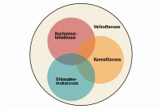

# Hyvän ilmastopolitiikan ominaisuuksia {#ominaisuuksia}

Ilmastonmuutoksen hillintään on tarjolla runsaasti vaihtoehtoisia välineitä, mutta mitkä niistä ovat tarkoituksenmukaisia? Millä kriteereillä eri välineitä  tulisi arvioida, jotta osaisimme valita oikeat työkalut ilmastonmuutoksen hillintään?

Keskustelu ilmastopolitiikan sisällöistä muotoutuu helposti hajanaiseksi ja jäsentymättömäksi, mikäli tarkastelulta puuttuu selkeä viitekehys. Tässä luvussa esitellään neljä keskeistä ominaisuutta, joita päätöksentekijä voi edellyttää ilmastopolitiikan välineiltä. 

*Vaikuttavuus* vastaa kysymykseen, kuinka suuren muutoksen toimet synnyttävät. *Kustannustehokkuus* vastaa, voisiko käytetyillä panoksilla saada aikaan suuremman vaikutuksen. *Kannattavuus* vastaa, onko toimien hyöty suurempi kuin kustannus. *Oikeudenmukaisuus* vastaa, koetaanko toimet moraalisesti oikeutetuiksi.

```{r, fig.cap = "Ilmastopolitiikalta toivottavia ominaisuuksia", echo = FALSE}
if (knitr::is_html_output()) {
  
} else {
  knitr::include_graphics("venn.pdf")
}
```

Vaikuttavuus, kustannustehokkuus ja kannattavuus voivat saada arkikielessä päällekkäisiä merkityksiä, mutta niille voidaan myös antaa täsmällinen sisältö. Oikeudenmukaisuus puolestaan on pohjimmiltaan subjektiivinen ominaisuus, mutta myös sen osalta voidaan esittää tutkimukseen perustuvia havaintoja, jotka jäsentävät keskustelua. 

Ilmaston kannalta ainoastaan vaikuttavuudella on merkitystä. Kaikki muut ominaisuudet ovat ihmistä varten. Ideaalitilanteessa ilmastopolitiikalla on kaikki neljä edellä mainittua ominaisuutta.


## Vaikuttavuus {#vaikuttavuus}

```{block2, type = "tiivis", echo = TRUE}
- Vaikuttavuus on ilmastopolitiikan olennaisin ominaisuus, jota ilman ilmastonmuutos ei hidastu.
- Ratkaisu ilmastonmuutokseen koostuu lukuisista pienistä teoista ympäri maailmaa.
- Ilmastotoimien suoria vaikutuksia on helpompi mitata, mutta kokonaisvaikutus riippuu myös markkinoiden reaktioista.

```

Olennaisin ominaisuus ilmastonmuutoksen hillintään pyrkivältä politiikkatoimilla on vaikuttavuus. Ilman vaikuttavuutta ilmastonmuutos ei hidastu. Ilmastotoimien vaikuttavuudella tarkoitetaan sitä, että toimenpiteellä saadaan aikaan aito parannus ilmaston kannalta. Jotta ilmastonmuutosta hillitsevät politiikkatoimet johtaisivat haluttuun lopputulokseen, niiden on oltava vaikuttavia. 

Vaikuttavuus saattaa tuntua ilmeiseltä kriteeriltä, mutta silti se ei aina käytännössä täyty. Yksi syy tähän on, että ilmastotoimet kytkeytyvät myös muihin politiikan osa-alueisiin ja käytännön politiikassa vaikuttavuus jää helposti muiden tavoitteiden varjoon. 

Lisäksi toimenpiteiden vaikuttavuuden ennakoiminen ja osoittaminen on haastavaa. Joissain tilanteissa esimerkiksi markkinareaktiot saattavat tehdä politiikkatoimien vaikutukset tyhjiksi. Näin voi käydä, kun politiikkatoimet kohdistuvat päästökauppasektorille (ks. päällekkäisiä ohjauskeinoja käsittelevä alaluku \@ref(paallekkaiset)).

### Ilmastonmuutoksen keskeisimmät mekanismit

Maapallomme ilmasto on hyvin monimutkainen järjestelmä. Sen keskeisimmät mekanismit tunnetaan jo varsin hyvin, vaikka moniin yksityiskohtiin liittyy yhä epävarmuutta. [@ipcc13.]

Ilmastopolitiikan välineiden valinnan näkökulmasta keskeisimmät ilmastonmuutosta kiihdyttävät tekijät voidaan tiivistää varsin yksinkertaisesti. Ihmisen toiminta vaikuttaa auringosta tulevan ja takaisin avaruuteen heijastuvan energian tasapainoon. Epätasapainon suuruutta mittaa ns. säteilypakote, johon keskeisimpinä tekijöinä vaikuttavat kasvihuonekaasupitoisuudet ilmakehässä ja maan heijastavuus eli albedo.^[On hyvä huomata, että säteilypakotteen lisäksi ihmisen ilmastonmuutosta kiihdyttävät toimet vaikuttavat myös moniin muihin seikkoihin kuten merien happamoitumiseen ja luonnon monimuotoisuuteen.]

Ihmisten toimista säteilypakotteeseen vaikuttaa voimakkaimmin päästöt, jotka syntyvät fossiilisten polttoaineiden käytöstä, teollisista prosesseista, maataloudesta ja jätteistä. Maankäyttö, maankäytön muutokset ja metsätalous vaikuttavat päästöjen ja maan heijastavuuden lisäksi hiilinieluihin, jotka poistavat kasvihuonekaasuja ilmakehästä. Säteilypakotteeseen voidaan myös vaikuttaa suoraan ilmastonmuokkauksella^[Geoengineering.] eli vaikuttamalla heijastavuuteen tai poistamalla kaasuja teknisin keinoin^[Hiiltä voidaan ottaa talteen ja varastoida (carbon capture and storage, CCS) suurten päästölähteiden kuten voimalaitosten yhteydessä. Bioenergian hiilen talteenotto ja varastointi (bio-energy with carbon capture and storage, BECCS) periaatteessa mahdollistaa ilmaston hiilidioksidipitoisuuksien alentamisen.]. [Ks. @Hsiang2018; @ipcc13.]

```{r suomikhk01, fig.cap = "Suomen nettopäästöt ovat hieman laskeneet 2000-luvulla", warning = FALSE, cache = TRUE}
```

Edelleen yksinkertaistaen ilmaston voi ajatella olevan ikään kuin suuri tiskiallas, jossa päästöt ovat vesihana ja hiilinielut viemäri. Kun vettä virtaa hanasta nopeammin kuin viemäristä poistuu, allas täyttyy, eli ilmaston kasvihuonekaasupitoisuudet lisääntyvät. Mitä korkeammalla altaan pinta on, sitä nopeammin ilmasto muuttuu. Ilmastopolitiikalla pyritään sulkemaan hanaa ja avaamaan viemäriä. Allas on globaalisti yhteinen eli kaikki maat omalta osaltaan vaikuttavat siihen, miten paljon vettä virtaa altaaseen ja siitä pois. 

Politiikkavälineiden valinnan kannalta on syytä myös huomioida, että luonnollisia hiilinieluja lisäävät toimet (kuten hiilen sitominen metsiin ja viljelysmaihin) vaikuttavat tyypillisesti hitaasti ja vasta pitkän ajan kuluessa. Myös luonnollisten nielujen mittaamisen ja pysyvyyden epävarmuus rajoittaa niiden hyödyllisyyttä ilmastonmuutoksen hillinnässä. Lisäksi lämpeneminen voi kiihtyä erilaisten takaisinkytkentöjen vuoksi, mikäli lämpötila ehtii nousta riittävän suureksi.
 
### Pienistä vaikutuksista koostuva globaali ongelma

Yksittäisten ilmastotoimien vaikutus on tyypillisesti niin pieni, että saattaa syntyä houkutus sanoa, että niillä ei ole lainkaan vaikutusta. Tässä on kuitenkin suuri vaara virhepäätelmille. Monta pientä pyöristysvirhettä voi summautua suureksi virheeksi. Kun tarkastella globaalia ilmiötä, on helppo löytää sellainen mittatikku, jota vasten yksittäinen toimi näyttää häviävän pieneltä.

Esimerkiksi yksittäisen ihmisen ruokavalintojen vaikutus ihmiskunnan kokonaispäästöihin on pieni siitä yksinkertaisesta syystä, että maapallolla asuu paljon ihmisiä ja päästöjä syntyy muustakin kuin ruoantuotannosta. Mutta jos suurempi ihmisjoukko muuttaa ruokailutottumuksiaan, yhteisvaikutus voi olla suuri. Jos yksittäiset vaikutukset pyöristää nollaan, saattaa erehtyä ajattelemaan, että myös suuren joukon toimiessa samalla tavalla toimilla ei ole merkittävää vaikutusta. 

Vaikutuksien suuruutta pohtiessa voi myös olla houkuttelevaa ajatella, että ilmastonmuutoksen ongelma olisi ratkaistavissa muutamalla isolla toimenpiteellä. Toisin sanoen saatetaan ajatella, että ilmastopolitiikan tulisi rajoittua toimiin, joilla ratkaistaan merkittävä osa ongelmasta kerralla. 

Ilmastonmuutos on kuitenkin monimutkainen globaali ongelma, johon vaikuttavat miljardien ihmisten valinnat lähes kaikilla elämän osa-alueilla. Sen takia ei ole syytä odottaa, että löytyisi niin sanottu hopealuoti, joka ratkaisisi suoraviivaisesti valtaosan ilmasto-ongelmasta kerralla. On todennäköisempää, että käytännössä ratkaisu tulee koostumaan lukuisista pienistä toimista, joilla on yksittäin pieni mutta yhdessä merkittävä vaikutus ilmastonmuutoksen hillinnässä.

Ilmastonmuutos on globaali ongelma myös siinä suhteessa, että ei ole juuri väliä, missä päin maapalloa vaikutukset syntyvät. Ilmaston kannalta vaikutus on sama riippumatta siitä, vähennetäänkö päästöjä Suomessa vai Kiinassa. Tämä on tärkeä huomioida, kun pohditaan, missä suhteessa Suomen tulisi jakaa panoksiaan kotimaisten ja ulkomaisten päästövähennysten välillä.

Vaikuttavuutta on tärkeä korostaa myös siitä syystä, että se kiinnittää huomion panosten sijaan tuloksiin. Ilmastonmuutoksen kannalta ei ole merkitystä sillä, kuinka suuria ponnistuksia tai uhrauksia ilmastonmuutoksen hillinnän eteen tehdään. Ilmastotavoitteiden toteutumisen kannalta vain sillä on merkitystä, miten vaikuttavia toimet ovat.

```{block2, type = "laatikko", echo = TRUE}
### Erilaisten vaikutusten yhteismitallisuus

Mittarina vaikuttavuuden arvioinnissa periaatteessa tulisi käyttää säteilypakotetta, joka kuvaa maapallolle saapuvan ja poistuvan säteilyn välistä eroa. Käytännössä kuitenkin on usein luontevampaa mitata vaikuttavuutta hiilidioksidipäästöillä ja suhteuttaa muut vaikutukset niihin. Hiilidioksidiekvivalentti (CO₂-ekv.) on suure, joka tekee yhteismitalliseksi muut vaikutukset kuten metaanipäästöt ja nielujen muutokset. Myös vaikutukset maapallon heijastavuuteen voidaan mitata säteilypakotteella. 

Nielujen osalta vaikutusten yhteismitalliseksi tekeminen on haastavaa, sillä nieluihin kohdistuvien toimien vaikutukset näkyvät tyypillisesti pitkän aikavälin kuluessa. Pääsääntöisesti päästöihin kohdistuvat toimet vaikuttavat heti, kun taas nielujen lisääminen poistaa kasvihuonekaasuja pitkän ajan kuluessa.
```

### Suorat vaikutukset

Ilmastotoimen vaikuttavuudessa on kyse kausaliteetista eli siitä, miten ilmasto kehittyy toimien toteutuessa, verrattuna tilanteeseen, jossa toimet olisivat jääneet toteutumatta. Vaikuttavuutta siis voidaan mitata vertailemalla päästöjen kokonaismäärää toimenpiteen kanssa ja ilman sitä. 

Kausaalisuhteiden voimakkuuden määrittäminen on yhteiskuntatieteiden kentällä tunnetusti erityisen haastavaa. Vaikka ilmastotoimien suoria vaikutuksia on usein helpompi mitata, haaste piilee siinä, miten ihmiset reagoivat muutoksiin. Ilmastonmuutoksen hillinnän kannalta tärkeintä olisi ymmärtää kokonaisvaikutuksia eli huomioida sekä suorat että epäsuorat vaikutukset.

Suorat vaikutukset voidaan usein mitata yksinkertaisen fysiikan ja kemian perusteella. Esimerkiksi tiedämme, kuinka paljon bensiinissä on hiiliatomeja litraa kohden ja miten ne muuttuvat palamisreaktiossa hiilidioksidiksi. Voimme siis laskea, paljonko bensalitran kulutuksesta syntyy päästöjä. Maatalouden, metsänhoidon, maankäytön ja jätteiden osalta päästöjen mittaaminen on mutkikkaampaa. [@ipcc07b.] Esimerkiksi arviot hakkuumäärien vaikutuksesta metsänieluihin ovat yhä epävarmoja ja aihe vaatii lisää tutkimusta [@Ilmastopaneeli2019].

### Epäsuorat vaikutukset

Suurin haaste piilee epäsuorien vaikutusten mittaamisessa. Jos kuluttaja jättää yhden bensalitran ostamatta, jääkö se todella käyttämättä? Jääkö raakaöljy maan alle vai myydäänkö se halvemmalla jollekulle toiselle? Talouden toimijat reagoivat muiden valintoihin ja valtion politiikkatoimiin. Markkinoilla hinnat sopeutuvat ja ohjaavat hyödykkeiden tuotantoa ja kulutusta. Tavanomaisesti markkinoilla kysynnän heikkeneminen saa tuottajat alentamaan hintojaan, joten lopulta kulutuksen määrä vähenee hieman vähemmän kuin kysyntä alun perin. 

Teoriassa on mahdollista, että kansallisen ilmastopolitiikan kiristymisen seurauksena osa tuotannosta siirretään maihin, joissa sääntely on kevyempää. Tämän ns. hiilivuodon suuruudesta ja olemassaolosta on kiistelty. Hiilivuodon seurauksena globaalit päästöt eivät vähene yhtä paljon kuin kotimaiset päästöt. Empiiristä näyttöä hiilivuodosta ei kuitenkaan juuri ole löytynyt [@vatt2016]. Näytön puute voi osaltaan johtua myös siitä, että pitkän aikavälin vaikutuksia on vaikea havaita empiirisesti. Laskennalliset talousmallit viittaavat hiilivuodon riskiin, mutta tulosten vaihteluväli on suuri ja kokonaisvaltaisemmissa malleissa hiilivuoto arvioidaan melko vähäiseksi [@Aldy2010; @pmr2015]. 

On myös mahdollista, että kotimaiset ilmastotoimet aiheuttavat positiivisia vaikutuksia ulkomailla. Hiilivuodon vastakohtana on puhuttu myös tuulivuodosta, eli siitä että puhtaan teknologian kehitys ja kaupallistaminen alentaa kustannuksia ja kannustaa muita maita päästövähennyksiin [@vnk2008]. Hiilivuodon riski pienenee, kun muissa maissa sovelletaan tiukkoja ilmastonormeja. On myös mahdollista, että johtajuus ja konkreettinen esimerkki kunnianhimoisemmasta ilmastopolitiikasta kannustaa muita maita vähentämään päästöjä, mutta tällaiselle vaikutusmekanismille ei löytyne tutkimusnäyttöä.

```{block2, type = "laatikko", echo = TRUE}
### Vihreä paradoksi

Äärimmäisenä esimerkkinä epäsuorista vaikutuksista on ns. vihreän paradoksin teoria, jonka mukaan raakaöljyn kysyntää supistavat politiikkatoimet jopa kannustavat kiihdyttämään öljyntuotantoa. 

Teoria lähtee siitä, että öljykenttä on omistajilleen pääoma, joka saa arvonsa siitä, että öljy tullaan aikanaan nostamaan ja myymään markkinoille. Omistaja maksimoi tuottonsa myymällä öljyn kokonaisuudessaan ja mahdollisimman korkealla hinnalla. Kun ilmastopolitiikka uhkaa alentaa öljyn hintaa tulevaisuudessa, syntyy kannustin pumpata öljykenttä nopeammin tyhjäksi.

Teorian taustalla oleva yksinkertainen malli kuvaa kuitenkin heikosti havaittua käyttäytymistä, ja vallitseva käsitys tutkijoiden keskuudessa näyttäisikin olevan, ettei vihreä paradoksi ole merkittävä uhka. Esimerkki kuitenkin alleviivaa, kuinka haastavaa kokonaisvaikutusten määrittäminen voi olla.
```

## Kustannustehokkuus {#kustannustehokkuus}

```{block2, type = "tiivis", echo = TRUE}
- Kustannustehokkailla välineillä saadaan aikaan suurempi ilmastovaikutus pienemmillä kustannuksilla.
- Tehottomuus tarkoittaa, että tilaisuus hyvinvoinnin parantamiseen jätetään käyttämättä.
- Ero kalliimpien ja halvimpien välineiden välillä voi käytännössä olla jopa satakertainen.

```

Kustannustehokkuus on hyvinvoinnin kannalta tärkeä ilmastopolitiikan ominaisuus. Mikäli ilmastotoimet valitaan kustannustehokkuudesta huolehtien, haluttu vaikutus voidaan saada aikaan pienemmillä kustannuksilla. 

Kustannustehokkuus mittaa vaikutusten suhdetta kustannuksiin. Kustannustehokkuus on sitä suurempi, mitä suurempi vaikutus saadaan tietyillä kustannuksilla tai mitä pienemmillä kustannuksilla saadaan aikaan tietty vaikutus. 

Kustannustehokkaaksi voidaan kutsua tilannetta, jossa vaikutusta ei voida kasvattaa lisäämättä kustannuksia, eikä kustannuksia voida vähentää supistamatta vaikutusta. Toisin sanoen, kustannustehokasta tilannetta ei voida muuttaa luopumatta joko tuotoksista tai panoksista. 

### Hyvinvointi ja kustannustehokkuus

Kustannustehokkuuden ansiosta yhteiskunnalle jää enemmän resursseja muiden hyvinvoinnin kannalta tärkeiden tavoitteiden edistämiseen. Ilmastotoimet kilpailevat samoista voimavaroista kuin esimerkiksi koulutus, terveydenhuolto, sosiaalipalvelut, maanpuolustus, investoinnit ja yksityinen kulutus. Tehottomuus tarkoittaa, että tilaisuus ihmisten hyvinvoinnin parantamiseen jätetään hyödyntämättä.

Kustannustehokkuutta parantamalla on mahdollista saada aikaan suurempi ilmastonmuutosta hillitsevä vaikutus. Jos valitsemme ilmastotoimet piittaamatta kustannustehokkuudesta, on suuri vaara, että tavoitellut päästövähennykset muuttuvat mahdottomiksi. 

Ilmastonmuutoksen hillitsemisen kustannusten arvioidaan tyypillisesti vastaavan muutaman prosentin leikkausta kulutukseen, mutta tämä edellyttää, että ilmastopolitiikka on kustannustehokasta [@IPCCwg3ar5]. Käytännössä ei kuitenkaan ole epätavallista, että ilmastopolitiikkaa toteutetaan välineillä, joiden kustannukset ovat kymmen- tai jopa satakertaiset halvimpiin vaihtoehtoihin nähden [ks. esim. @Aldy2016; @Gillingham2018]. 

Jos esimerkiksi kustannukset nousevat kymmenkertaisiksi, kasvaa ilmastonmuutoksen hillitsemisen hintalappu myös kymmenkertaiseksi. Silloin se vastaa muutamien prosenttien sijaan kymmenien prosenttien leikkausta kotitalouksien kulutukseen. Jos kustannukset nousevat satakertaisiksi, on ilmeistä, että ilmastonmuutoksen torjuminen muuttuu mahdottomaksi.

### Pääsääntöisesti ilmastopolitiikka maksaa

Ilmastopolitiikkaan liittyy monia oheishyötyjä, mutta pääsääntöisesti on syytä olettaa, että ilmastopolitiikka maksaa. Tämän maksun vastineeksi ilmastonmuutos hidastuu.

Ilmastonmuutoksen torjuminen edellyttää, että osa yhteiskunnan voimavaroista käytetään ilmaston hyväksi ja että saastuttavimmista teknologioista luovutaan. Tulevaisuudessa taloudellisesti tuottavimmat tuotantotavat eivät välttämättä ole enää käytettävissä [ks. @Gillingham2018]. Joudumme tuottamaan hyvinvointimme ikään kuin toinen käsi sidottuna selän taakse.

On kuitenkin mahdollista, että alkuun kansantaloudessa on yhä hyödyntämättä sellaisia keinoja, jotka säästävät sekä ilmastoa että muita resursseja. Niin sanotun Porterin hypoteesin mukaan ympäristösääntely voi kannustaa parantamaan tuottavuutta ja luomaan innovaatioita niin, että kannattavuus ja kilpailukyky paranevat. 

Porterin hypoteesiin sopii suhtautua epäillen, sillä voidaan odottaa, että oman edun nimissä yritykset ovat jo suurelta osin hyödyntäneet mahdollisuudet parantaa kannattavuuttaan. Empiirinen evidenssi ei kuitenkaan anna kysymykseen yksioikoista vastausta [@Sterner2013; @Ambec2013; @OECD2018].

Ilmastopolitiikan ideana on vaihtaa ilmastonmuutoksen aiheuttamat kustannukset ilmastopolitiikan kustannuksiksi. Jotta vaihtokauppa olisi mielekäs, ilmastotoimien kustannukset tulisi pitää mahdollisimman pieninä verrattuna niiden vaikutuksiin.

### Edullisimmat toimet ensin

Kustannustehokkuuden ominaisuus täyttyy määritelmän mukaan, kun ensin toteutetaan ilmastotoimet, joissa kustannus on pienin. Ilmastonmuutoksen hillintä tulisi siis aloittaa edullisimmasta ja edetä järjestyksessä kohti kalliimpia toimia. Tyypillisesti edullisimpia ovat energiatehokkuutta edistävät ohjelmat ja kalleimpia esimerkiksi vanhojen autojen romutuspalkkiot [@Gillingham2018]. 

Edellä kuvatulla tavalla voidaan päästä haluttuun päästövähennystavoitteeseen kustannustehokkaasti. Vaihtoehtoisia ilmastotoimia lisätään toteutettavien toimien listalle, kunnes niiden yhteenlasketut vaikutukset riittävät haluttuun tavoitteeseen. Näin tavoitteeseen päästään mahdollisimman pienin kokonaiskustannuksin.

Mikäli toteutettavien toimien listalle valitaan kalliimpia toimia kuin mitä olisi käytettävissä, kustannustehokkuus heikkenee ja ihmisten hyvinvoinnille voi aiheutua tarpeetonta vahinkoa. Poliittisen päätöksentekijöiden suurimpana haasteena onkin luoda kannustimet, jotka ohjaavat talouden toimijat toteuttamaan edullisimmat toimet.^[Kun kaikki mahdolliset ilmastotoimet järjestetään kustannustehokkuuden mukaan, voidaan piirtää ns. päästövähennysten rajakustannuskäyrä (marginal abatement cost curve). Se kertoo, kuinka paljon yhden CO₂-päästötonnin vähentämisen suuruisen vaikutuksen aikaansaaminen maksaa kullakin päästövähennysten määrällä, kun päästöjä vähennetään kustannukset minimoiden.]

```{block2, type = "laatikko", echo = TRUE}
### Yhden hinnan laki

Yksinkertaisessa talousteoreettisessa tarkastelussa kustannustehokkuus edellyttää, että nettopäästöjen vähentämisen rajakustannus (eli yhden lisäyksikön vähentämisen lisäkustannus) on sama kaikkialla. Äärimmillään se tarkoittaa, että globaalisti kaikissa maissa ja kaikilla toimialoilla päästöjen vähentäminen ja nielujen kasvattaminen on yhtä kallista. Yhden hinnan laki on yksinkertaisuudessaan hyvä ohjenuora käytännön päätöksentekoon, mutta on syytä myös huomioida, että teoreettiseen tulokseen liittyy vahvoja oletuksia [@chic94; @Chichilnisky1994].

Täydellistä kustannustehokkuutta tuskin koskaan tullaan saavuttamaan, mutta käytännössä kustannustehokkuus paranisi merkittävästi esimerkiksi, jos ilmastopolitiikan kireys olisi sama kaikissa maissa [@Aldy2016]. Vastaavasti EU:n ilmastopolitiikan kokonaiskustannuksia voitaisi vähentää tinkimättä päästötavoitteista, jos päästökauppasektorin ja muiden sektoreiden päästövähennystavoitteet olisivat yhtä tiukat [@Böhringer2009; @Böhringer2006].
```

## Kannattavuus

```{block2, type = "tiivis", echo = TRUE}
- Ilmastopolitiikka on kannattavaa, kun sen hyödyt ylittävät kustannukset.
- Vaikka päästöjen vähentäminen on kannattavaa, se ei välttämättä ole sitä yksilön oman edun näkökulmasta.
- Optimaalisen päästöjen määrän ja hinnan määrittäminen on haastavaa.

```

Tutkijoiden keskuudessa ilmastonmuutoksen hillinnän yleisestä kannattavuudesta ei juuri esiinny kiistaa. Kattavien arvioiden mukaan ilmastonmuutoksen hidastamisen kustannukset ovat toimettomuuden kustannuksia pienemmät [@ster07; @IPCCwg3ar5]. On kuitenkin perusteltua kysyä, kannattaako ilmastonmuutoksen hillintä yksilön tai yksittäisen maan näkökulmasta? Kuinka paljon ja kuinka nopeasti ilmastonmuutosta tulisi hillitä? Kannattaako kaikkia välineitä ilmastonmuutoksen hillitsemiseksi käyttää?

Kun pohtii ilmastonmuutoksen aiheuttamaa uhkaa ihmiskunnalle ja tilanteen kiireellisyyttä, voi tuntua luontevalta vastata, että meidän on tehtävä kaikkemme katastrofin välttämiseksi. Tämän vastapainoksi on kuitenkin helppo keksiä myös toimia, jotka hillitsevät ilmastonmuutosta, mutta joiden toteuttamista on vaikea suositella. Ilmastotoimet voivat olla myös hyvinvointia heikentäviä.

Kysymyksiä kannattavuudesta voidaan lähestyä systemaattisesti kustannus--hyöty-analyysin avulla. Ilmastotoimia voidaan pitää kannattavina, jos niiden aiheuttamat hyödyt ovat suuremmat kuin kustannukset. 

Hyödyt ja kustannukset on tässä ymmärrettävä hyvin laajassa merkityksessä. Välttämättä kaikki vaikutukset eivät ole millään mielekkäällä tavalla rahassa mitattavia. Ideaalisesti arvioinnissa tulisi huomioida kaikki hyvinvoinnin kannalta merkitykselliset vaikutukset sekä lyhyellä että pitkällä aikavälillä. Myös lopputulemiin liittyvä epävarmuus voidaan tulkita kustannuksena. 

### Yksityinen ja yleinen etu

Vaikka ilmastotoimet ovat yhteiskunnallisesti kannattavia, ne eivät välttämättä ole sitä yksilön oman edun näkökulmasta. Tyypillisesti, kun yksittäinen ihminen vähentää päästöjä, kustannukset koituvat yksilölle itselleen, mutta hyödyt jakautuvat kaikkien kesken. 

Yksilön näkökulmasta kustannusten ja hyötyjen suhde ei aina ole riittävän kannustava, vaikka koko ihmiskunnan näkökulmasta toimet olisivatkin kannatettavia. Yleinen ja yksityinen etu vetävät eri suuntiin. 

Ilmastopolitiikkaa vaivaa siis eräänlainen vapaamatkustajaongelma. Esimerkiksi joukkoliikenteen käyttäjät saattavat ajatella säästävänsä kustannuksissa jättämällä lipun maksamatta.^[Yksittäisellä vapaamatkustajalla ei ole suurta vaikutusta siihen, järjestetäänkö joukkoliikennepalvelu vai ei.
Jos lisäksi kiinnijäämisen riski ja kustannus ovat pieniä, liputta matkustaminen saattaa olla oman edun nimissä kannattavaa.] Mutta vapaamatkustaminen siirtää taakan muille matkustajille, mikä saattaa kaikkien vahingoksi johtaa siihen, että arvokas palvelu jää kokonaan tuottamatta.

Vastaavasti ilmastonmuutoksen tapauksessa yksittäinen ihminen saattaa ajatella, että pääsee helpommalla, kun ei tee mitään. Yksittäisen ihmisen valintojen vaikutus lopputulokseen on pieni. Jos kuitenkin muut ryhtyvät ilmastotoimiin, vapaamatkustaja pääsee nauttimaan suotuisammasta ilmastosta osallistumatta kustannuksiin. 

Vapaamatkustajaongelma vaivaa myös kansainvälistä ilmastopolitiikkaa varsinkin pienien maiden osalta. Maat, jotka ryhtyvät toimiin ilmastonmuutoksen hillitsemiseksi, maksavat kustannukset, mutta myös ne maat, jotka eivät tee mitään, pääsevät hyötymään tästä palveluksesta.

Taloustieteessä on pitkään tutkittu myös mahdollisuutta, että yksittäiset maat voisivat muodostaa keskenään puhtaasti omaan etuun perustuvia koalitioita [@Barrett1994; @Carraro1993]. Koalitioita voidaan yrittää vahvistaa hiilitullien ja taloudellisen yhteistyön avulla [@Nordhaus2015; @Carraro2017]. Yleinen tulos kuitenkin on, että koalitiot jäisivät pieniksi, epävakaiksi ja kunnianhimoltaan vaatimattomiksi. 

```{block2, type = "laatikko", echo = TRUE}
### Yhteisesti omistettujen resurssien ongelma

Ilmaston voi tulkita myös ylikulutettuna resurssina, jota vaivaa niin sanottu yhteismaan ongelma (tragedy of the commons). Yhteismaan ongelma syntyy, kun omaa etuaan ajavat toimijat ylikuluttavat vapaasti yhteisessä käytössä olevaa resurssia ja päätyvät tilanteeseen, jota kukaan ei toivoisi. [@Hardin1968.]

Näin voi käydä esimerkiksi, kun karjanomistajat laiduntavat yhteismaalla ilman kannustimia rajoittaa karjan määrää kestävälle tasolle. Araljärven kuivuminen on käytännön esimerkki siitä, kuinka huonosti määritellyt käyttö- ja omistusoikeudet voivat aiheuttaa ympäristöongelmia [@CS2010]. Samaan tapaan ihmiset ovat ylikuluttaneet luonnon kykyä sitoa hiilidioksidipäästöjä, mikä on johtanut hallitsemattomaan ilmastonmuutokseen. 

Usein yhteisöt onnistuvat itse ratkaisemaan paikallisia yhteismaan ongelman sopimalla yhteisten resurssien käytön rajoittamisesta, mutta ilmastonmuutoksen globaali ja monimutkainen luonne vaikeuttaa sopimista [@Ostrom1999]. 

Valtiot voivat ratkoa paikallisia yhteismaan ongelmia määrittelemällä omistusoikeudet resursseille tai verottamalla resursseja siten, että käyttö asettuu kestävälle tasolle. Esimerkiksi paikallisen järven ylikalastus voidaan estää myöntämällä rajallinen määrä kalastusoikeuksia tai asettamalla riittävän korkea kalastusmaksu. 
```

### Kansainvälinen ratkaisu

Koska ilmasto on globaali yhteismaa, ilmasto-ongelma voitaisiin periaatteessa ratkaista kansainvälisellä sopimuksella, joka toimisi samaan tapaan kuin paikalliset yhteismaan ongelmien ratkaisut. Ilmastonmuutosta hillitsevistä toimista on käyty kansainvälisiä neuvotteluja YK:n ilmastonsuojelun puitesopimuksen (UNFCCC) puitteissa vuodesta 1992 alkaen. 

Alkuun osapuolet pyrkivät sopimaan päästöille laillisesti sitovan ylärajan, joka velvoittaisi sanktioiden uhalla maat hillitsemään päästöjään. Kioton pöytäkirjassa vuonna 1997 tällaisesta rajasta sovittiin, mutta sopimuksen kattavuus jäi lopulta heikoksi. Kaikki maat eivät nähneet sopimusta osaltaan kannattavana.

Yksityisen ja yleisen edun välistä ristiriita voidaan tulkita myös peliteoreettisesti niin sanottuna vangin dilemmana. Vangin dilemmassa yhteistyö johtaisi kaikkien kannalta hyvään lopputulokseen, mutta yksittäisillä mailla on houkutus livetä sopimuksesta. 

Omaa etuaan tavoitteleva maa voi katsoa, että luopumalla kalliista ilmastotoimistaan se saa yhä valtaosan suotuisan ilmaston tuomista hyödyistä, mutta säästää ilmastopolitiikan kustannukset. Näin maa saattaa päätyä johtopäätökseen, että sen kannattaa luopua ilmastopolitiikastaan. Kun muutkin maat ajattelevat samoin, yhä useampi lipeää sopimuksesta. Silloin päädytään tilanteeseen, jossa kaikki ovat alkutilannetta huonommassa asemassa.

Yleisen ja yksityisen edun ristiriita onkin tietyllä tavalla ilmasto-ongelman juurisyy. Oman edun lyhytnäköinen tavoittelu ei johda yhteiskunnallisesti parhaaseen lopputulokseen. 

### Kannattava tavoite

Oletetaan seuraavaksi, että maat onnistuisivat pääsemään ylitse edellä kuvatuista ongelmista ja ryhtyisivät toteuttamaan globaalisti optimaalista ilmastopolitiikkaa. Kuinka paljon ja kuinka nopeasti nettopäästöjä kannattaisi vähentää?

Optimaalisen päästövähennyspolun löytäminen edellyttää ilmastopolitiikan kustannusten ja hyötyjen punnitsemista. 

Lähtökohtaisesti voidaan ajatella, että ilmastopolitiikan kiristämisen kustannukset kasvavat sitä suuremmiksi, mitä enemmän nettopäästöjä vähennetään ja mitä nopeammin toimitaan. Alkuun päästöjen vähentäminen ja nielujen kasvattaminen on verrattain edullista: helppoja keinoja on yhä runsaasti käyttämättä. Kun helpot ja halvat keinot (ns. matalalla roikkuvat hedelmät) on käytetty, on siirryttävä kalliimpiin vaihtoehtoihin. 

Samoin jos ilmastopolitiikan kiristys tehdään hyvin nopeasti, talouden toimijoille jää vähemmän aikaa sopeutua muutokseen. Ylimääräisiä tappioita voi syntyä esimerkiksi, jos toimivia koneita ja laitteita joudutaan hylkäämään ennen kuin ne on kulutettu loppuun. Jos päästöjä vähennetään liian nopeasti, kustannukset saattavat ylittää hyödyt. Samasta syystä kustannuksissa voidaan säästää, jos ilmastotoimiin ryhdytään mahdollisimman varhain.

### Yhdennetyn arvioinnin mallit

Ilmastopolitiikan ensisijainen hyöty on ilmastonmuutoksen aiheuttamilta vahingoilta säästyminen. Ilmastonmuutoksen kustannuksia voidaan arvioida käyttämällä niin sanottuja yhdennetyn arvioinnin malleja^[Integrated assesment models.]. Arviointimallit muodostavat tyylitellyn kuvan sekä globaalista taloudesta että ilmastosta. Mallit mahdollistavat ilmastonmuutoksen aiheuttamien vahinkojen arvioinnin tavalla, joka on ilmastopolitiikan kustannusten kanssa yhteismitallinen. [@Nordhaus2017; @ster07.]

Arviointimalleilla voidaan tuottaa estimaatti *hiilen sosiaalisesta kustannuksesta*^[Social cost of carbon.], joka mittaa päästöjen aiheuttamaa kokonaiskustannusta. Se siis kertoo, paljonko yhden hiilidioksiditonnin lisääminen ilmakehään aiheuttaa ilmastonmuutoksesta johtuvia kustannuksia, kun kaikki sen aiheuttamat vaikutukset summataan globaalisti. 

Arviointimallien mukaan ilmaston lämpeneminen yli puolentoista asteen asettaa monia elämän perusedellytyksiä vaaraan ja riskit voimistuvat, mitä pidemmälle lämpeneminen etenee [@IPCC2018]. Tämä käytännössä tarkoittaa, että ensimmäiset toimet ilmastonmuutoksen hillitsemiseksi ovat kaikkein hyödyllisimpiä.

Ilmastonmuutoksen vaikutusten arviointiin liittyy huomattavaa epävarmuutta ja arviot vaihtelevat parista kymmenestä eurosta aina satoihin euroihin [@Nordhaus2017; @Nordhaus2013]. Yleinen tulos arviointimalleja hyödyntävässä tutkimuskirjallisuudessa on, että merkittävimmät kustannukset ja myös epävarmuudet liittyvät katastrofien riskiin [@Aldy2010; @Nordhaus2013]. 

Arviointimallien hyödyllisyyttä politiikka-arvioinnissa on myös kyseenalaistettu voimakkaasti [@Pindyck2013]. Merkittävimmät kustannukset liittyvät katastrofien riskeihin, ja näiden todennäköisyyksien ja seurausten arvioiminen on erityisen epävarmaa [@Aldy2010; @Heal2017].

### Ilmastopolitiikan tavoitteen asettaminen

Kustannus--hyöty-analyysin näkökulmasta ilmastopolitiikka kannattaa siis aina, kun päästötonnin vähentämisen kustannus on pienempi kuin sen aiheuttama hiilen sosiaalinen kustannus. Ensimmäiset, edullisimmat toimet ovat suurella todennäköisyydellä kannattavia. Nettopäästöjen kiristämistä kannattaa jatkaa niin pitkälle, kun hyödyt ylittävät kustannukset. Koska ilmastopolitiikan kiristyessä päästövähennysten rajakustannukset kasvavat ja rajahyödyt supistuvat, jossain vaiheessa saavutetaan optimaalinen päästöjen määrä. Tämän jälkeen päästöjen vähentämisen rajahyödyt olisivat vähäisemmät kuin rajakustannukset.

On hyvä huomata, että jossain määrin myös kustannustehottomat toimet voivat olla kannattavia. Tämä on mahdollista, mikäli ilmastopolitiikan viritys on alle optimaalisen tason. Silloin on todennäköisesti löydettävissä sellaisia toimia, joiden hyödyt ylittävät kustannukset, vaikka niille olisi kustannustehokkaampia vaihtoehtoja.

Vaikka kustannus--hyöty-analyysi antaa käsitteellisesti selkeän tavan määrittää optimaalisen ilmastopolitiikan mitoituksen, se ei välttämättä ole käytännön politiikan kannalta tarkoituksenmukainen. Optimaalisen päästötavoitteen määrittämiseen liittyy paljon erimielisyyttä ja epävarmuutta. Käytännössä  ilmastopolitiikan tavoitteenasettelussa onkin käytetty suoraan ilmaston lämpötilapoikkeamaa ja sen edellyttämiä nettopäästöjen vähennyksiä. 


## Oikeudenmukaisuus {#oikeudenmukaisuus}

```{block2, type = "tiivis", echo = TRUE}
- Ilmastonmuutoksella ja ilmastopolitiikalla on tulonjakovaikutuksia maiden sisällä ja välillä.
- Tulonjakovaikutukset voidaan usein kompensoida muilla politiikkavälineillä.

```

Ilmastopolitiikan toimia voidaan tarkastella myös laajemmin moraalisena kysymyksenä ja pohtia niiden oikeudenmukaisuutta. Ilmastonmuutokseen liittyy monia yksilöiden, maiden ja sukupolvien välisiä eettisiä kysymyksiä [@Gardiner2012]. 

Kysymys politiikkatoimien oikeudenmukaisuudesta on pohjimmiltaan subjektiivinen, eikä tiede voi sanoa, minkälaisten arvojen pohjalta ilmastopolitiikan välineitä ja niiden vaikutuksia tulisi arvioida. Tutkimuksen pohjalta voidaan kuitenkin nostaa eräitä huomioita keskusteluun ja arvioida erilaisten oikeudenmukaisuuteen vetoavien valintojen ilmastollisia ja taloudellisia seurauksia.

### Ilmastopolitiikan tulonjakovaikutukset

Ilmastopolitiikka vaikuttaa jossain määrin tulonjakoon maiden sisällä ja maiden välillä. Vaikutus on voimakkaampi kotitalouksille, joiden kulutuksesta suurempi osa koostuu runsaspäästöisistä hyödykkeistä ja joiden toimeentulo perustuu runsaspäästöiseen tuotantoon. 

Pääsääntöisesti suurituloiset kuluttavat enemmän ja siten aiheuttavat enemmän päästöjä. Toisaalta pienituloisten kulutuksen päästöt suhteutettuna kulutuksen rahalliseen arvoon on suurempi. Heidän kulutuksestaan suurempi osa koostuu runsaspäästöisistä hyödykkeistä (elintarvikkeet, asuminen ja liikenne), joten heille ilmastotoimien prosentuaalinen vaikutus on isompi. [@Nurmela2018.] 

Tästä johtuen kasvihuonekaasupäästöjen rajoittamisella on lähtökohtaisesti suurempi suhteellinen vaikutus pienituloisten reaalituloihin [@Parry2010]. Kattava hiilivero olisi siis todennäköisesti regressiivinen eli tuloeroja voimistava.

Ilmastopolitiikan tulonjakovaikutukset on tärkeä huomata, mutta niiden ei tarvitse olla este tehokkaiden välineiden käytölle. Hiiliveron ja muiden ohjauskeinojen tulonjakovaikutus voidaan halutessa kompensoida muiden vero- ja tukipolitiikan välineiden avulla. 

Jos esimerkiksi hiilivero heikentää pienituloisten asemaa, voidaan hiiliveron käyttöönoton yhteydessä tehdä sellainen kulutus- tai tuloverotuksen muutos, joka parantaa pienituloisten asemaa. Monista ilmastopolitiikan välineistä kertyy valtiolle tuloja, joita voidaan hyödyntää tulonjakovaikutusten kumoamiseen. Ilmastopolitiikan tuloja voidaan laajemminkin käyttää ilmastotoimien hyväksyttävyyden parantamiseksi (alaluvussa \@ref(hiilitulot) tarkastellaan ilmastopolitiikan tulojen vaihtoehtoisia käyttötapoja).

Ilmastopolitiikan voi myös nähdä tulonsiirtona sukupolvien välillä. Ilmastopolitiikan kustannukset koituvat pääosin nykysukupolville, kun taas ilmastonmuutoksen vaikutuksista kärsivät voimakkaimmin tulevat sukupolvet.^[Nykyisten ja tulevien kustannusten mielekäs vertailu edellyttää, että tulevat kustannukset muutetaan nykyarvoon, eli diskontataan. Ajallisesti hyvin etäisten arvojen diskonttaukseen liittyy kuitenkin monia teknisiä haasteita ja eettisiä kysymyksiä, eikä oikeasta menetelmästä ole syntynyt yksimielisyyttä [@ster07; @Nordhaus2007; @Dasgupta2008].]

### Ilmastopolitiikan taakanjako

Koska ilmastonmuutos on globaali ongelma, kansainvälisessä ilmastopolitiikassa joudutaan ratkaisemaan, miten ilmastotoimien kustannustaakka tulisi jakaa maiden välillä. Keskeiseksi kysymykseksi on muotoutunut, miten taakan tulisi jakautua kehittyneiden ja vähemmän kehittyneiden maiden välillä. Henkeä kohti laskettuna päästöjä syntyy enemmän kehittyneissä maissa (kuvio \@ref(fig:edgar)).

```{r fig_options,  echo = FALSE, cache = FALSE, warning = FALSE}
if (knitr::is_latex_output()) {
  oe = "angle=-90"
  fw = 13
  fh = 8
  ow = "18cm"
} else {
  oe = ""
  fw = 12
  fh = 6
  ow = NULL
}
```

```{r edgar, fig.cap = "Vauraissa maissa fossiilisista polttoaineista syntyy henkeä kohti enemmän päästöjä kuin köyhissä", echo = FALSE, cache = TRUE, warning = FALSE, fig.width = fw, fig.height = fh, out.extra = oe, out.width= ow}
```

Ihmisten käsitykset taakanjaon oikeudenmukaisuudesta saattavat olla erilaisia eri maissa [@Schleich2014; @Lange2007]. Oikeudenmukaisuuden arviointiin on esitetty monenlaisia periaatteita [@Bretschger2013; @Mattoo2012; @Suomenilmastopaneeli2018]. Yksinkertaisen tasajaon periaatteen mukaan globaali hiilibudjetti tulisi jakaa tasan kaikkien maapallon asukkaiden kesken. 

YK:n ilmastonmuutosta koskevassa puitesopimuksessa (UNFCCC) on hyväksytty periaate yhteisistä mutta eriytetyistä vastuista. Periaatteen mukaan kaikkien maiden tulisi pyrkiä ilmastonmuutoksen hillitsemiseen, mutta kehittyneillä mailla on erityinen velvoite toimia edelläkävijöinä. 

Taustalla on maksukyvyn periaate, jonka mukaan taakanjaossa tulisi huomioida maiden väliset erot kyvyssä vähentää päästöjään. Ilmastopolitiikan kustannusten vaikutus hyvinvointiin voi olla suurempi köyhissä maissa. Myös ilmastonmuutoksen vaikutusten kustannukset ovat pääsääntöisesti suurempia kehitysmaissa. Ilmaston lämpenemisen arvioidaan jo lisänneen maiden välisiä tuloeroja viime vuosikymmeninä [@Diffenbaugh2019].

Tarkastelussa voidaan huomioida nykyisten päästöjen lisäksi pidemmän ajanjakson aikana ilmakehään kertyneet päästöt (historiallisen vastuun periaate). Kehittyneet maat ovat ehtineet tuottaa päästöjä pidempään, joten niiden osuus nykyisestä ilmastonmuutosta kiihdyttävästä vaikutuksesta on suurempi [@Ekholm2015]. 

### Omat vai globaalit päästöt

Ilmaston kannalta ei ole olennaista merkitystä, missä nettopäästöt vähenevät, mutta ihmisten oikeudenmukaisuuskäsitysten kannalta sillä voi olla.  Ilmastopolitiikan välineiden valintaa näyttäisi rajoittavan ihmisten koettu erityinen vastuu omista päästöistä. Usein ajatellaan, että kunkin velvollisuus on vähentää juuri omia päästöjä sen sijaan, että esimerkiksi rahoitettaisiin päästövähennyksiä toisaalla.

Käytännössä tämä näkyy siinä, että maat ovat asettaneet itselleen maakohtaiset päästövähennystavoitteet. Saman ilmastovaikutuksen voisi myös tuottaa toteuttamalla osan päästövähennyksistä muissa maissa. Maidenväliset erot päästöjen vähentämisen kustannuksissa voivat olla jopa satakertaiset, joten ilmastopolitiikan kustannustehokuutta voitaisiin parantaa huomattavasti vähentämällä päästöjä siellä, missä se on edullista [@Aldy2016].


