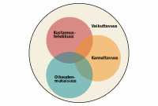

```{r setup, include = FALSE}
if (!require("pacman")) install.packages("pacman")
pacman::p_load(tidyverse, treemapify, pxweb, svglite, RJSONIO, countrycode, data.table, ggrepel)
knitr::opts_chunk$set(echo = FALSE,
                      cache = TRUE,
                      cache.extra = list(
                        sessionInfo(),
                        tools::md5sum("koodit.R")))
knitr::read_chunk("koodit.R")

```

# Tiivistelmä {-}

Ilmastonmuutoksen hillitsemiseksi on olemassa vaikuttavia ja kustannustehokkaita välineitä. Ilmastopolitiikan välineistä on saatavilla valtavasti tutkimustietoa ja käytännön sovelluksista on kertynyt runsaasti kokemuksia. Keinot ilmastonmuutoksen muodostaman uhan torjumiseksi tunnetaan tieteessä paremmin kuin ehkä yleisesti tiedostetaan.

Tässä raportissa esitellään ilmastopolitiikan hillinnän välineitä tutkimuskirjallisuuden pohjalta. Aluksi pohditaan, millaisia ominaisuuksia ilmastopolitiikan välineiltä tulisi odottaa? Hyvällä ilmastopolitiikalla tulisi olla ainakin neljä seuraavaa ominaisuutta:

1. [*Vaikuttavuus*](#vaikuttavuus) on ilmastopolitiikan olennaisin ominaisuus, jota ilman ilmastonmuutos ei hidastu. Käytännössä huonosti suunnitellut ilmastotoimet eivät välttämättä vähennä päästöjä tai lisää hiilinieluja. Näin voi käydä esimerkiksi, jos toimet kohdistuvat päästöihin, [joita säännellään jo ennestään](#paallekkaiset).
2. [*Kustannustehokkuus*](#kustannustehokkuus) tarkoittaa, että saadaan aikaan suurempi ilmastovaikutus pienemmillä kustannuksilla. Kustannustehokkuuden ansiosta resursseja jää enemmän muiden hyvinvoinnin kannalta tärkeiden tavoitteiden edistämiseen. Ero kalliimpien ja halvimpien välineiden välillä on usein jopa [satakertainen](#kvpolitiikka).
3. [*Kannattavuus*](#kannattavuus) tarkoittaa, että ilmastopolitiikan hyödyt ylittävät kustannukset. Vaikka päästöjen vähentäminen on yhteiskunnallisesti kannattavaa, yksilön oman edun näkökulmasta se ei välttämättä ole sitä.
4. [*Oikeudenmukaisuus*](#oikeudenmukaisuus) on pohjimmiltaan subjektiivinen piirre, mutta tutkimuksen pohjalta voidaan arvioida arvovalintojen seurauksia. Ilmastonmuutoksella ja ilmastopolitiikalla on tulonjakovaikutuksia maiden sisällä ja välillä. Tulonjakovaikutukset voidaan usein hyvittää muilla politiikkavälineillä.

Tutkimuskirjallisuudessa on muodostunut verrattain vakiintunut käsitys tarkoituksenmukaisen ilmastopoliittisen kokonaisuuden pääpiirteistä.

1. Hiilen hinnoittelu [*päästökaupan*](#paastokauppa) tai [*hiiliveron*](#hiilivero) avulla on ilmastopolitiikan ensisijainen väline. Päästökaupassa päästöjen tuottamiseen myönnetään rajallinen määrä oikeuksia, joille muodostuu hinta markkinoilla. Vastaava hinta päästöjen tuottamisesta voidaan veloittaa myös hiiliverolla. Päästöoikeuksien määrää supistamalla tai hiiliveroa kiristämällä päästöt saadaan vähenemään niin paljon kuin halutaan. Kustannustehokkuuden ansiosta hiilen hinnoitteluun perustuva ilmastopolitiikka ei aiheuta tarpeetonta haittaa ihmisten hyvinvoinnille.
2. Ilmastopolitiikasta koituvia kustannuksia voidaan keventää [*tukemalla innovaatiotoimintaa*](#tktuki), joka tuottaa nettopäästöjen vähentämiseen uusia teknologisia ratkaisuja ja edistää niiden käyttöönottoa. Uutta teknologiaa kehittämällä Suomi voi vaikuttaa päästöihin kansainvälisesti kokoaan suuremmin. T&k-tuet parantavat ilmastopolitiikan kustannustehokkuutta, mutta eivät vähennä päästöjä yksinään.
3. Yritysten ja kuluttajien ympäristöystävällistä käyttäytymistä voidaan tukea [*tarjoamalla tietoa*](#informaatio) ilmastovaikutuksista valintojen tueksi. Informaatio voi ohjata ihmisiä parempiin valintoihin rajoittamatta vaihtoehtoja tai lisäämättä kustannuksia.
4. [*Tukien*](#ilmastotuet) avulla voidaan kannustaa hiilinielujen kasvattamiseen ja päästövähennyksiin kansainvälisesti. Tuki vähäpäästöiselle tuotannolle ei välttämättä ole kustannustehokas ja se voi jopa lisätä päästöjä.
5. Päästöihin voidaan puuttua myös suoran [*sääntelyn*](#kiellot) keinoin, mikäli kannusteiden luominen muilla välineillä ei onnistu. Kiellot ja sääntely ovat kuitenkin kalliita välineiltä, joille usein löytyy parempia vaihtoehtoja. Sääntely saattaa estää yrityksiä käyttämästä parhaita mahdollisia keinoja päästöjen vähentämiseen.

Ilmastopolitiikan kansainvälistä [kokonaisuutta suunnitellessa](#arkkitehtuuri) on syytä huomioida, että ilmastonmuutoksen pysäyttäminen edellyttää, että laaja joukko maita osallistuu päästöjen vähentämiseen. Jotta ilmastopolitiikan kustannukset pysyvä hallittavina, nettopäästöjä tulisi vähentää painotetusti siellä, missä se on edullisinta. 

Ilmastopolitiikan kokonaisuus on syytä rakentaa niin, että samoja päästölähteitä ei säännellä moneen kertaan [päällekkäisillä ohjauskeinoilla](#paallekkaiset). Päästökaupan piiriin osuvat ylimääräiset ilmastotoimet eivät normaalioloissa auta ilmastoa, mutta lisäävät kustannuksia.

Hiilen hinnoittelu on usein paras kohdistaa [tuotantoketjun alkupäähän](#kohde) eli suoraan fossiilisiin polttoaineisiin eikä niitä hyödyntäviin tuotteisiin. Esimerkiksi lentolippujen verottaminen ei kannusta lentoyhtiöitä vähentämään päästöjään yhtä hyvin kuin lentopolttoaineiden verottaminen.

Hiilivero, päästökauppa ja hiilitulli [kerryttävät valtiolle tuloja](#hiilitulot), joille on ehdotettu monenlaisia käyttötapoja. Jos lisätulot käytetään verorasituksen vähentämiseen, esimerkiksi työn verotusta keventämällä, ilmastopolitiikan kokonaiskustannus voi supistua. Lisätuloja on ehdotettu käytettäväksi myös ilmastopolitiikan oikeutuksen vahvistamiseen.

Toimimalla nopeasti ja valitsemalla välineet viisaasti, ilmastonmuutosta on yhä mahdollista hillitä.


# Esipuhe {-}

Ilmastonmuutos on yksi suurimmista globaaleista muutosvoimista ja lähivuosikymmenten uhkista. Muuttuvalla ilmastolla on myös merkittäviä vaikutuksia talouteen ja yritystoimintaan koko maailmassa. Tietoisuus ilmiöstä on viime vuosina kasvanut voimakkaasti, ja keinoista ilmastonmuutoksen estämiseksi ja rajoittamiseksi keskustellaan tällä hetkellä erittäin paljon. 

Pariisin ilmastosopimuksen tavoitteisiin pääsy edellyttää mittavia päästövähennyksiä. Ilmastopolitiikalle ollaan asettamassa koko ajan kunnianhimoisempia tavoitteita, mutta konkreettisia toimia globaalien päästöjen vähentämiseksi tarvitaan kuitenkin huomattavasti lisää. 

Samaan aikaan kokonaiskuva ilmastopolitiikan keinovalikoimasta ja parhaista vaihtoehdoista on silti varsin puutteellinen. Ilmastonmuutoksen torjuntaan esitetään keinoiksi esimerkiksi erilaisen sääntelyn huomattavan voimakasta kiristämistä, mutta myös markkinamekanismiin perustuvia tapoja kuten päästökauppaa. 

Välineet ilmastonmuutoksen hillitsemiseksi on Tehokkaan Tuotannon Tutkimussäätiön* rahoittama keskustelunaloite, jossa VTT Juha Itkonen analysoi eri keinoja ilmastonmuutoksen torjumiseksi ekonomistin näkökulmasta ja vankkaan tutkimustietoon perustuen. Itkonen kiteyttää tekstissään hyvän ilmastopolitiikan periaatteet, joiden avulla voidaan arvioida eri keinoja ilmastonmuutoksen torjuntaan ja valita niistä parhaat. 

Kirjoittaja on yksi Suomen aktiivisimmista talouspoliittiseen keskusteluun osallistuvista ekonomisteista ja hän on laajasti perehtynyt ilmastopolitiikkaan ja tutkimustietoon eri keinoista ilmastonmuutoksen hillitsemiseksi.

Itkosen kirjoittama keskustelunaloite ilmestyy Tehokkaan Tuotannon Tutkimussäätiön julkaisusarjassa, jossa julkaistaan talouden tuottavuus- ja tehokkuuskysymyksiä eri näkökulmista tarkastelevia raportteja ja selvityksiä. Säätiö toivoo Itkosen työn raportin syventävän Suomessa käytävää keskustelua ilmastopolitiikasta sekä antavan välineitä optimaalisen ilmastopolitiikan harjoittamiseksi. Ilmastonmuutosta on vielä mahdollista hillitä, mutta se edellyttää oikeiden keinojen valintaa nopeasti ja laajasti. 

Kaikki raportissa esitetyt tulkinnat ovat luonnollisesti kirjoittajan omia, eivätkä ne sellaisenaan edusta säätiön tai sen taustayhteisöjen kantoja. 

```{block2, type='flushright', html.tag='p', echo = T}
**Aaro Cantell**
```

###

Ilmastonmuutos on valtavan laaja aihe, jota voi lähestyä lukemattomista eri näkökulmista. Tässä raportissa tarkastelu on rajattu ilmastonmuutoksen hillinnän politiikkavälineisiin. Taustalla on kysymys, millaisilla poliittisilla päätöksillä talous voidaan ohjata vähentämään nettopäästöjä siten, että hyöty ilmastolle olisi mahdollisimman suuri ja kustannus ihmisille mahdollisimman pieni? 

Näin rajattunakin aiheeseen liittyvän tutkimuskirjallisuuden laajuus on mittava. Tässä raportissa pyrin luomaan laaja-alaisen katsauksen kirjallisuuteen ja kokoamaan keskeisimmät havainnot ja tutkimukseen perustuvat politiikkasuositukset. Tällainen tiivistys ei voi koskaan olla täysin tyhjentävä. Tiivistelmän tekijän suurimpana haasteena on rakentaa tasapainoinen ja olennaisilta osilta kattava kokonaisuus. Sen vuoksi olen julkaissut raportin hyödyntäen uudenlaista tekniikkaa.

Tämä raportti on avoimen lähdekoodin julkaisu. Kaikki raportin julkaisuun tarvittava lähdekoodit ovat vapaasti ladattavissa. Lähdekoodi kertoo, mistä käytetyt tiedot on haettu, miten niitä on käsitelty ja miten kuviot on piirretty. Raportti on toteutettu [R-ohjelmistolla](https://cran.r-project.org/), joka on myös avoimen lähdekoodin sovellus. 

Julkaisun lähdekoodi on käännetty useampaan julkaisumuotoon ja on saatavilla [nettisivuna](https://www.ilmastoraportti.fi) sekä [pdf](_main.pdf)-, [epub](_main.epub)- ja [mobi](_main.mobi)-muodossa. Digitaalista raporttia on helppo lukea puhelimella, tabletilla, tietokoneella ja e-kirjojen lukulaitteella tai sen voi tulostaa. 

Lukijat voivat ladata julkaisun [lähdekoodin](https://github.com/itkonen/ilmasto) koneelleen ja ehdottaa siihen parannuksia tai korjauksia. Jos raportista löytyy virheitä, voi ne korjata ja päivittää raportin kaikki digitaaliset versiot. Kaikista muutoksista jää digitaalinen jälki, joka on julkisesti nähtävillä. Vastuu raportin sisällöstä ja sen mahdollisista virheistä säilyy allekirjoittaneella. 

Kun lukija saapuu raportin nettisivulle tai lataa pdf-tiedoston, hän saa raportista aina viimeisimmän, korjatun version. Toiveeni on, että lukija voi näin vakuuttua tietojen oikeellisuudesta, tasapainoisuudesta ja ajantasaisuudesta. 

Julkaisutapa on uusi ja kokeellinen. Sen toimivuus riippuu siitä, miten yleisö ottaa raportin vastaan. Toivon runsasta ja asiallista keskustelua ilmastonmuutoksen hillinnän vaihtoehdoista, jotta ilmasto-ongelman ratkaisuun kyettäisiin valitsemaan tarkoituksenmukaiset välineet. 

Mikäli tämä kokeellinen julkaisutapa osoittautuu onnistuneeksi, olisi suotavaa, että jatkossa yhä useammat poliittisen päätöksenteon tueksi laaditut asiakirjat julkaistaisiin tavalla, joka lisää läpinäkyvyyttä ja tukee julkista keskustelua.

Haluaisin kiittää suuresti kaikkia raportin kanssa auttaneita. Erityisesti haluaisin kiittää Outi Honkatukiaa ja Markku Ollikaista asiantuntevista kommenteista. Lisäksi lämmin kiitos kuuluu Penna Urrilalle ja TTT-säätiön hallitukselle, jotka mahdollistivat tämä raportin laatimisen ja jotka näkivät uuden teknologian tuomat mahdollisuudet julkaisutavassa. Kaikista viisaista kommenteista huolimatta vastaan toki mahdollisista virheistä ja puutteista itse.


```{block2, type='flushright', html.tag='p', echo = T}
**Juha Itkonen**
```

```{block2, type = "info", echo = T}
*Tehokkaan Tuotannon Tutkimussäätiö* on vuonna 1953 perustettu säätiö, jonka tarkoituksena on yritystoiminnan eri alojen tehokkuuden edistäminen suunnittelemalla, ohjaamalla, valvomalla ja tukemalla tätä varten suoritettavaa tutkimustoimintaa. Säätiön taustayhteisöinä ovat Elinkeinoelämän keskusliitto, Finanssiala ry, Kaupan liitto, Keskuskauppakamari sekä Liikkeenjohdon konsultit ry. Säätiön hallituksen puheenjohtajana toimii DI Aaro Cantell ja asiamiehenä VTM Penna Urrila.

*Juha Itkonen* työskentelee tällä hetkellä yrittäjänä perustamassaan Robonomist Oy:ssä, joka tuottaa palveluita tietotyön automatisointiin, data-analytiikkaan ja dynaamisten dokumenttien tuotantoon. Hän on koulutukseltaan valtiotieteiden tohtori ja luonnontieteiden kandidaatti. Hän on perehtynyt laajasti ilmastonmuutokseen väitöskirjassaan, joka käsitteli ilmastonmuutoksen ja verkostojen taloustiedettä. Aiemmin Itkonen on työskennellyt mm. Suomen Pankissa ekonomistina Suomen talouden ennuste-, seuranta- ja analyysitehtävien parissa. Lisäksi hän on työskennellyt ilmastopolitiikan parissa Valtiovarainministeriössä ja Münchenissä Ifo-instituutissa.

```

<!--chapter:end:index.Rmd-->

# Johdanto 

Tietoisuus ilmastonmuutoksen riskeistä on lisääntynyt ja  suomalaiset laajasti haluavat toimia ilmastonmuutoksen hillitsemiseksi [@ilmastobarometri2019]. 
Loppuvuonna 2018 [kahdeksan eduskuntapuoluetta](https://valtioneuvosto.fi/artikkeli/-/asset_publisher/10616/kahdeksan-eduskuntapuoluetta-paatti-yhteisista-ilmastopolitiikan-tavoitteista) linjasi yhteisistä ilmastopolitiikan tavoitteista. Suomi ja EU ovat sitoutuneet Pariisin ilmastosopimuksessa annettuihin päästövähennystavoitteisiin ja päästövähennysten kunnianhimon nostamisesta neuvotellaan. 

Hallitustenvälinen ilmastopaneeli IPCC julkaisi marraskuussa 2018 erikoisraportin, jossa arvioitiin ilmaston 1,5 lämpöasteen nousun vaikutuksia ja mahdollisia polkuja sen estämiseksi. Raportin mukaan ilmaston lämpeneminen yli 1,5 °C aiheuttaisi suurella varmuudella merkittäviä riskejä ihmisille ja luonnolle. Elämän perusedellytykset ovat vaarassa ja riskit terveydelle, elinkeinoille, ruoan- ja vedensaannille, turvallisuudelle sekä talouskasvulle voimistuvat ilmaston lämmetessä. [@IPCC2018.]

Jotta lämpötilan nouseminen yli 1,5 asteen verran voitaisiin estää, se edellyttää nopeita ja laaja-alaisia toimia. Nettopäästöjä tulisi alentaa globaalisti noin 45 prosenttia vuoteen 2030 mennessä verrattuna vuoteen 2010. Vuosisadan puolessavälissä nettopäästöt tulisi saada jo nollaan. Riskit ja kustannukset kasvavat, mikäli ilmastotoimiin ryhtyminen viivästyy. IPCC:n raportti myös toteaa, että Pariisin ilmastosopimuksessa tehdyt sitoumukset eivät suurella varmuudella riitä estämään 1,5 °C lämpenemistä. [@IPCC2018.]

Miten ilmastonmuutosta voidaan hillitä? Vaihtoehtoisia välineitä on runsaasti. Mikäli poliittista tahtoa löytyy, ilmastopolitiikan haasteeksi ei muodostu välineiden puute, vaan tarkoituksenmukaisten välineiden valinta. 

Ilmastopolitiikan välineistä on kertynyt runsaasti sekä tieteellistä tutkimustietoa että kokemuksia käytännön sovelluksista. Meillä on enemmän tietoa ilmastonmuutoksen ratkaisuista kuin ehkä yleisesti tiedostetaan. 

Tässä raportissa esitellään vaihtoehtoisia politiikkavälineitä ilmastonmuutoksen hillitsemiseksi taloustieteellisen tutkimuskirjallisuuden pohjalta. Pyrkimyksenä on tarjota yleistajuinen katsaus välineistä, joilla päätöksentekijät voivat ohjata talouden kohti ilmastotavoitteita.

Ennen vaihtoehtoisten välineiden esittelyä on syytä pohtia, millaisia ominaisuuksia hyvältä ilmastopolitiikalta tulisi odottaa? Millä kriteereillä vaihtoehtoisia välineitä tulisi arvioida, jotta osaamme valita oikeat keinot estää ilmaston yli 1,5 asteen lämpeneminen? 

Pyrkimyksenä on luoda viitekehys, joka auttaa arvioimaan poliittisia vaihtoehtoja ja jäsentämään ilmastokeskustelua. Raportissa tarkastellaan ilmastopolitiikan vaikuttavuutta, kustannustehokkuutta, kannattavuutta sekä oikeudenmukaisuutta. 

Välineet voidaan jaotella seitsemään luokkaan. Näistä keskeisimpiä välineitä ovat päästökauppa ja hiilivero. Lisäksi tarkastellaan kieltoja, sääntelyä, ilmastotukia, hiilitulleja, informaatio-ohjausta sekä teknologisen kehityksen tukia. 

Tarkoituksenmukaisen ilmastopolitiikan kokonaisuudesta on muodostunut tutkimuskirjallisuudessa verrattain yhtenäinen näkemys. Vaikuttava ja kustannustehokas ilmastopolitiikan kokonaisuus perustuu ensisijaisesti hiilidioksidipäästöjen hinnoittelulle, mikä onnistuu markkinaehtoisten välineiden kuten päästökaupan ja hiiliveron avulla. Hiilen hinnoittelu tarkoittaa, että nettopäästöjen aiheuttamisesta koituu niiden tuottajalle kustannus. Hiilen hintaa nostamalla voidaan laskea nettopäästöt tavoitellulle tasolle.

Markkinaehtoisen lähestymistavan tarkoituksena on saada aikaan mahdollisimman suuri ilmastonmuutosta hillitsevä vaikutus ja pienentää siitä aiheutuvia yhteiskunnallisia kustannuksia. Luomalla riittävät taloudelliset kannustimet poliittiset päätöksentekijät voivat ohjata taloudenpitäjät vähentämään nettopäästöjä ja kehittämään siihen tarvittavat teknologiat. Näin päätöksentekijöiden ei tarvitse tuntea syvällisesti kaikkien erilaisten nykyisten ja tulevien tuotantotapojen teknisiä yksityiskohtia tai kuluttajien erilaisia mieltymyksiä.

Hiilen hinnoittelun lisäksi on perusteltua tukea teknologista kehitystä sekä tarjota kuluttajille ja yrityksille päästöjen vähentämistä helpottavaa informaatiota. Ilmastotukien avulla voidaan kannustaa kasvattamaan hiilinieluja ja rahoittaa nettopäästöjen vähennyksiä kansainvälisesti. Mikäli edellä esitetyt välineet eivät ole käytettävissä, on mahdollista myös säännellä päästöjä aiheuttavaa toimintaa suoraan.

Ilmastopolitiikan kokonaisuuden suunnittelussa tulisi huomioida ilmastopolitiikan globaali luonne ja välttää päällekkäisiä välineitä. Myös kotimaisen ilmastopolitiikan tulisi tähdätä ensisijaisesti globaalien nettopäästöjen vähentämiseen, mikä on ilmastonmuutoksen hillinnässä olennaisinta. 

Tutkimuskirjallisuuden perusteella näyttää selvältä, että ilmastonmuutoksen pysäyttämiseksi on olemassa kaikki tarvittavat politiikkavälineet.

Tämän raportin luvussa \@ref(ominaisuuksia) esitellään ilmastopolitiikan välineiltä toivottavia ominaisuuksia, joiden valossa välineitä tarkastellaan luvussa \@ref(valineet). Luvussa \@ref(arkkitehtuuri) pohditaan ilmastopolitiikan arkkitehtuuria eli välineiden muodostamaa kokonaisuutta Suomessa ja kansainvälisesti. Lopuksi keskeisimmät havainnot vedetään yhteen.


<!--chapter:end:01-Johdanto.Rmd-->

# Hyvän ilmastopolitiikan ominaisuuksia {#ominaisuuksia}

Ilmastonmuutoksen hillintään on tarjolla runsaasti vaihtoehtoisia välineitä, mutta mitkä niistä ovat tarkoituksenmukaisia? Millä kriteereillä eri välineitä  tulisi arvioida, jotta osaisimme valita oikeat työkalut ilmastonmuutoksen hillintään?

Keskustelu ilmastopolitiikan sisällöistä muotoutuu helposti hajanaiseksi ja jäsentymättömäksi, mikäli tarkastelulta puuttuu selkeä viitekehys. Tässä luvussa esitellään neljä keskeistä ominaisuutta, joita päätöksentekijä voi edellyttää ilmastopolitiikan välineiltä. 

*Vaikuttavuus* vastaa kysymykseen, kuinka suuren muutoksen toimet synnyttävät. *Kustannustehokkuus* vastaa, voisiko käytetyillä panoksilla saada aikaan suuremman vaikutuksen. *Kannattavuus* vastaa, onko toimien hyöty suurempi kuin kustannus. *Oikeudenmukaisuus* vastaa, koetaanko toimet moraalisesti oikeutetuiksi.

```{r, fig.cap = "Ilmastopolitiikalta toivottavia ominaisuuksia", echo = FALSE}
if (knitr::is_html_output()) {
  
} else {
  knitr::include_graphics("venn.pdf")
}
```

Vaikuttavuus, kustannustehokkuus ja kannattavuus voivat saada arkikielessä päällekkäisiä merkityksiä, mutta niille voidaan myös antaa täsmällinen sisältö. Oikeudenmukaisuus puolestaan on pohjimmiltaan subjektiivinen ominaisuus, mutta myös sen osalta voidaan esittää tutkimukseen perustuvia havaintoja, jotka jäsentävät keskustelua. 

Ilmaston kannalta ainoastaan vaikuttavuudella on merkitystä. Kaikki muut ominaisuudet ovat ihmistä varten. Ideaalitilanteessa ilmastopolitiikalla on kaikki neljä edellä mainittua ominaisuutta.


## Vaikuttavuus {#vaikuttavuus}

```{block2, type = "tiivis", echo = TRUE}
- Vaikuttavuus on ilmastopolitiikan olennaisin ominaisuus, jota ilman ilmastonmuutos ei hidastu.
- Ratkaisu ilmastonmuutokseen koostuu lukuisista pienistä teoista ympäri maailmaa.
- Ilmastotoimien suoria vaikutuksia on helpompi mitata, mutta kokonaisvaikutus riippuu myös markkinoiden reaktioista.

```

Olennaisin ominaisuus ilmastonmuutoksen hillintään pyrkivältä politiikkatoimilla on vaikuttavuus. Ilman vaikuttavuutta ilmastonmuutos ei hidastu. Ilmastotoimien vaikuttavuudella tarkoitetaan sitä, että toimenpiteellä saadaan aikaan aito parannus ilmaston kannalta. Jotta ilmastonmuutosta hillitsevät politiikkatoimet johtaisivat haluttuun lopputulokseen, niiden on oltava vaikuttavia. 

Vaikuttavuus saattaa tuntua ilmeiseltä kriteeriltä, mutta silti se ei aina käytännössä täyty. Yksi syy tähän on, että ilmastotoimet kytkeytyvät myös muihin politiikan osa-alueisiin ja käytännön politiikassa vaikuttavuus jää helposti muiden tavoitteiden varjoon. 

Lisäksi toimenpiteiden vaikuttavuuden ennakoiminen ja osoittaminen on haastavaa. Joissain tilanteissa esimerkiksi markkinareaktiot saattavat tehdä politiikkatoimien vaikutukset tyhjiksi. Näin voi käydä, kun politiikkatoimet kohdistuvat päästökauppasektorille (ks. päällekkäisiä ohjauskeinoja käsittelevä alaluku \@ref(paallekkaiset)).

### Ilmastonmuutoksen keskeisimmät mekanismit

Maapallomme ilmasto on hyvin monimutkainen järjestelmä. Sen keskeisimmät mekanismit tunnetaan jo varsin hyvin, vaikka moniin yksityiskohtiin liittyy yhä epävarmuutta. [@ipcc13.]

Ilmastopolitiikan välineiden valinnan näkökulmasta keskeisimmät ilmastonmuutosta kiihdyttävät tekijät voidaan tiivistää varsin yksinkertaisesti. Ihmisen toiminta vaikuttaa auringosta tulevan ja takaisin avaruuteen heijastuvan energian tasapainoon. Epätasapainon suuruutta mittaa ns. säteilypakote, johon keskeisimpinä tekijöinä vaikuttavat kasvihuonekaasupitoisuudet ilmakehässä ja maan heijastavuus eli albedo.^[On hyvä huomata, että säteilypakotteen lisäksi ihmisen ilmastonmuutosta kiihdyttävät toimet vaikuttavat myös moniin muihin seikkoihin kuten merien happamoitumiseen ja luonnon monimuotoisuuteen.]

Ihmisten toimista säteilypakotteeseen vaikuttaa voimakkaimmin päästöt, jotka syntyvät fossiilisten polttoaineiden käytöstä, teollisista prosesseista, maataloudesta ja jätteistä. Maankäyttö, maankäytön muutokset ja metsätalous vaikuttavat päästöjen ja maan heijastavuuden lisäksi hiilinieluihin, jotka poistavat kasvihuonekaasuja ilmakehästä. Säteilypakotteeseen voidaan myös vaikuttaa suoraan ilmastonmuokkauksella^[Geoengineering.] eli vaikuttamalla heijastavuuteen tai poistamalla kaasuja teknisin keinoin^[Hiiltä voidaan ottaa talteen ja varastoida (carbon capture and storage, CCS) suurten päästölähteiden kuten voimalaitosten yhteydessä. Bioenergian hiilen talteenotto ja varastointi (bio-energy with carbon capture and storage, BECCS) periaatteessa mahdollistaa ilmaston hiilidioksidipitoisuuksien alentamisen.]. [Ks. @Hsiang2018; @ipcc13.]

```{r suomikhk01, fig.cap = "Suomen nettopäästöt ovat hieman laskeneet 2000-luvulla", warning = FALSE, cache = TRUE}
```

Edelleen yksinkertaistaen ilmaston voi ajatella olevan ikään kuin suuri tiskiallas, jossa päästöt ovat vesihana ja hiilinielut viemäri. Kun vettä virtaa hanasta nopeammin kuin viemäristä poistuu, allas täyttyy, eli ilmaston kasvihuonekaasupitoisuudet lisääntyvät. Mitä korkeammalla altaan pinta on, sitä nopeammin ilmasto muuttuu. Ilmastopolitiikalla pyritään sulkemaan hanaa ja avaamaan viemäriä. Allas on globaalisti yhteinen eli kaikki maat omalta osaltaan vaikuttavat siihen, miten paljon vettä virtaa altaaseen ja siitä pois. 

Politiikkavälineiden valinnan kannalta on syytä myös huomioida, että luonnollisia hiilinieluja lisäävät toimet (kuten hiilen sitominen metsiin ja viljelysmaihin) vaikuttavat tyypillisesti hitaasti ja vasta pitkän ajan kuluessa. Myös luonnollisten nielujen mittaamisen ja pysyvyyden epävarmuus rajoittaa niiden hyödyllisyyttä ilmastonmuutoksen hillinnässä. Lisäksi lämpeneminen voi kiihtyä erilaisten takaisinkytkentöjen vuoksi, mikäli lämpötila ehtii nousta riittävän suureksi.
 
### Pienistä vaikutuksista koostuva globaali ongelma

Yksittäisten ilmastotoimien vaikutus on tyypillisesti niin pieni, että saattaa syntyä houkutus sanoa, että niillä ei ole lainkaan vaikutusta. Tässä on kuitenkin suuri vaara virhepäätelmille. Monta pientä pyöristysvirhettä voi summautua suureksi virheeksi. Kun tarkastella globaalia ilmiötä, on helppo löytää sellainen mittatikku, jota vasten yksittäinen toimi näyttää häviävän pieneltä.

Esimerkiksi yksittäisen ihmisen ruokavalintojen vaikutus ihmiskunnan kokonaispäästöihin on pieni siitä yksinkertaisesta syystä, että maapallolla asuu paljon ihmisiä ja päästöjä syntyy muustakin kuin ruoantuotannosta. Mutta jos suurempi ihmisjoukko muuttaa ruokailutottumuksiaan, yhteisvaikutus voi olla suuri. Jos yksittäiset vaikutukset pyöristää nollaan, saattaa erehtyä ajattelemaan, että myös suuren joukon toimiessa samalla tavalla toimilla ei ole merkittävää vaikutusta. 

Vaikutuksien suuruutta pohtiessa voi myös olla houkuttelevaa ajatella, että ilmastonmuutoksen ongelma olisi ratkaistavissa muutamalla isolla toimenpiteellä. Toisin sanoen saatetaan ajatella, että ilmastopolitiikan tulisi rajoittua toimiin, joilla ratkaistaan merkittävä osa ongelmasta kerralla. 

Ilmastonmuutos on kuitenkin monimutkainen globaali ongelma, johon vaikuttavat miljardien ihmisten valinnat lähes kaikilla elämän osa-alueilla. Sen takia ei ole syytä odottaa, että löytyisi niin sanottu hopealuoti, joka ratkaisisi suoraviivaisesti valtaosan ilmasto-ongelmasta kerralla. On todennäköisempää, että käytännössä ratkaisu tulee koostumaan lukuisista pienistä toimista, joilla on yksittäin pieni mutta yhdessä merkittävä vaikutus ilmastonmuutoksen hillinnässä.

Ilmastonmuutos on globaali ongelma myös siinä suhteessa, että ei ole juuri väliä, missä päin maapalloa vaikutukset syntyvät. Ilmaston kannalta vaikutus on sama riippumatta siitä, vähennetäänkö päästöjä Suomessa vai Kiinassa. Tämä on tärkeä huomioida, kun pohditaan, missä suhteessa Suomen tulisi jakaa panoksiaan kotimaisten ja ulkomaisten päästövähennysten välillä.

Vaikuttavuutta on tärkeä korostaa myös siitä syystä, että se kiinnittää huomion panosten sijaan tuloksiin. Ilmastonmuutoksen kannalta ei ole merkitystä sillä, kuinka suuria ponnistuksia tai uhrauksia ilmastonmuutoksen hillinnän eteen tehdään. Ilmastotavoitteiden toteutumisen kannalta vain sillä on merkitystä, miten vaikuttavia toimet ovat.

```{block2, type = "laatikko", echo = TRUE}
### Erilaisten vaikutusten yhteismitallisuus

Mittarina vaikuttavuuden arvioinnissa periaatteessa tulisi käyttää säteilypakotetta, joka kuvaa maapallolle saapuvan ja poistuvan säteilyn välistä eroa. Käytännössä kuitenkin on usein luontevampaa mitata vaikuttavuutta hiilidioksidipäästöillä ja suhteuttaa muut vaikutukset niihin. Hiilidioksidiekvivalentti (CO₂-ekv.) on suure, joka tekee yhteismitalliseksi muut vaikutukset kuten metaanipäästöt ja nielujen muutokset. Myös vaikutukset maapallon heijastavuuteen voidaan mitata säteilypakotteella. 

Nielujen osalta vaikutusten yhteismitalliseksi tekeminen on haastavaa, sillä nieluihin kohdistuvien toimien vaikutukset näkyvät tyypillisesti pitkän aikavälin kuluessa. Pääsääntöisesti päästöihin kohdistuvat toimet vaikuttavat heti, kun taas nielujen lisääminen poistaa kasvihuonekaasuja pitkän ajan kuluessa.
```

### Suorat vaikutukset

Ilmastotoimen vaikuttavuudessa on kyse kausaliteetista eli siitä, miten ilmasto kehittyy toimien toteutuessa, verrattuna tilanteeseen, jossa toimet olisivat jääneet toteutumatta. Vaikuttavuutta siis voidaan mitata vertailemalla päästöjen kokonaismäärää toimenpiteen kanssa ja ilman sitä. 

Kausaalisuhteiden voimakkuuden määrittäminen on yhteiskuntatieteiden kentällä tunnetusti erityisen haastavaa. Vaikka ilmastotoimien suoria vaikutuksia on usein helpompi mitata, haaste piilee siinä, miten ihmiset reagoivat muutoksiin. Ilmastonmuutoksen hillinnän kannalta tärkeintä olisi ymmärtää kokonaisvaikutuksia eli huomioida sekä suorat että epäsuorat vaikutukset.

Suorat vaikutukset voidaan usein mitata yksinkertaisen fysiikan ja kemian perusteella. Esimerkiksi tiedämme, kuinka paljon bensiinissä on hiiliatomeja litraa kohden ja miten ne muuttuvat palamisreaktiossa hiilidioksidiksi. Voimme siis laskea, paljonko bensalitran kulutuksesta syntyy päästöjä. Maatalouden, metsänhoidon, maankäytön ja jätteiden osalta päästöjen mittaaminen on mutkikkaampaa. [@ipcc07b.] Esimerkiksi arviot hakkuumäärien vaikutuksesta metsänieluihin ovat yhä epävarmoja ja aihe vaatii lisää tutkimusta [@Ilmastopaneeli2019].

### Epäsuorat vaikutukset

Suurin haaste piilee epäsuorien vaikutusten mittaamisessa. Jos kuluttaja jättää yhden bensalitran ostamatta, jääkö se todella käyttämättä? Jääkö raakaöljy maan alle vai myydäänkö se halvemmalla jollekulle toiselle? Talouden toimijat reagoivat muiden valintoihin ja valtion politiikkatoimiin. Markkinoilla hinnat sopeutuvat ja ohjaavat hyödykkeiden tuotantoa ja kulutusta. Tavanomaisesti markkinoilla kysynnän heikkeneminen saa tuottajat alentamaan hintojaan, joten lopulta kulutuksen määrä vähenee hieman vähemmän kuin kysyntä alun perin. 

Teoriassa on mahdollista, että kansallisen ilmastopolitiikan kiristymisen seurauksena osa tuotannosta siirretään maihin, joissa sääntely on kevyempää. Tämän ns. hiilivuodon suuruudesta ja olemassaolosta on kiistelty. Hiilivuodon seurauksena globaalit päästöt eivät vähene yhtä paljon kuin kotimaiset päästöt. Empiiristä näyttöä hiilivuodosta ei kuitenkaan juuri ole löytynyt [@vatt2016]. Näytön puute voi osaltaan johtua myös siitä, että pitkän aikavälin vaikutuksia on vaikea havaita empiirisesti. Laskennalliset talousmallit viittaavat hiilivuodon riskiin, mutta tulosten vaihteluväli on suuri ja kokonaisvaltaisemmissa malleissa hiilivuoto arvioidaan melko vähäiseksi [@Aldy2010; @pmr2015]. 

On myös mahdollista, että kotimaiset ilmastotoimet aiheuttavat positiivisia vaikutuksia ulkomailla. Hiilivuodon vastakohtana on puhuttu myös tuulivuodosta, eli siitä että puhtaan teknologian kehitys ja kaupallistaminen alentaa kustannuksia ja kannustaa muita maita päästövähennyksiin [@vnk2008]. Hiilivuodon riski pienenee, kun muissa maissa sovelletaan tiukkoja ilmastonormeja. On myös mahdollista, että johtajuus ja konkreettinen esimerkki kunnianhimoisemmasta ilmastopolitiikasta kannustaa muita maita vähentämään päästöjä, mutta tällaiselle vaikutusmekanismille ei löytyne tutkimusnäyttöä.

```{block2, type = "laatikko", echo = TRUE}
### Vihreä paradoksi

Äärimmäisenä esimerkkinä epäsuorista vaikutuksista on ns. vihreän paradoksin teoria, jonka mukaan raakaöljyn kysyntää supistavat politiikkatoimet jopa kannustavat kiihdyttämään öljyntuotantoa. 

Teoria lähtee siitä, että öljykenttä on omistajilleen pääoma, joka saa arvonsa siitä, että öljy tullaan aikanaan nostamaan ja myymään markkinoille. Omistaja maksimoi tuottonsa myymällä öljyn kokonaisuudessaan ja mahdollisimman korkealla hinnalla. Kun ilmastopolitiikka uhkaa alentaa öljyn hintaa tulevaisuudessa, syntyy kannustin pumpata öljykenttä nopeammin tyhjäksi.

Teorian taustalla oleva yksinkertainen malli kuvaa kuitenkin heikosti havaittua käyttäytymistä, ja vallitseva käsitys tutkijoiden keskuudessa näyttäisikin olevan, ettei vihreä paradoksi ole merkittävä uhka. Esimerkki kuitenkin alleviivaa, kuinka haastavaa kokonaisvaikutusten määrittäminen voi olla.
```

## Kustannustehokkuus {#kustannustehokkuus}

```{block2, type = "tiivis", echo = TRUE}
- Kustannustehokkailla välineillä saadaan aikaan suurempi ilmastovaikutus pienemmillä kustannuksilla.
- Tehottomuus tarkoittaa, että tilaisuus hyvinvoinnin parantamiseen jätetään käyttämättä.
- Ero kalliimpien ja halvimpien välineiden välillä voi käytännössä olla jopa satakertainen.

```

Kustannustehokkuus on hyvinvoinnin kannalta tärkeä ilmastopolitiikan ominaisuus. Mikäli ilmastotoimet valitaan kustannustehokkuudesta huolehtien, haluttu vaikutus voidaan saada aikaan pienemmillä kustannuksilla. 

Kustannustehokkuus mittaa vaikutusten suhdetta kustannuksiin. Kustannustehokkuus on sitä suurempi, mitä suurempi vaikutus saadaan tietyillä kustannuksilla tai mitä pienemmillä kustannuksilla saadaan aikaan tietty vaikutus. 

Kustannustehokkaaksi voidaan kutsua tilannetta, jossa vaikutusta ei voida kasvattaa lisäämättä kustannuksia, eikä kustannuksia voida vähentää supistamatta vaikutusta. Toisin sanoen, kustannustehokasta tilannetta ei voida muuttaa luopumatta joko tuotoksista tai panoksista. 

### Hyvinvointi ja kustannustehokkuus

Kustannustehokkuuden ansiosta yhteiskunnalle jää enemmän resursseja muiden hyvinvoinnin kannalta tärkeiden tavoitteiden edistämiseen. Ilmastotoimet kilpailevat samoista voimavaroista kuin esimerkiksi koulutus, terveydenhuolto, sosiaalipalvelut, maanpuolustus, investoinnit ja yksityinen kulutus. Tehottomuus tarkoittaa, että tilaisuus ihmisten hyvinvoinnin parantamiseen jätetään hyödyntämättä.

Kustannustehokkuutta parantamalla on mahdollista saada aikaan suurempi ilmastonmuutosta hillitsevä vaikutus. Jos valitsemme ilmastotoimet piittaamatta kustannustehokkuudesta, on suuri vaara, että tavoitellut päästövähennykset muuttuvat mahdottomiksi. 

Ilmastonmuutoksen hillitsemisen kustannusten arvioidaan tyypillisesti vastaavan muutaman prosentin leikkausta kulutukseen, mutta tämä edellyttää, että ilmastopolitiikka on kustannustehokasta [@IPCCwg3ar5]. Käytännössä ei kuitenkaan ole epätavallista, että ilmastopolitiikkaa toteutetaan välineillä, joiden kustannukset ovat kymmen- tai jopa satakertaiset halvimpiin vaihtoehtoihin nähden [ks. esim. @Aldy2016; @Gillingham2018]. 

Jos esimerkiksi kustannukset nousevat kymmenkertaisiksi, kasvaa ilmastonmuutoksen hillitsemisen hintalappu myös kymmenkertaiseksi. Silloin se vastaa muutamien prosenttien sijaan kymmenien prosenttien leikkausta kotitalouksien kulutukseen. Jos kustannukset nousevat satakertaisiksi, on ilmeistä, että ilmastonmuutoksen torjuminen muuttuu mahdottomaksi.

### Pääsääntöisesti ilmastopolitiikka maksaa

Ilmastopolitiikkaan liittyy monia oheishyötyjä, mutta pääsääntöisesti on syytä olettaa, että ilmastopolitiikka maksaa. Tämän maksun vastineeksi ilmastonmuutos hidastuu.

Ilmastonmuutoksen torjuminen edellyttää, että osa yhteiskunnan voimavaroista käytetään ilmaston hyväksi ja että saastuttavimmista teknologioista luovutaan. Tulevaisuudessa taloudellisesti tuottavimmat tuotantotavat eivät välttämättä ole enää käytettävissä [ks. @Gillingham2018]. Joudumme tuottamaan hyvinvointimme ikään kuin toinen käsi sidottuna selän takana.

On kuitenkin mahdollista, että alkuun kansantaloudessa on yhä hyödyntämättä sellaisia keinoja, jotka säästävät sekä ilmastoa että muita resursseja. Niin sanotun Porterin hypoteesin mukaan ympäristösääntely voi kannustaa parantamaan tuottavuutta ja luomaan innovaatioita niin, että kannattavuus ja kilpailukyky paranevat. 

Porterin hypoteesiin sopii suhtautua epäillen, sillä voidaan odottaa, että oman edun nimissä yritykset ovat jo suurelta osin hyödyntäneet mahdollisuudet parantaa kannattavuuttaan. Empiirinen evidenssi ei kuitenkaan anna kysymykseen yksioikoista vastausta [@Sterner2013; @Ambec2013; @OECD2018].

Ilmastopolitiikan ideana on vaihtaa ilmastonmuutoksen aiheuttamat kustannukset ilmastopolitiikan kustannuksiksi. Jotta vaihtokauppa olisi mielekäs, ilmastotoimien kustannukset tulisi pitää mahdollisimman pieninä verrattuna niiden vaikutuksiin.

### Edullisimmat toimet ensin

Kustannustehokkuuden ominaisuus täyttyy määritelmän mukaan, kun ensin toteutetaan ilmastotoimet, joissa kustannus on pienin. Ilmastonmuutoksen hillintä tulisi siis aloittaa edullisimmasta ja edetä järjestyksessä kohti kalliimpia toimia. Tyypillisesti edullisimpia ovat energiatehokkuutta edistävät ohjelmat ja kalleimpia esimerkiksi vanhojen autojen romutuspalkkiot [@Gillingham2018]. 

Edellä kuvatulla tavalla voidaan päästä haluttuun päästövähennystavoitteeseen kustannustehokkaasti. Vaihtoehtoisia ilmastotoimia lisätään toteutettavien toimien listalle, kunnes niiden yhteenlasketut vaikutukset riittävät haluttuun tavoitteeseen. Näin tavoitteeseen päästään mahdollisimman pienin kokonaiskustannuksin.

Mikäli toteutettavien toimien listalle valitaan kalliimpia toimia kuin mitä olisi käytettävissä, kustannustehokkuus heikkenee ja ihmisten hyvinvoinnille voi aiheutua tarpeetonta vahinkoa. Poliittisen päätöksentekijöiden suurimpana haasteena onkin luoda kannustimet, jotka ohjaavat talouden toimijat toteuttamaan edullisimmat toimet.^[Kun kaikki mahdolliset ilmastotoimet järjestetään kustannustehokkuuden mukaan, voidaan piirtää ns. päästövähennysten rajakustannuskäyrä (marginal abatement cost curve). Se kertoo, kuinka paljon yhden CO₂-päästötonnin vähentämisen suuruisen vaikutuksen aikaansaaminen maksaa kullakin päästövähennysten määrällä, kun päästöjä vähennetään kustannukset minimoiden.]

```{block2, type = "laatikko", echo = TRUE}
### Yhden hinnan laki

Yksinkertaisessa talousteoreettisessa tarkastelussa kustannustehokkuus edellyttää, että nettopäästöjen vähentämisen rajakustannus (eli yhden lisäyksikön vähentämisen lisäkustannus) on sama kaikkialla. Äärimmillään se tarkoittaa, että globaalisti kaikissa maissa ja kaikilla toimialoilla päästöjen vähentäminen ja nielujen kasvattaminen on yhtä kallista. Yhden hinnan laki on yksinkertaisuudessaan hyvä ohjenuora käytännön päätöksentekoon, mutta on syytä myös huomioida, että teoreettiseen tulokseen liittyy vahvoja oletuksia [@chic94; @Chichilnisky1994].

Täydellistä kustannustehokkuutta tuskin koskaan tullaan saavuttamaan, mutta käytännössä kustannustehokkuus paranisi merkittävästi esimerkiksi, jos ilmastopolitiikan kireys olisi sama kaikissa maissa [@Aldy2016]. Vastaavasti EU:n ilmastopolitiikan kokonaiskustannuksia voitaisi vähentää tinkimättä päästötavoitteista, jos päästökauppasektorin ja muiden sektoreiden päästövähennystavoitteet olisivat yhtä tiukat [@Böhringer2009; @Böhringer2006].
```

## Kannattavuus

```{block2, type = "tiivis", echo = TRUE}
- Ilmastopolitiikka on kannattavaa, kun sen hyödyt ylittävät kustannukset.
- Vaikka päästöjen vähentäminen on kannattavaa, se ei välttämättä ole sitä yksilön oman edun näkökulmasta.
- Optimaalisen päästöjen määrän ja hinnan määrittäminen on haastavaa.

```

Tutkijoiden keskuudessa ilmastonmuutoksen hillinnän yleisestä kannattavuudesta ei juuri esiinny kiistaa. Kattavien arvioiden mukaan ilmastonmuutoksen hidastamisen kustannukset ovat toimettomuuden kustannuksia pienemmät [@ster07; @IPCCwg3ar5]. On kuitenkin perusteltua kysyä, kannattaako ilmastonmuutoksen hillintä yksilön tai yksittäisen maan näkökulmasta? Kuinka paljon ja kuinka nopeasti ilmastonmuutosta tulisi hillitä? Kannattaako kaikkia välineitä ilmastonmuutoksen hillitsemiseksi käyttää?

Kun pohtii ilmastonmuutoksen aiheuttamaa uhkaa ihmiskunnalle ja tilanteen kiireellisyyttä, voi tuntua luontevalta vastata, että meidän on tehtävä kaikkemme katastrofin välttämiseksi. Tämän vastapainoksi on kuitenkin helppo keksiä myös toimia, jotka hillitsevät ilmastonmuutosta, mutta joiden toteuttamista on vaikea suositella. Ilmastotoimet voivat olla myös hyvinvointia heikentäviä.

Kysymyksiä kannattavuudesta voidaan lähestyä systemaattisesti kustannus--hyöty-analyysin avulla. Ilmastotoimia voidaan pitää kannattavina, jos niiden aiheuttamat hyödyt ovat suuremmat kuin kustannukset. 

Hyödyt ja kustannukset on tässä ymmärrettävä hyvin laajassa merkityksessä. Välttämättä kaikki vaikutukset eivät ole millään mielekkäällä tavalla rahassa mitattavia. Ideaalisesti arvioinnissa tulisi huomioida kaikki hyvinvoinnin kannalta merkitykselliset vaikutukset sekä lyhyellä että pitkällä aikavälillä. Myös lopputulemiin liittyvä epävarmuus voidaan tulkita kustannuksena. 

### Yksityinen ja yleinen etu

Vaikka ilmastotoimet ovat yhteiskunnallisesti kannattavia, ne eivät välttämättä ole sitä yksilön oman edun näkökulmasta. Tyypillisesti, kun yksittäinen ihminen vähentää päästöjä, kustannukset koituvat yksilölle itselleen, mutta hyödyt jakautuvat kaikkien kesken. 

Yksilön näkökulmasta kustannusten ja hyötyjen suhde ei aina ole riittävän kannustava, vaikka koko ihmiskunnan näkökulmasta toimet olisivatkin kannatettavia. Yleinen ja yksityinen etu vetävät eri suuntiin. 

Ilmastopolitiikkaa vaivaa siis eräänlainen vapaamatkustajaongelma. Esimerkiksi joukkoliikenteen käyttäjät saattavat ajatella säästävänsä kustannuksissa jättämällä lipun maksamatta.^[Yksittäisellä vapaamatkustajalla ei ole suurta vaikutusta siihen, järjestetäänkö joukkoliikennepalvelu vai ei.
Jos lisäksi kiinnijäämisen riski ja kustannus ovat pieniä, liputta matkustaminen saattaa olla oman edun nimissä kannattavaa.] Mutta vapaamatkustaminen siirtää taakan muille matkustajille, mikä saattaa kaikkien vahingoksi johtaa siihen, että arvokas palvelu jää kokonaan tuottamatta.

Vastaavasti ilmastonmuutoksen tapauksessa yksittäinen ihminen saattaa ajatella, että pääsee helpommalla, kun ei tee mitään. Yksittäisen ihmisen valintojen vaikutus lopputulokseen on pieni. Jos kuitenkin muut ryhtyvät ilmastotoimiin, vapaamatkustaja pääsee nauttimaan suotuisammasta ilmastosta osallistumatta kustannuksiin. 

Vapaamatkustajaongelma vaivaa myös kansainvälistä ilmastopolitiikkaa varsinkin pienien maiden osalta. Maat, jotka ryhtyvät toimiin ilmastonmuutoksen hillitsemiseksi, maksavat kustannukset, mutta myös ne maat, jotka eivät tee mitään, pääsevät hyötymään tästä palveluksesta.

Taloustieteessä on pitkään tutkittu myös mahdollisuutta, että yksittäiset maat voisivat muodostaa keskenään puhtaasti omaan etuun perustuvia koalitioita [@Barrett1994; @Carraro1993]. Koalitioita voidaan yrittää vahvistaa hiilitullien ja taloudellisen yhteistyön avulla [@Nordhaus2015; @Carraro2017]. Yleinen tulos kuitenkin on, että koalitiot jäisivät pieniksi, epävakaiksi ja kunnianhimoltaan vaatimattomiksi. 

```{block2, type = "laatikko", echo = TRUE}
### Yhteisesti omistettujen resurssien ongelma

Ilmaston voi tulkita myös ylikulutettuna resurssina, jota vaivaa niin sanottu yhteismaan ongelma (tragedy of the commons). Yhteismaan ongelma syntyy, kun omaa etuaan ajavat toimijat ylikuluttavat vapaasti yhteisessä käytössä olevaa resurssia ja päätyvät tilanteeseen, jota kukaan ei toivoisi. [@Hardin1968.]

Näin voi käydä esimerkiksi, kun karjanomistajat laiduntavat yhteismaalla ilman kannustimia rajoittaa karjan määrää kestävälle tasolle. Araljärven kuivuminen on käytännön esimerkki siitä, kuinka huonosti määritellyt käyttö- ja omistusoikeudet voivat aiheuttaa ympäristöongelmia [@CS2010]. Samaan tapaan ihmiset ovat ylikuluttaneet luonnon kykyä sitoa hiilidioksidipäästöjä, mikä on johtanut hallitsemattomaan ilmastonmuutokseen. 

Usein yhteisöt onnistuvat itse ratkaisemaan paikallisia yhteismaan ongelman sopimalla yhteisten resurssien käytön rajoittamisesta, mutta ilmastonmuutoksen globaali ja monimutkainen luonne vaikeuttaa sopimista [@Ostrom1999]. 

Valtiot voivat ratkoa paikallisia yhteismaan ongelmia määrittelemällä omistusoikeudet resursseille tai verottamalla resursseja siten, että käyttö asettuu kestävälle tasolle. Esimerkiksi paikallisen järven ylikalastus voidaan estää myöntämällä rajallinen määrä kalastusoikeuksia tai asettamalla riittävän korkea kalastusmaksu. 
```

### Kansainvälinen ratkaisu

Koska ilmasto on globaali yhteismaa, ilmasto-ongelma voitaisiin periaatteessa ratkaista kansainvälisellä sopimuksella, joka toimisi samaan tapaan kuin paikalliset yhteismaan ongelmien ratkaisut. Ilmastonmuutosta hillitsevistä toimista on käyty kansainvälisiä neuvotteluja YK:n ilmastonsuojelun puitesopimuksen (UNFCCC) puitteissa vuodesta 1992 alkaen. 

Alkuun osapuolet pyrkivät sopimaan päästöille laillisesti sitovan ylärajan, joka velvoittaisi sanktioiden uhalla maat hillitsemään päästöjään. Kioton pöytäkirjassa vuonna 1997 tällaisesta rajasta sovittiin, mutta sopimuksen kattavuus jäi lopulta heikoksi. Kaikki maat eivät nähneet sopimusta osaltaan kannattavana.

Yksityisen ja yleisen edun välistä ristiriita voidaan tulkita myös peliteoreettisesti niin sanottuna vangin dilemmana. Vangin dilemmassa yhteistyö johtaisi kaikkien kannalta hyvään lopputulokseen, mutta yksittäisillä mailla on houkutus livetä sopimuksesta. 

Omaa etuaan tavoitteleva maa voi katsoa, että luopumalla kalliista ilmastotoimistaan se saa yhä valtaosan suotuisan ilmaston tuomista hyödyistä, mutta säästää ilmastopolitiikan kustannukset. Näin maa saattaa päätyä johtopäätökseen, että sen kannattaa luopua ilmastopolitiikastaan. Kun muutkin maat ajattelevat samoin, yhä useampi lipeää sopimuksesta. Silloin päädytään tilanteeseen, jossa kaikki ovat alkutilannetta huonommassa asemassa.

Yleisen ja yksityisen edun ristiriita onkin tietyllä tavalla ilmasto-ongelman juurisyy. Oman edun lyhytnäköinen tavoittelu ei johda yhteiskunnallisesti parhaaseen lopputulokseen. 

### Kannattava tavoite

Oletetaan seuraavaksi, että maat onnistuisivat pääsemään ylitse edellä kuvatuista ongelmista ja ryhtyisivät toteuttamaan globaalisti optimaalista ilmastopolitiikkaa. Kuinka paljon ja kuinka nopeasti nettopäästöjä kannattaisi vähentää?

Optimaalisen päästövähennyspolun löytäminen edellyttää ilmastopolitiikan kustannusten ja hyötyjen punnitsemista. 

Lähtökohtaisesti voidaan ajatella, että ilmastopolitiikan kiristämisen kustannukset kasvavat sitä suuremmiksi, mitä enemmän nettopäästöjä vähennetään ja mitä nopeammin toimitaan. Alkuun päästöjen vähentäminen ja nielujen kasvattaminen on verrattain edullista: helppoja keinoja on yhä runsaasti käyttämättä. Kun helpot ja halvat keinot (ns. matalalla roikkuvat hedelmät) on käytetty, on siirryttävä kalliimpiin vaihtoehtoihin. 

Samoin jos ilmastopolitiikan kiristys tehdään hyvin nopeasti, talouden toimijoille jää vähemmän aikaa sopeutua muutokseen. Ylimääräisiä tappioita voi syntyä esimerkiksi, jos toimivia koneita ja laitteita joudutaan hylkäämään ennen kuin ne on kulutettu loppuun. Jos päästöjä vähennetään liian nopeasti, kustannukset saattavat ylittää hyödyt. Samasta syystä kustannuksissa voidaan säästää, jos ilmastotoimiin ryhdytään mahdollisimman varhain.

### Yhdennetyn arvioinnin mallit

Ilmastopolitiikan ensisijainen hyöty on ilmastonmuutoksen aiheuttamilta vahingoilta säästyminen. Ilmastonmuutoksen kustannuksia voidaan arvioida käyttämällä niin sanottuja yhdennetyn arvioinnin malleja^[Integrated assesment models.]. Arviointimallit muodostavat tyylitellyn kuvan sekä globaalista taloudesta että ilmastosta. Mallit mahdollistavat ilmastonmuutoksen aiheuttamien vahinkojen arvioinnin tavalla, joka on ilmastopolitiikan kustannusten kanssa yhteismitallinen. [@Nordhaus2017; @ster07.]

Arviointimalleilla voidaan tuottaa estimaatti *hiilen sosiaalisesta kustannuksesta*^[Social cost of carbon.], joka mittaa päästöjen aiheuttamaa kokonaiskustannusta. Se siis kertoo, paljonko yhden hiilidioksiditonnin lisääminen ilmakehään aiheuttaa ilmastonmuutoksesta johtuvia kustannuksia, kun kaikki sen aiheuttamat vaikutukset summataan globaalisti. 

Arviointimallien mukaan ilmaston lämpeneminen yli puolentoista asteen asettaa monia elämän perusedellytyksiä vaaraan ja riskit voimistuvat, mitä pidemmälle lämpeneminen etenee [@IPCC2018]. Tämä käytännössä tarkoittaa, että ensimmäiset toimet ilmastonmuutoksen hillitsemiseksi ovat kaikkein hyödyllisimpiä.

Ilmastonmuutoksen vaikutusten arviointiin liittyy huomattavaa epävarmuutta ja arviot vaihtelevat parista kymmenestä eurosta aina satoihin euroihin [@Nordhaus2017; @Nordhaus2013]. Yleinen tulos arviointimalleja hyödyntävässä tutkimuskirjallisuudessa on, että merkittävimmät kustannukset ja myös epävarmuudet liittyvät katastrofien riskiin [@Aldy2010; @Nordhaus2013]. 

Arviointimallien hyödyllisyyttä politiikka-arvioinnissa on myös kyseenalaistettu voimakkaasti [@Pindyck2013]. Merkittävimmät kustannukset liittyvät katastrofien riskeihin, ja näiden todennäköisyyksien ja seurausten arvioiminen on erityisen epävarmaa [@Aldy2010; @Heal2017].

### Ilmastopolitiikan tavoitteen asettaminen

Kustannus--hyöty-analyysin näkökulmasta ilmastopolitiikka kannattaa siis aina, kun päästötonnin vähentämisen kustannus on pienempi kuin sen aiheuttama hiilen sosiaalinen kustannus. Ensimmäiset, edullisimmat toimet ovat suurella todennäköisyydellä kannattavia. Nettopäästöjen kiristämistä kannattaa jatkaa niin pitkälle, kun hyödyt ylittävät kustannukset. Koska ilmastopolitiikan kiristyessä päästövähennysten rajakustannukset kasvavat ja rajahyödyt supistuvat, jossain vaiheessa saavutetaan optimaalinen päästöjen määrä. Tämän jälkeen päästöjen vähentämisen rajahyödyt olisivat vähäisemmät kuin rajakustannukset.

On hyvä huomata, että jossain määrin myös kustannustehottomat toimet voivat olla kannattavia. Tämä on mahdollista, mikäli ilmastopolitiikan viritys on alle optimaalisen tason. Silloin on todennäköisesti löydettävissä sellaisia toimia, joiden hyödyt ylittävät kustannukset, vaikka niille olisi kustannustehokkaampia vaihtoehtoja.

Vaikka kustannus--hyöty-analyysi antaa käsitteellisesti selkeän tavan määrittää optimaalisen ilmastopolitiikan mitoituksen, se ei välttämättä ole käytännön politiikan kannalta tarkoituksenmukainen. Optimaalisen päästötavoitteen määrittämiseen liittyy paljon erimielisyyttä ja epävarmuutta. Käytännössä  ilmastopolitiikan tavoitteenasettelussa onkin käytetty suoraan ilmaston lämpötilapoikkeamaa ja sen edellyttämiä nettopäästöjen vähennyksiä. 


## Oikeudenmukaisuus {#oikeudenmukaisuus}

```{block2, type = "tiivis", echo = TRUE}
- Ilmastonmuutoksella ja ilmastopolitiikalla on tulonjakovaikutuksia maiden sisällä ja välillä.
- Tulonjakovaikutukset voidaan usein kompensoida muilla politiikkavälineillä.

```

Ilmastopolitiikan toimia voidaan tarkastella myös laajemmin moraalisena kysymyksenä ja pohtia niiden oikeudenmukaisuutta. Ilmastonmuutokseen liittyy monia yksilöiden, maiden ja sukupolvien välisiä eettisiä kysymyksiä [@Gardiner2012]. 

Kysymys politiikkatoimien oikeudenmukaisuudesta on pohjimmiltaan subjektiivinen, eikä tiede voi sanoa, minkälaisten arvojen pohjalta ilmastopolitiikan välineitä ja niiden vaikutuksia tulisi arvioida. Tutkimuksen pohjalta voidaan kuitenkin nostaa eräitä huomioita keskusteluun ja arvioida erilaisten oikeudenmukaisuuteen vetoavien valintojen ilmastollisia ja taloudellisia seurauksia.

### Ilmastopolitiikan tulonjakovaikutukset

Ilmastopolitiikka vaikuttaa jossain määrin tulonjakoon maiden sisällä ja maiden välillä. Vaikutus on voimakkaampi kotitalouksille, joiden kulutuksesta suurempi osa koostuu runsaspäästöisistä hyödykkeistä ja joiden toimeentulo perustuu runsaspäästöiseen tuotantoon. 

Pääsääntöisesti suurituloiset kuluttavat enemmän ja siten aiheuttavat enemmän päästöjä. Toisaalta pienituloisten kulutuksen päästöt suhteutettuna kulutuksen rahalliseen arvoon on suurempi. Heidän kulutuksestaan suurempi osa koostuu runsaspäästöisistä hyödykkeistä (elintarvikkeet, asuminen ja liikenne), joten heille ilmastotoimien prosentuaalinen vaikutus on isompi. [@Nurmela2018.] 

Tästä johtuen kasvihuonekaasupäästöjen rajoittamisella on lähtökohtaisesti suurempi suhteellinen vaikutus pienituloisten reaalituloihin [@Parry2010]. Kattava hiilivero olisi siis todennäköisesti regressiivinen eli tuloeroja voimistava.

Ilmastopolitiikan tulonjakovaikutukset on tärkeä huomata, mutta niiden ei tarvitse olla este tehokkaiden välineiden käytölle. Hiiliveron ja muiden ohjauskeinojen tulonjakovaikutus voidaan halutessa kompensoida muiden vero- ja tukipolitiikan välineiden avulla. 

Jos esimerkiksi hiilivero heikentää pienituloisten asemaa, voidaan hiiliveron käyttöönoton yhteydessä tehdä sellainen kulutus- tai tuloverotuksen muutos, joka parantaa pienituloisten asemaa. Monista ilmastopolitiikan välineistä kertyy valtiolle tuloja, joita voidaan hyödyntää tulonjakovaikutusten kumoamiseen. Ilmastopolitiikan tuloja voidaan laajemminkin käyttää ilmastotoimien hyväksyttävyyden parantamiseksi (alaluvussa \@ref(hiilitulot) tarkastellaan ilmastopolitiikan tulojen vaihtoehtoisia käyttötapoja).

Ilmastopolitiikan voi myös nähdä tulonsiirtona sukupolvien välillä. Ilmastopolitiikan kustannukset koituvat pääosin nykysukupolville, kun taas ilmastonmuutoksen vaikutuksista kärsivät voimakkaimmin tulevat sukupolvet.^[Nykyisten ja tulevien kustannusten mielekäs vertailu edellyttää, että tulevat kustannukset muutetaan nykyarvoon, eli diskontataan. Ajallisesti hyvin etäisten arvojen diskonttaukseen liittyy kuitenkin monia teknisiä haasteita ja eettisiä kysymyksiä, eikä oikeasta menetelmästä ole syntynyt yksimielisyyttä [@ster07; @Nordhaus2007; @Dasgupta2008].]

### Ilmastopolitiikan taakanjako

Koska ilmastonmuutos on globaali ongelma, kansainvälisessä ilmastopolitiikassa joudutaan ratkaisemaan, miten ilmastotoimien kustannustaakka tulisi jakaa maiden välillä. Keskeiseksi kysymykseksi on muotoutunut, miten taakan tulisi jakautua kehittyneiden ja vähemmän kehittyneiden maiden välillä. Henkeä kohti laskettuna päästöjä syntyy enemmän kehittyneissä maissa (kuvio \@ref(fig:edgar)).

```{r fig_options,  echo = FALSE, cache = FALSE, warning = FALSE}
if (knitr::is_latex_output()) {
  oe = "angle=-90"
  fw = 13
  fh = 8
  ow = "18cm"
} else {
  oe = ""
  fw = 12
  fh = 6
  ow = NULL
}
```

```{r edgar, fig.cap = "Vauraissa maissa fossiilisista polttoaineista syntyy henkeä kohti enemmän päästöjä kuin köyhissä", echo = FALSE, cache = TRUE, warning = FALSE, fig.width = fw, fig.height = fh, out.extra = oe, out.width= ow}
```

Ihmisten käsitykset taakanjaon oikeudenmukaisuudesta saattavat olla erilaisia eri maissa [@Schleich2014; @Lange2007]. Oikeudenmukaisuuden arviointiin on esitetty monenlaisia periaatteita [@Bretschger2013; @Mattoo2012; @Suomenilmastopaneeli2018]. Yksinkertaisen tasajaon periaatteen mukaan globaali hiilibudjetti tulisi jakaa tasan kaikkien maapallon asukkaiden kesken. 

YK:n ilmastonmuutosta koskevassa puitesopimuksessa (UNFCCC) on hyväksytty periaate yhteisistä mutta eriytetyistä vastuista. Periaatteen mukaan kaikkien maiden tulisi pyrkiä ilmastonmuutoksen hillitsemiseen, mutta kehittyneillä mailla on erityinen velvoite toimia edelläkävijöinä. 

Taustalla on maksukyvyn periaate, jonka mukaan taakanjaossa tulisi huomioida maiden väliset erot kyvyssä vähentää päästöjään. Ilmastopolitiikan kustannusten vaikutus hyvinvointiin voi olla suurempi köyhissä maissa. Myös ilmastonmuutoksen vaikutusten kustannukset ovat pääsääntöisesti suurempia kehitysmaissa. Ilmaston lämpenemisen arvioidaan jo lisänneen maiden välisiä tuloeroja viime vuosikymmeninä [@Diffenbaugh2019].

Tarkastelussa voidaan huomioida nykyisten päästöjen lisäksi pidemmän ajanjakson aikana ilmakehään kertyneet päästöt (historiallisen vastuun periaate). Kehittyneet maat ovat ehtineet tuottaa päästöjä pidempään, joten niiden osuus nykyisestä ilmastonmuutosta kiihdyttävästä vaikutuksesta on suurempi [@Ekholm2015]. 

### Omat vai globaalit päästöt

Ilmaston kannalta ei ole olennaista merkitystä, missä nettopäästöt vähenevät, mutta ihmisten oikeudenmukaisuuskäsitysten kannalta sillä voi olla.  Ilmastopolitiikan välineiden valintaa näyttäisi rajoittavan ihmisten koettu erityinen vastuu omista päästöistä. Usein ajatellaan, että kunkin velvollisuus on vähentää juuri omia päästöjä sen sijaan, että esimerkiksi rahoitettaisiin päästövähennyksiä toisaalla.

Käytännössä tämä näkyy siinä, että maat ovat asettaneet itselleen maakohtaiset päästövähennystavoitteet. Saman ilmastovaikutuksen voisi myös tuottaa toteuttamalla osan päästövähennyksistä muissa maissa. Maidenväliset erot päästöjen vähentämisen kustannuksissa voivat olla jopa satakertaiset, joten ilmastopolitiikan kustannustehokuutta voitaisiin parantaa huomattavasti vähentämällä päästöjä siellä, missä se on edullista [@Aldy2016].


<!--chapter:end:02-Ilmastopolitiikan_ominaisuuksia.Rmd-->

# Ilmastopolitiikan ohjauskeinot {#valineet}

Ilmastonmuutoksen hillitsemiseen löytyy laaja kirjo erilaisia välineitä. Ympäristö- ja taloustieteilijät ovat tutkineet ja kehittäneet viime vuosisadan aikana monenlaisia politiikkatyökaluja, ja niiden soveltamisesta on kertynyt runsaasti kokemuksia ympäri maailmaa. Työkalujen ominaisuuksia tunnetaan jo varsin hyvin. 

Taloustieteen perusvälineet ympäristöongelmien ratkaisemiseen muotoutuivat pääpiirteissään jo 1950- ja 1960-luvuilla [ks. @tiet06]. Ajatus ympäristöongelmien hillitsemisestä verotuksella on peräisin jo 1920-luvulta. 

@Pigou1920 esitti, että verotuksella voitaisiin luoda talouden toimijoille kannustimet, jotta he huomioisivat paremmin sivullisille aiheutuneita haittoja. @coas60 oivalsi, että periaatteessa osapuolet voisivat ratkoa ympäristöongelmia myös keskenään, kunhan juridiset oikeudet päästöjen tuottamiseen ovat hyvin määriteltyjä ja neuvoteltavissa. @dale68 ja @croc66 jalostivat tästä ajatuksen päästömarkkinoista. Taloustieteellisessä kirjallisuudessa kasvihuonekaasupäästöjen aiheuttama uhka on huomioitu jo 1960-luvulla [@dale68]. 

Tiettävästi hiiliveroa ehdotettiin ensimmäisen kerran  [Yhdysvalloissa](http://news.mit.edu/2013/emeritus-david-wilson-was-early-proponent-concept-energy-use-fees) jo 1970-luvulla ja Suomi oli vuonna 1990 ensimmäinen maa, joka sellaisen otti käyttöön. 
Päästökauppaa puolestaan hyödynnettiin ensimmäisen kerran käytännössä Yhdysvalloissa vuonna 1977, kun uusi ilmansaastelaki (Clean Air Act) mahdollisti ylimääräisten päästövähennysten hyödyntämisen muiden päästölähteiden kompensoinnissa [@tiet06].

Ilmastonmuutoksen hillinnän välineitä voidaan luokitella monin tavoin [ks. esim. @Aldy2010; @Hanley2007; @Sterner2013; @Stavins2003]. Tässä raportissa välineet on jaoteltu seitsemään luokkaan, joista voidaan erotella kolme pääluokkaa: 

1. **Kiellot ja sääntely** perustuvat päätöksentekijöiden suoraan ohjaukseen siitä, mitä ja miten taloudessa tuotetaan ja kulutetaan. 
2. **Markkinaehtoiset välineet** sallivat talouden toimijoille vapauden valita itse toimintatavat, joilla päästövähennys saadaan aikaiseksi. Markkinaehtoisiksi voidaan luokitella päästökauppa sekä hiiliverot ja -tullit sekä osa ilmastotuista. 
3. **Markkinakitkoja vähentävät välineet** kuten informaatio-ohjaus ja teknologisen kehityksen tukeminen oikovat epäsuorasti ilmastonmuutokseen kytkeytyviä markkinahäiriöitä.

Seuraavassa välineet käydään yksitellen läpi ja pohditaan hyviä ja huonoja puolia [edellisessä luvussa esitettyjen ominaisuuksien](#ominaisuuksia) valossa.


## Kiellot ja sääntely {#kiellot}

```{block2, type = "tiivis", echo = TRUE}
- Kiellot ja sääntely ovat kalliita välineitä, joille usein löytyy parempia vaihtoehtoja.
- Kiellot eivät huomioi yksilöiden välisiä eroja päästöjen vähentämisen kustannuksissa. 
- Sääntely voi estää yrityksiä käyttämästä parhaita mahdollisia keinoja päästöjen vähentämiseen.

```

Yksinkertaisin tapa vähentää päästöjä on kieltää tai rajoittaa sääntelyllä päästöjä tuottavaa toimintaa. Silloin ohjataan suoraan sitä, mitä ja miten taloudessa tuotetaan tai kulutetaan. Pääsääntöisesti kiellot ja sääntely ovat ilmastopolitiikan välineinä kalliita ja aiheuttavat tarpeettomia hyvinvointitappioita. Suoralle ohjaukselle löytyy usein kustannustehokkaita vaihtoehtoja.

Valtaosa kasvihuonekaasupäästöistä syntyy lähteistä, joiden toimintaan on hallinnollisesti verrattain helppo puuttua. Suuria määriä päästöjä on vaikea tuottaa viranomaisilta salassa. Fossiilisten polttoaineiden maahantuonti, jalostaminen ja jakelu ovat jo nykyisellään tarkasti säänneltyjä toimialoja. Lisäksi teollisuuden päästöt syntyvät isoissa tuotantolaitoksissa, joita viranomaisen on helppo valvoa. Samoin laajamittaista maataloutta on vaikea harjoittaa lainsäätäjän tietämättä. 

On monta eri tapaa, jolla julkinen sektori voi puuttua päästöjä tuottavaan toimintaan. Suoranaisia kieltoja lievempänä keinona voidaan määrittää yrityskohtaisia päästökiintiöitä. Silloin sääntelijä joutuu päättämään, kuinka paljon kukin yritys saa tuottaa. 

Sääntelyllä voidaan myös estää sellaisia toimintamuotoja (kuten teknologisia valintoja), jotka synnyttävät runsaasti päästöjä. Sääntelyllä voidaan esimerkiksi velvoittaa yrityksiä käyttämään vähäpäästöisempiä teknologisia vaihtoehtoja.

Vaikka kieltojen ja sääntelyn avulla voitaisiin puuttua päästöjä aiheuttavaan toimintaan melko suoraan, niiden keskeisenä ongelmana on korkea kustannus. Kielto saattaa estää sellaisia toimia, joiden hyöty kuluttajille tai arvo yrityksille on huomattavan suuri suhteessa päästöjen aiheuttamaan haittaan. [Ks. @IPCCwg3ar5.]

### Epäsymmetrinen informaatio

Kieltojen ja sääntelyn heikko kustannustehokkuus johtuu perimmiltään siitä, että sääntelijällä on  rajallisesti tietoa sääntelyn kohteista. Sääntelijän on vaikea saada luotettavaa tietoa siitä, mitä kukin kuluttaja arvostaa ja miten erilaiset yritykset kykenevät vähentämään päästöjään. Paras tieto kuluttajien mieltymyksistä ja yritysten kyvyistä on heillä itsellään. 

Taloustieteessä tällaista asetelmaa kutsutaan epäsymmetriseksi informaatioksi. Kieltoja ja säännöksiä on vaikea asettaa siten, että ne huomioisivat yksilöiden väliset erot päästöjen vähentämisen kustannuksissa.

Osalle ihmisistä esimerkiksi polttomoottoriautosta luopuminen saattaa merkitä suurta heikennystä subjektiiviseen hyvinvointiin. Toisille taas kulkumuodon vaihtaminen ei tuota suurempaa haittaa. Ne, joille autosta luopuminen on suuri menetys, saattaisivat olla halukkaita vähentämään vastaavan ja jopa suuremman määrän päästöjä muilla keinoilla.

Ilmaston kannalta ei ole olennaista merkitystä, millä toimilla päästöjä vähennetään, mutta ihmisille sillä voi olla suuri merkitys. Kiellot ja sääntely eivät anna  mahdollisuutta vähentää päästöjä tavalla, joka on kullekin vähiten kivulias. Siten ilmastopolitiikasta aiheutuu ihmisille tarpeetonta vahinkoa.

Kun sääntely määrittää tuotantotapoja, se voi myös rajoittaa yritysten mahdollisuutta kehittää uusia teknologisia ratkaisuja päästöjen vähentämiseen. 

Yritysten välillä voi olla suuria eroja siinä, kuinka edullisesti ne kykenevät vähentämään päästöjä. Yhden yrityksen saattaa olla helppo vaihtaa vähäpäästöisempään tuotantoteknologiaan, kun taas toiselle se on mahdotonta tuotantoa lakkauttamatta. 

Haluttu päästövähennys saavutetaan matalammilla kustannuksilla, jos päästövähennykset toteutetaan yrityksissä, joissa se on helpointa. Koska sääntelijällä on rajallisesti tietoa eri yritysten tuotantomahdollisuuksista, se ei tiedä, mikä on paras paikka vähentää päästöjä. Siksi sen on vaikea määrittää, kuinka paljon kenenkin pitäisi vähentää päästöjä. Lisäksi yrityskohtaisiin kiintiöihin liittyy merkittävä korruption riski, kun viranomaiset joutuvat päättämään arvokkaiden kiintiöiden jakamisesta [@Sterner2013].

Informaation epäsymmetria näkyy myös siinä, että yritykset kärsivät epävarmuudesta tulevan sääntelyn suhteen. Kiellot voivat aiheuttaa merkittäviä taloudellisia tappioita, jos niiden seurauksena jo hankitut koneet ja laitteet muuttuvat käyttökelvottomiksi. Silloin yritykset joutuvat kirjaamaan alas aiempia investointeja tai myymään koneita ja laitteita ulkomaille.

### Kiellot harvoin paras vaihtoehto

Ympäristötaloustieteilijöiden keskuudessa onkin varsin vahva näkemys, että useimmissa tapauksissa kiellot ja sääntely ovat tehottomia välineitä, joille löytyy parempia vaihtoehtoja.

Kiellot ja sääntely voivat kuitenkin olla perusteltu ratkaisu tietyissä rajatapauksissa. Kielto voi olla tehokas väline tapauksissa, joissa on perusteltu syy ohjata kaikki toimijat käyttämään yhtä tiettyä teknologiaan. Samoin, jos yritysten välillä ei ole olennaisia eroja, kieltoja joustavammat ohjauskeinot saavat aikaan vain vähän kustannussäästöjä [@Newell2003]. Tapauksissa, joissa toiminnan haitta ympäristölle on suuri, taloudellinen hyöty vähäinen ja vaihtoehtoinen teknologia edullinen, kielto voi olla yksinkertainen tapa ohjata tuotantotapoja. 

Jos kielto on mahdollista toimeenpanna vaiheittain, toimeenpanossa voidaan hyödyntää markkinamekanismeja, jotka lieventävät sopeutumisen kustannuksia. Asteittain kiristyvän [hiiliveron](#hiilivero) tai [päästökaupan](#paastokauppa) avulla voidaan lähestyä täyskieltoa pehmeämmin. Esimerkiksi vuonna 1987 allekirjoitettu Montrealin pöytäkirja, joka rajoitti otsonikatoa aiheuttavien aineiden käyttöä, mahdollisti päästökaupan hyödyntämisen sopimuksen toimeenpanossa [@tiet06].

<!-- Kieltojen ja sääntelyn suora vaikutus päästöihin voi olla helppo määrittää. Toimien epäsuorien vaikutusten arviointi on usein hankalampaa. Vaikuttavuuden kriteerikään ei täyty kaikissa tapauksissa. Kiellot ja sääntely ei lähtökohtaisesti vaikuta päästöihin silloin, kun ne kohdistuvat päästökauppasektorille [@Goulder2011; @goul11].  -->


## Päästökauppa {#paastokauppa}

```{block2, type = "tiivis", echo = TRUE}
- Päästökauppa on vaikuttava ja kustannustehokas tapa vähentää päästöjä.
- Päästökaupassa luodaan rajallinen määrä kaupattavia oikeuksia päästöjen tuottamiseen.
- Päästöoikeuksien määrää supistamalla päästöt saadaan vähenemään niin paljon kuin halutaan.

```

Päästökaupan perusidea on luoda rajallinen määrä kaupattavia oikeuksia päästöjen tuottamiseen. Päästöoikeus antaa omistajalleen luvan tuottaa määrätyn määrän kasvihuonekaasupäästöjä. Jos päästöoikeuden myy pois, siirtyy myös lupa tuottaa päästöjä uudelle omistajalle. Päästöoikeuksien kokonaismäärä määrittää, kuinka paljon päästöjä kaiken kaikkiaan on lupa tuottaa. 

Päästökauppa on lienee eniten käytetty väline kasvihuonekaasupäästöjen vähentämiseen. Päästökauppajärjestelmiä on perustettu useita myös hillitsemään muita ympäristöongelmia kuten happosadetta ja otsonikatoa. Päästökaupan toimintaperiaate on varsin yksinkertainen, mutta siihen myös liittyy monia yleisiä väärinkäsityksiä.

### Päästöille yläraja

Päästökaupassa päätöksentekijä valitsee päästöoikeuksien määrän ja siten asettaa ylärajan päästöjen kokonaismäärälle. Toisin sanoen päästökaupassa päästöjen määrä on poliittinen päätös. Tämä on päästökaupan ominaisuus, jonka kaikkia seurauksia ei tule helposti ajatelleeksi. 

Ennen kaikkea se tarkoittaa, että päätöksentekijöiden ei tarvitse murehtia siitä, saavutetaanko haluttu päästötavoite. Päästökauppajärjestelmä pitää huolen, että päästöt vähenevät niin paljon kuin on päätetty.

Lisäksi se tarkoittaa, että normaalioloissa talouden toimijat eivät voi vaikuttaa tuotanto- ja kulutuspäätöksillään päästöjen kokonaismäärään. Kulutuksen lisääminen tai vähentäminen ei lisää eikä vähennä kokonaispäästöjä. Jos joku lisää päästöjään, hän joutuu ostamaan lisää päästöoikeuksia, jolloin joku toinen joutuu vähentämään päästöjään.

Jos päätöksentekijä haluaa vähentää päästöjen kokonaismäärää entisestään, sen tarvitsee vain luoda vähemmän päästöoikeuksia. Vastaavasti kuka tahansa voi vähentää kokonaispäästöjä ostamalla päästöoikeuksia ja jättämällä ne käyttämättä.

Päästöoikeudet voidaan jakaa niitä tarvitseville joko huutokauppaamalla tai antamalla ilmaiseksi. Ilmaisjako voi perustua esimerkiksi aiempiin päästöihin tai se voi määräytyä alan tehokkaimpien tuotantolaitosten päästöjen mukaan (benchmarking). Jakotapa ei vaikuta päästöjen kokonaismäärään, kunhan päästöoikeuksien määrää ei muuteta.

```{block2, type = "laatikko", echo = TRUE}
### Olennaista on päästöoikeuksien määrä

Päästökaupan normaalioloilla tarkoitetaan tilannetta, jossa päästöoikeuksista on niukkuutta eli niillä on nollaa korkeampi hinta. Kun päästöoikeuksista ei ole niukkuutta, päästöjen lisäämien ei edellytä päästöjen vähentämistä toisaalla. Tässäkään tapauksessa päästöjen kokonaismäärä ei voi ylittää päästöoikeuksien kokonaismäärää. Normaaliolot voi aina palauttaa vähentämällä päästöoikeuksien määrää niin, että päästöoikeuksista on jälleen niukkuutta. (Ks. myös alaluku \@ref(paallekkaiset).)

Jos ilmaisjaon osuus on kovin suuri, se voi heikentää kustannustehokkuutta, vaikkei vaikutakaan päästöjen määrään [@hahn84, @lisk11]. Huutokaupan osuuden kasvattaminen lisää päästöoikeuksien hintaan liittyvää epävarmuutta yrityksille, mutta toisaalta kannustaa voimakkaammin vähäpäästöisen teknologian kehittämiseen [@IPCCwg3ar5].
```


### Päästömarkkinat ohjaavat päästöoikeudet oikeaan paikkaan

Päästömarkkinat eli kaupankäynti päästöoikeuksilla johtaa normaalioloissa siihen, että kaikki päästöoikeudet käytetään. Mikäli päästöjä vähennetään yhdessä paikassa, päästöoikeuksia vapautuu markkinoille myytäväksi. Päästöoikeuksien myynti painaa hintaa alas, kunnes niille löytyy uusi ostaja.

On tärkeä painottaa, että päästöoikeuksien siirtyminen omistajalta toiselle ei ole ongelma ilmastopolitiikan vaikuttavuuden kannalta. Päästökaupassa päätöksentekijä määrittää vaikuttavuuden suoraan.^[Jos päätöksentekijä haluaa vähemmän päästöjä, hän voi aina kiristää päästötavoitetta eli luoda vähemmän päästöoikeuksia.]

Sen sijaan päästöoikeuksien siirtyminen on keskeinen edellytys kustannustehokkuudelle. Päästömarkkinat ohjaavat päästöoikeudet sinne, missä niiden arvo on suurin, tai kääntäen, missä päästöjen vähentämisen kustannus on pienin.^[Päästökaupan voi ajatella olevan laajennus perinteisestä sääntelystä, jossa sääntelijä määrää yrityskohtaiset päästökiintiöt. Päästökauppa vain lisää toimijoille mahdollisuuden siirtää osan kiintiöstä muille.]

Päästökauppaan velvoitetun yrityksen näkökulmasta sillä on kaksi vaihtoehtoa: sen on joko vähennettävä päästöjään tai ostettava päästöoikeuksia. Yrityksellä on siis taloudellinen kannustin arvioida, millä hinnalla se kykenee vähentämään omia päästöjään. Päästöjen vähentäminen kannattaa, jos se onnistuu päästöoikeuksien markkinahintaa edullisemmin. Jos päästöoikeuksien ostaminen on edullisempaa, päästöjen on vähennyttävä jossain muualla.

Usein päästökauppajärjestelmät sallivat tiettynä vuonna myönnettyjen päästöoikeuksien tallettamisen tuleville vuosille. Päästöoikeuksien tallennusmahdollisuus vakauttaa päästömarkkinoita. Se auttaa välttämään tilannetta, jossa päästöoikeudet loppuvat yllättäen kesken, mikä pakottaisi sulkemaan tuotantolaitoksia.

Se, että joinain vuosina myönnettyjä päästöoikeuksia jää käyttämättä, ei vielä välttämättä poista niukkuutta päästömarkkinoilta. Ylimääräisiä päästöoikeuksia saatetaan pitää varastossa tulevan varalle ja niille on myös spekulatiivista kysyntää. Niin kauan kuin päästöoikeuksien hinta on positiivinen, päästökauppaan velvoitetuilla yrityksillä on edellä kuvattu taloudellinen kannustin vähentää päästöjään.

### Hiilikrediitit ja päästökompensaatiot {#hiilikrediitit}

Nettopäästöjen vähennyksistä voidaan myöntää hiilikrediittejä (carbon credits), jotka ovat kaupattavia tositteita mitatuista ja vahvistetuista ilmastotoimista. Krediittien taustalla voi olla esimerkiksi hankkeita, joissa istutetaan metsiä tai parannetaan energiatehokkuutta. Hiilikrediittien avulla on mahdollista hyödyntää päästökaupan tavoin markkinamekanismia ja kannustaa nielujen kasvattamiseen tai päästöjen vähentämiseen kustannustehokkaasti. Krediittejä voidaan käyttää rahoittamaan ilmastotoimia myös maan rajojen ulkopuolella. 

Jotta hiilikrediiteille syntyisi markkinat, jonkun on haluttava ostaa niitä. Krediiteille syntyy kysyntää, jos jokin päästökauppajärjestelmä sallii niiden käytön päästöoikeuksien korvikkeena [@Itkonen2009]. Hiilikrediittejä ostavat usein myös tahot, jotka haluavat kompensoida aiheuttamia päästöjään.^[Tällöin puhutaan usein päästökompensaatioista (carbon offset), mutta käsitteistö ei ole erityisen vakiintunutta.]

```{block2, type = "laatikko", echo = TRUE}
### Mitä krediittien saaminen edellyttää?

Krediittien myöntämisen tärkeitä periaatteita ovat mitattavuus, lisäisyys, pysyvyys ja verifioitavuus. Krediittejä hakevien hankkeiden vaikutusten mitattavuus on tärkeää, jotta krediittejä myönnetään oikea määrä. Usein hankkeet liittyvä juurikin luonnollisiin hiilinieluihin, joiden mittaaminen on erityisen haastavaa.

Lisäisyys tarkoittaa, että hankkeesta syntyy nettopäästöjen vähennyksiä, jotka eivät olisi toteutuneet ilman krediittien tuomaa taloudellista tukea. Tämä edellyttää arviota siitä, miten päästöt ja nielut kehittyisivät ilman hanketta (business-as-usual baseline) ja olisiko projekti taloudellisesti kannattava myös ilman krediittejä. 

Hankkeiden vaikutusten pysyvyys tarkoittaa, että ilmakehästä poistettu hiilidioksidi myös pysyy poissa. Varsinkin metsityshankkeiden avulla syntyneet hiilen poistot voivat helposti kumoutua, jos maankäyttöä muutetaan hankkeen jälkeen ja hiili palaa jälleen kiertoon.

Käytännössä krediittien vaikutuksen arvioiminen on hyvin haastavaa, joten niitä on päädytty myöntämään myös perusteetta [@Warnecke2019; @Schneider2011; @Schneider2019]. Krediittijärjestelmien käytöstä on kertynyt kokemusta ja niiden luotettavuus on osin parantunut, mutta niihin liittyy yhä varteenotettavia riskejä, jotka on tärkeä tiedostaa. Luotettavuuden parantamiseksi krediittien saaminen edellyttää aina, että riippumaton kolmas osapuoli verifioi eli todentaa nettopäästöjen todella vähentyneen.
```

### Ongelmat syövät krediittien käytön hyötyjä

Jos krediittien perusteena olevat päästövähennykset eivät toteudu täysimääräisinä, ilmastotoimien vaikuttavuus jää ennakoitua heikommaksi. Mikäli krediitit on linkitetty päästökauppajärjestelmään, eli niitä voidaan käyttää kuten päästöoikeuksia, krediittien laatuongelmat voivat johtaa nettopäästöjen lisääntymiseen. Ongelmaa voi lievittää edellyttämällä, että krediittejä on hankittu enemmän kuin niillä korvattavia päästöjä. 

Krediittien päästövähennysten epävarmuus ja laatuongelmat ei kuitenkaan välttämättä tee krediittien hyödyntämisestä täysin kustannustehotonta tai kannattamatonta. Krediittien avulla rahoitettujen ilmastotoimet voivat olla kokonaisuudessaan hyvin edullisia ja keskimäärin vaikuttavia, vaikka yksittäiset hankkeet jäävätkin tavoitteistaan. 

```{block2, type = "laatikko", echo = TRUE}
### Päästökaupan pitkät perinteet

Tiettävästi ensimmäinen käytännön sovellus päästökaupasta oli Yhdysvalloissa vuonna 1977 säädetty ilmansaastelaki (Clean Air Act), jonka markkinaehtoisia joustomekanismeja laajennettiin myöhemmin kokonaisvaltaiseksi päästökauppaohjelmaksi (Emissions Trading Program). 1980-luvulla päästökauppaa hyödynnettiin Yhdysvalloissa öljynjalostuksessa, kun lyijyn käyttö bensiinissä kiellettiin vaiheittain, ja otsonikatoa hillitsevän Montrealin sopimuksen toimeenpanossa. Myös 1990-luvulla aloittanut rikki- ja typpioksidipäästöjä rajoittava happosadeohjelma (Acid Rain Program) perustui päästökauppaan. [@tiet06].

Kasvihuonekaasupäästöjen hillintään päästökauppaa on hyödynnetty laajasti aina Kioton pöytäkirjan solmimisesta saakka. Kioton pöytäkirja mahdollisti päästökiintiöiden kaupan maiden välillä ja sisälsi erilaisia joustomekanismeja. Näistä merkittävimpänä Puhtaan kehityksen mekanismi (Clean Development Mechanism, CDM) salli teollisuusmaiden hyödyntää tavoitteissaan päästöjä vähentäviä ja nieluja lisääviä hankkeita kehitysmaissa. EU:n päästökauppajärjestelmä on yhä maailman suurin hiilimarkkina. Maailmanpankin katsauksen mukaan vuonna 2018 maailmassa oli käytössä tai astumassa voimaan yhteensä 25 kansallista tai alueellista päästökauppajärjestelmää [@WB2018b].
```

## Hiilivero

```{block2, type = "tiivis", echo = TRUE}
- Hiilivero on vaikuttava ja kustannustehokas väline päästöjen vähentämiseen.
- Hallinnollisesti hiilivero on usein päästökauppaa yksinkertaisempi.
- Hiilivero asettaa hinnan päästöille, mutta päästöjen määrä määräytyy markkinoilla.

```

Hiilivero on vero, jonka määrä suhteutuu hyödykkeen aiheuttamiin kasvuhuonekaasupäästöihin. Hiiliveron perusajatuksena on tehdä runsaspäästöisistä hyödykkeistä kalliimpia suhteessa vähäpäästöisiin vaihtoehtoihin. Siten se ohjaa tuotantoa ja kulutusta kestävämpään suuntaan.

Hiilivero on päästökaupan rinnalla toinen kahdesta tärkeimmästä välineestä ilmastopolitiikan työkalupakissa. Vuoteen 2018 mennessä oli otettu käyttöön 26 kansallista tai alueellista hiiliveroa [@WB2018b]. Vuonna 2019 hiilivero otetaan käyttöön [Argentiinassa ja Etelä-Afrikassa](https://carbonpricingdashboard.worldbank.org/map_data).

### Hiilivero on kustannustehokas

Hiilivero on päästökaupan tavoin markkinaehtoinen ohjauskeino eli se kannustaa talouden toimijoita löytämään itselleen parhaat tavat vähentää päästöjä. Hiilivero on siten myös kustannustehokas, eikä edellytä päätöksentekijöiltä täydellinen tietoa yritysten tuotantomahdollisuuksista ja kuluttajien mieltymyksistä.

Hiilivero toteuttaa *saastuttaja maksaa* -periaatteen eli veron aiheuttama kustannus koituu niille, joiden toiminnasta päästöt aiheutuvat. Hiiliverosta muodostuu valtiolle tulovirta, jonka voi hyödyntää monin tavoin (ks. luku \@ref(hiilitulot)).

Hiilivero on esimerkki haittaverosta, jonka perusajatus on jo noin 100 vuotta vanha. @Pigou1920 argumentoi, että oman edun tavoittelu markkinoilla ei johda yhteiskunnallisesti parhaaseen lopputulokseen, mikäli talouden toimijat eivät huomioi kaikkia sivullisille aiheuttamiaan kustannuksia. Taloustieteessä näitä kutsutaan yleisesti ulkoisvaikutuksiksi. 

Ongelman voi ratkaista verolla, jonka suuruus vastaa sivullisille aiheutuneita kustannuksia. Tällöin taloudellinen toiminta on oman edun näkökulmasta kannattavaa vain, jos sen arvo on suurempi kuin kaikille osapuolille koituvat kustannukset yhteensä.

Hiiliveron oikean tason määrittäminen on käytännössä haastavaa. Yksinkertaisessa teoreettisessa tarkastelussa hyvinvoinnin maksimoiva hiilivero vastaa kasvihuonekaasupäästöjen sosiaalista rajakustannusta. Sosiaalisella rajakustannuksella tarkoitetaan yhden päästötonnin lisäämisen aiheuttamaa kustannusta globaalisti. Sen määrittäminen on varsin hankalaa [@Pindyck2017] ja arviot sen suuruudesta vaihtelevat merkittävästi [@Nordhaus2017; @Wang2019; @Pindyck2017b].

### Hiilivero ja päästökauppa ovat lähisukulaisia

Hiilivero ja päästökauppa ovat monin tavoin läheistä sukua, mutta hinnan ja määrän sääntelyn suhteen ne ovat toistensa peilikuvia. Hiilivero asettaa päästöjen hinnan ja antaa markkinoiden määrittää määrän. Päästökauppa puolestaan asettaa päästöjen määrän ja antaa markkinoiden määrittää hinnan. 

Hiiliveron avulla päätöksentekijä voi siis asettaa suoraan päästöjen hinnan mutta ei määrää. Päästöjen määrä riippuu siitä, kuinka paljon talouden toimijat ovat halukkaita tuottamaan päästöjä, kun niistä joutuu hiiliveron muodossa maksamaan. Vaikka tarkkaa päästövähennyksen määrää ei tiedä etukäteen, päästöjen määrä voidaan aina supistaa nostamalla hiiliveroa. Jos hiiliveron nostaa äärimmäisen korkealle, se vastaa käytännössä kieltoa.

Päästökaupan avulla päätöksentekijä voi puolestaan asettaa suoraan päästöjen määrän mutta ei hintaa. Päästöille muodostuu hinta päästömarkkinoilla, kun toimijat ostavat ja myyvät päästöoikeuksia.

Hiiliveron ja päästökaupan avulla voidaan periaatteessa ohjata samaan lopputulokseen. Jos päästökauppajärjestelmän korvaisi hiiliverolla, joka vastaa päästöoikeuksien hintaa, hiilivero tuottaisi päästöoikeuksien verran päästöjä. Vastaavasti jos hiiliveron korvaisi päästökauppajärjestelmällä, jossa päästöoikeuksien määrä vastaisi hiiliveron kanssa toteutunutta päästömäärä, päästöoikeuksien hinta asettuisi hiiliveron suuruiseksi.^[Yksinkertaisessa teoreettisessa asetelmassa voidaan osoittaa, että epävarmuus liittyen päästöjen vähentämisen rajakustannuksiin ja -hyötyihin ja näiden jyrkkyys vaikuttaa valintaan hiiliveron ja päästökaupan välillä. Koska yksittäisen maan päästöjen vaikutus rajahyötyyn on pieni ja päästöjen vähentämisen kustannuksiin liittyy epävarmuutta, hiilivero on hyvinvoinnin kannalta optimaalinen väline. [@Weitzman1974].]

Päästökaupasta ja hiiliverosta on mahdollista muodostaa yhdistelmiä [@Goulder2013b]. Päästökauppaan voidaan luoda hintakatto tai -lattia, jolloin se muistuttaa ääritapauksissa hiiliveroa. Hintakaton tapauksessa sääntelijä sitoutuu luomaan lisää päästöoikeuksia, jos niiden hinta ylittää tietyn rajan. Hintalattia syntyy, jos sääntelijä jättää osan oikeuksista myymättä tai ostaa oikeuksia pois markkinoilta, kun hinta alittaa tietyn rajan. Näissä ääritapauksissa päästöjen vähentämisen kustannus asettuu tiettyyn rajaan, mutta päästömäärä määräytyy markkinoilla. Vastaavasti hiilivero voidaan ehdollistaa päästöjen määrälle. Hiiliveroa voidaan nostaa, jos päästöt ylittävät tietyn rajan, tai laskea, kun päästöjä syntyy tavoiteltua vähemmän.

```{block2, type = "laatikko", echo = TRUE}
### Hiilivero vai päästökauppa? {#verovaikauppa}

Taloustieteilijät vaikuttaisivat olevan varsin yksimielisiä siinä, että ensisijaisena ohjauskeinona tulisi olla joko hiilivero tai päästökauppa. Näiden kahden vaihtoehdon välillä on mieltymyseroja. [Yhdysvalloissa](https://www.clcouncil.org/economists-statement/) [hiilivero](http://www.igmchicago.org/surveys/climate-change-policies) on selvästi suositumpi, mutta [Suomessa](http://www.ekonomistikone.fi/kysymys-49/) molemmat ovat suunnilleen yhtä suosittuja. Se, suosiiko hiiliveroa vai päästökauppaa, riippunee siitä, miten poliittisesti toteutuskelpoisena kumpikin vaihtoehto nähdään. 

Usein hiiliveron arvioidaan olevan hallinnollisesti päästökauppaa edullisempi. Verojen keräämisen institutionaaliset rakenteet ovat pidemmälle kehittyneitä, mutta myös päästökaupasta on kertynyt paljon käyttökokemuksia.

Euroopassa päästökaupan etuna voidaan pitää, että sen avulla taakanjako maiden välillä on läpinäkyvämpää. Hiiliveron todellisia veroasteita on vaikea vertailla maiden välillä, sillä kansalliset verojärjestelmät ovat erilaisia ja maat käyttävät laajaa budjettivaltaa. Hiiliveron kotimainen vaikutus on helppo vesittää esimerkiksi alentamalla muita verokantoja tai lisäämällä tuotantotukia. Päästökaupassa tällaiset toimet johtaisivat vain päästöjen siirtymiseen maiden välillä.
```

## Ilmastotuet

```{block2, type = "tiivis", echo = TRUE}
- Tukien vaikuttavuus ja kustannustehokkuus riippuu tapauksesta.
- Tuki vähäpäästöiselle tuotannolle voi jopa lisätä päästöjä.
- Tuet ovat kustannustehokas väline hiilinielujen lisäämiseen.

```

Julkinen valta voi monin tavoin antaa rahallista tukea nettopäästöjä vähentävälle toiminnalle. Ilmastotukien avulla voidaan tehdä päästöttömistä tai vähäpäästöisistä vaihtoehdoista muita edullisempia.

Yhtäältä ilmastotuet voivat olla markkinaperustaisia ohjauskeinoja. Esimerkiksi tuki voi toimia ikään kuin negatiivinen hiilivero, jolloin rahan keräämisen sijaan veronmaksajat kustantavat hiilinielujen ylläpitämisen. Tuki voi myös perustua päästökauppamekanismiin. Julkinen sektori voi esimerkiksi ostaa [hiilikrediittejä](#hiilikrediitit) markkinoilta. 

Toisaalta tuki voidaan myös kohdistaa suoraan johonkin tiettyyn toimintaan tai teknologiaa. Suoran tuen tapauksessa sääntelijä valitsee tuettavan kohteen, mikä edellyttää perusteellista tietoa teknologisista vaihtoehdoista.

### Kustannustehokas kannustin päästöjen poistolle

Yksinkertaisessa tarkastelussa markkinaehtoiset ilmastotuet näyttävät symmetriseltä vaihtoehdolta hiiliveroille ja päästökaupalle. Syvällisempi tarkastelu kuitenkin osoittaa olennaisia eroja niiden ominaisuuksissa. 

Tuet ovat kustannustehokkaita ja vaikuttavia, kun niillä kannustetaan hiilinielujen ylläpitoon ja lisäämiseen. Tällöin tuen avulla voidaan maksaa hiilinieluista niiden ilmakehästä poistamien kasvihuonekaasujen perusteella. Esimerkiksi päästökompensaatioita ostamalla voidaan kannustaa toteuttamaan uudelleenmetsityshankkeita.

Tukien avulla voidaan myös vaikuttaa globaaliin väestönkehitykseen, joka on päästöjen kasvun merkittävä taustatekijä. Esimerkiksi tukemalla perhesuunnittelua korkean syntyvyyden maissa voidaan ilmastovaikutusten lisäksi edistää monia kehitystavoitteita [@Cleland2006]. Kehitysyhteistyö tarjoaisi laajemminkin mahdollisuuksia kestävän kehityksen ja ilmastopolitiikan tavoitteiden yhdistämiseksi, esimerkiksi teknologiansiirtoa tukemalla [@IPCC2018].

Jos ilmastopolitiikalla halutaan kannustaa ilmastotoimiin maan rajojen ulkopuolella, ohjauskeinon on oltava tuki (tai [hiilitulli](#hiilitullit)). Verojen ja maksujen kantaminen päästöistä tai nielujen supistamisesta ei luonnollisesti ole mahdollista maan hallintovallan ulkopuolella.

### Tehoton väline päästöjen vähentämiseen

Tuilla voidaan myös yrittää kannustaa päästöjen vähentämiseen. Se edellyttää, että sääntelijä arvioi, kuinka paljon päästöjä talouden toimijat tuottaisivat ilman tukea. Tukea maksetaan, jos päästöt alittavat ennalta määritellyn tavoitteen. Vastaavasti hiilikrediittejä voidaan myöntää tavoitteen ja toteutuneiden päästöjen erotusta vastaava määrä.

Kun päästövähennyksistä maksetaan tukea, politiikka ei täytä saastuttaja maksaa -periaatetta. Tuki kannustaa vähentämään päästöjä, mutta sen kustannukset maksaa julkinen sektori. Itse päästöistä ei muodostu saastuttajalle kustannusta.

Tuki päästövähennyksille ei ole lähtökohtaisesti kustannustehokas, sillä se vaikuttaa yritysten kannustimiin tulla ja poistua päästöjä tuottavalta toimialalta. Yritys, joka onnistuu vähentämään päästöjä ja saa siitä tuen, on aiempaa kannattavampi. Tämä saattaa estää tuotannon lopettamisen silloinkin, kun se olisi sekä kansantalouden että ympäristön kannalta perusteltua. [@Hanley2007; @Sterner2013.] 

```{block2, type = "laatikko", echo = TRUE}
### Tuki päästöjen vähentämiselle  voi jopa lisätä päästöjä

Tuki päästöjen vähentämiselle voi pahimmillaan jopa kannustaa päästöjen lisäämiseen. Esimerkiksi Kioton pöytäkirjassa perustettu Puhtaan kehityksen mekanismi (Clean Development Mechanism, CDM) aiheutti hetkellisesti tällaisen tilanteen. Mekanismin avulla teollisuusmaat pystyvät rahoittamaan päästövähennyshankkeita kehitysmaissa. 

Alkuun Puhtaan kehityksen mekanismi myönsi hiilikrediittejä hankkeista, joissa vähennettiin jäähdytysainetuotannon sivutuotteena syntyviä fluorihiilivety- eli HFC-päästöjä. Osoittautui kuitenkin, että Kiinassa näiden päästöjen tuotantoa lisättiin, jotta niiden vähentämisestä saisi kreiittejä [@Schneider2011]. Lopulta Puhtaan kehityksen mekanismi päätti lopettaa hiilikrediittien myöntämisen HFC-hankkeille.
```

### Suorat ilmastotuet usein tehottomia 

Suorat ilmastotuet ovat taloustieteen teorian näkökulmasta perusteltuja, mikäli voidaan osoittaa jokin markkinahäiriö, jonka korjaamisessa tuki auttaa. Suorat tuet liittyvät tyypillisesti tiettyihin toimialoihin, hyödykkeisiin tai teknologioihin, joten niiden tarkoituksenmukaisuutta on arvioitava aina tapauskohtaisesti [ks. esim. @Aldy2010; @Gillingham2018]. Taloustieteilijöiden keskuudessa yleinen näkemys vaikuttaisi olevan, että suorien tukien vaikutukset jäävät turhan usein niille asetetuista tavoitteista.

Kun ilmastopoliittinen tuki kohdistetaan suoraan johonkin tiettyyn toimintaan, on sääntelijällä oltava runsaasti tietoa sääntelyn kohteesta, jotta tuki olisi vaikuttava ja kustannustehokas. Esimerkiksi uusiutuviin energialähteisiin kohdistuvien tukien tarkoituksenmukainen mitoitus edellyttää sääntelijältä ymmärrystä teknologisista vaihtoehdoista, energian markkinahinnoista ja tuotantokustannuksista.

```{block2, type = "laatikko", echo = TRUE}
### Tuulisähkön tyyris syöttötariffi

Suomessa astui vuonna 2011 voimaan laki uusiutuvilla energialähteillä tuotetun sähkön tuotantotuesta. Lailla tuettiin valtion varoista tuulivoimaa, biokaasua, puupolttoainetta ja metsähaketta hyödyntävää sähköntuotantoa. 

Valtiontalouden tarkastusvirasto on arvioinut tuloksellisuustarkastuskertomuksessaan tuulisähkön tuottajille maksettavan syöttötariffin kustannustehokkuutta [@VTV2017]. Virasto katsoi, että tavoitehintaan perustuva tariffi siirtää markkinahintariskin veronmaksajille ja heikentää kustannustehokkuutta. Tukijärjestelmä osoittautui ennakoitua kalliimmaksi, sillä tavoitehintaa ei kyetty asettamaan markkinaperustaisesti ja sähkön hinta laski ennakoimattomasti.

Uusiutuvan energian tuotantotuet maksoivat valtion talousarvioesitysten mukaan vuosina 2017-2018 noin 250 miljoonaa euroa vuodessa. Lisäksi on syytä huomioida, että nämä päästökauppasektorille kohdistuvat tuet eivät vaikuta olennaisesti päästöjen määrään (ks. alaluku \@ref(paallekkaiset)). Tukea ei voida siis pitää ilmaston kannalta vaikuttavana saati kustannustehokkaana ilmastopolitiikkana.

Uusiutuvilla energialähteillä tuotetun sähkön [tukijärjestelmää uudistettiin vuonna 2018](https://tem.fi/artikkeli/-/asset_publisher/uusiutuvan-energian-tarjouskilpailusta-tukea-seitsemalle-hankkeelle-hyvaksyttyjen-tarjousten-keskihinta-2-5-euroa-mwh) siten, että kiinteän tavoitehinnan sijaan tuki kohdennetaan tarjouskilpailun avulla. Uudessa järjestelmässä sähkön tuottajat tekevät valtiolle tarjouksen siitä, kuinka suurella tuella ne kykenevät tuottamaan uusiutuvaa sähköä markkinoille. Valtio myöntää tukia edullisuusjärjestyksessä tarjouksen tehneille tuottajille täyttääkseen määrätyn uusiutuvan sähkön tuotantokiintiön. 
```

### Ympäristölle haitalliset tuet

Ilmastotukien vastapainona erilaiset ympäristölle haitalliset tuet ovat yleisiä maailmanlaajuisesti. Ympäristölle haitallisiksi tuiksi määritellään yleisesti tuet, joiden seurauksena ympäristöhaittaa syntyy enemmän kuin ilman kyseistä tukea [ks. esim. @oecd05]. Ilmastolle haitallisten tukien poistaminen on vaikuttava ja ilmeisen kustannustehokas tapa vähentää päästöjä.

Käytännössä tukien luokittelu ilmastolle haitallisiksi on joissain tapauksissa hyvin haastavaa, sillä liki kaikki tuet lisäävät joltain osin päästöjä suorasti tai epäsuorasti. Tuilla on tyypillisesti muita hyötyjä, joita vasten tuen tarkoituksenmukaisuutta tulee arvioida. 

Selkeänä esimerkkinä ilmastolle haitallisista tuista ovat erilaiset tuet fossiilisten polttoaineiden käytölle. Suomessa fossiilisia polttoaineita tuetaan mm. turpeelle, yhdistetylle lämmön- ja sähköntuotannolle, osalle teollisuudesta ja maataloudelle myönnetyillä energiaverotuksen kevennyksillä. Niiltä osin kuin tuet [kohdistuvat päästökauppasektorille](#paallekkaiset), ne eivät kuitenkaan lisää kokonaispäästöjä.

Maailmanlaajuisesti fossiilisten polttoaineiden kulutusta tuettiin vuonna 2017 arviolta 300 miljardilla dollarilla. Valtaosa fossiilisten polttoaineiden tuista on kehittyvissä öljyntuottajamaissa. Dollarimääräisesti eniten tukia maksoivat Iran, Kiina ja Saudi Arabia. [@WEO2018.]

```{r subsidies, fig.cap = "Fossiilisia polttoaineita tuettiin maailmanlaajuisesti 300 miljardilla dollarilla vuonna 2017", echo = FALSE, cache = TRUE, warning = FALSE}
```


## Hiilitullit {#hiilitullit}

```{block2, type = "tiivis", echo = TRUE}
- Hiilitullit suojaavat kotimaista tuotantoa epäreilulta kilpailuedulta ja hiilivuodolta.
- Hiilitullit aiheuttavat merkittäviä kauppapoliittisia riskejä.
- Hiilitullit voivat olla vaikuttavia mutta kustannustehokkuus on kyseenalainen.

```

Hiilitullit ovat tuontituotteille päästöjen perusteella  asetettavia ylimääräisiä tulleja. Potentiaalisesti ne voivat hieman parantaa ilmastopolitiikan vaikuttavuutta, kustannustehokkuutta ja oikeudenmukaisuutta sekä kannustaa muita maita tiukempaan ilmastopolitiikkaan, mutta hiilitulleihin liittyy merkittäviä riskejä.

Hiilitullien perusajatuksena on nostaa tuontituotteiden hintaa, mikäli lähtömaa ei hinnoittele päästöjään tai ilmastopolitiikka on löysempää kuin kotimaassa. Näin voidaan tehdä päästöjen hinnoittelu kotimaisen ja tuontituotannon välillä yhdenmukaiseksi.

Hiilitulleilla voidaan pyrkiä suojaamaan kotimaista tuotantoa epäreilulta kilpailulta. Hiilitullit hyödyttävät epäsuorasti myös muita maita, jotka toteuttavat tiukempaa ilmastopolitiikkaa.

Hiilitullien päästöjä vähentävä vaikutus perustuu osin samaan markkinamekanismiin kuin hiilivuoto. Kotimainen päästöjen hinnoittelu nostaa kotimaisen tuotannon hintaa suhteessa kilpailijamaihin, jolloin osa tuotannosta saattaa siirtyä ulkomaille. Vastaavasti hiilitulli nostaa tuontituotteiden hintaa suhteessa kotimaisiin kilpailijoihin, jolloin tuotantoa saattaa siirtyä kotimaahan. Teoreettisesti hiilitullit ovat vaihtoehto ilmastopoliittisille helpotuksille, joita voidaan myöntää hiilivuodolle alttiille toimialoille [@Hoel1996]. 

Vaikka teoriassa ilmastopolitiikan kustannustehokkuutta voidaan parantaa hiilitullien avulla, simulaatiomallit viittaavat, että vaikutus jää pieneksi [@Böhringer2012; @Helminen2017].

### Tuontituotteiden hiilisisältö 

Hiilitullien käyttöönotossa käytännön haasteena on määrittää, kuinka paljon  ulkomaisista tuotteista on syntynyt kasvihuonekaasupäästöjä. Yksinkertaisten raaka-aineiden kuten fossiilisten polttoaineiden osalta hinnoittelu on varsin suoraviivaista. Haaste on kuitenkin erityisen suuri pitkälle jalostetuille tuotteille, jotka syntyvät monimutkaisissa kansainvälisissä tuotantoketjuissa. 

Esimerkiksi autojen ja puhelimien valmistuksessa käytettyjä komponentteja valmistetaan monessa maassa ja monenlaisilla tuotantotavoilla. Arvio tällaisten tuotteiden hiilijalanjäljestä on lähinnä suuntaa antava arvio ja perustuu pääosin toimialojen ja tavaraluokkien keskiarvoihin. Tarvittavat tilastotiedot kansainvälisten tuotantoketjujen rakenteista valmistuvat useamman vuoden viiveellä. Hiilitullien määrittämisen haastavuutta lisää se, että kansainvälisessä kaupassa liikkuu miljoonia erilaisia tavaroita ja palveluita, joiden tuotantotavat muuttuvat alati. Siksi kustannustehokkaan ja reilun hiilitullin määrittäminen on vaikeaa. 

### Hiilitullit ja protektionismi

Ilmastovaikutusten ohessa hiilitulleilla on paljolti samanlaisia vaikutuksia  kuin tulleilla ja kaupan rajoitteilla yleisesti. Niitä voidaan käyttää protektionistisen kauppapolitiikan välineenä [@Mehling2018]. Hiilitulleista kertyy valtiolle tuloja joita voidaan käyttää monin tavoin [@Grubb2011]. Samalla hiilitulleihin kytkeytyy kaikki protektionistisen kauppapolitiikan tyypilliset riskit kuten kiihtyvän kauppasodan uhka. 

Mikäli tullien seurauksena kansainvälinen kaupan edellytykset heikkenevät, se johtaisi vapaan kaupan synnyttämien taloudellisen hyötyjen supistumiseen. Tuontitullit voivat myös heikentää kotimaisten vientiyritysten kilpailukykyä, mikäli ne ovat riippuvaisia ulkomaisista tuontipanoksista. Suomen kaltaisen pienen avotalouden kohdalla riskit olisivat erityisen suuret. 


## Informaatio-ohjaus {#informaatio}

```{block2, type = "tiivis", echo = TRUE}
- Parempi tieto auttaa tekemään parempia valintoja.
- Tuuppaamalla ihmisiä voi ohjata parempiin valintoihin rajoittamatta vaihtoehtoja tai muuttamatta kustannuksia.
- Vaikuttavuus ja kustannustehokkuus riippuu tapauksesta.

```

Informaatio-ohjaukseen tai "tuuppaukseen" perustuvien politiikkatoimien ideana on tarjota talouden toimijoille tietoa, jonka toivotaan ohjaavan ilmastoystävällisempään käyttäytymiseen. Tuottajia ja kuluttajia voidaan ohjata vähentämään päästöjä tarjoamalla heille tietoa erilaisten toimintatapojen kustannuksista ja hyödyistä. Tuuppaamisessa ei varsinaisesti puututa kannustimiin tai rajata vaihtoehtoja, vaan ikään kuinka hyödynnetään talouden toimijoiden epärationaalisuutta [@Brekke2008; @Gowdy2008].

Monet kotitaloudet ja yritykset ovat halukkaita vähentämään päästöjä, mutta luotettavaa ja ymmärrettävää tietoa omien valintojen vaikutuksista ei aina ole saatavilla. Oikea-aikainen ja käyttökelpoinen tieto voi auttaa tekemään parempia valintoja.

Parhaimmillaan tuuppaaminen voi olla erittäin kustannustehokas tapa vähentää päästöjä. Tulokset vaikutuksista ovat vaihtelevia, mutta vaikuttavuuden kannalta merkittävistä tekijöistä on kertynyt runsaasti lisätietoa kokeilujen myötä. Yksinään parempaa informaatiota tarjoamalla ei synny kovinkaan suuria vaikutuksia, mutta tuuppausohjelmat voivat olla arvokas lisä ilmastopolitiikan kokonaisuudessa [@Benartzi2017]. 

### Ympäristömerkit 

Ympäristömerkit ovat perinteinen tapa viestiä tietoa tuotteiden ympäristövaikutuksista. Suomessa tunnettuja esimerkkejä ovat  Pohjoismainen ympäristömerkki eli Joutsenmerkki ja luomu-merkki. 

Ympäristömerkin saaminen tyypillisesti edellyttää, että jokin riippumaton taho valvoo merkin käyttöä ja varmistaa, että merkityt tuotteet täyttävät tietyt ympäristövaatimukset. Ympäristömerkkien tavoitteena on ohjata kuluttajien valintoja ja tuotteiden valmistusta ympäristöystävällisempään suuntaan, mutta kuluttajien informaatio-ohjausta vaikuttavuudesta on heikosti tutkimusnäyttöä [@Mont2005].

Ilmastonmuutoksen hillintään on usein esitetty tuotekohtaisia hiilijalanjälkimerkintöjä. Käytännössä kuitenkin satojentuhansien hyödykkeiden hiilijalanjälkien mittaaminen luotettavasti ja tietojen ylläpitäminen olisi liki mahdoton urakka. 

Likimääräisten ja tuoteluokkakohtaisten laskelmien tekeminen olisi aavistuksen helpompi tehtävä, mutta tällöin merkintöjen ohjausvaikutus olisi heikompi. Yksittäiset valmistajat eivät voisi esimerkiksi parantaa suhteellista asemaa investoimalla vähäpäästöisempään teknologiaan, vaan niiden hiilijalanjälki määräytyisi tuoteluokan keskiarvon perusteella.

### Energiatehokkuus

Energian säästämiseen olisi tarjolla monenlaisia mahdollisuuksia, mutta kuluttajat ja yritykset eivät välttämättä ole tietoisia eri vaihtoehdoista. Energiatehokkuuden parantamista informaatio-ohjauksella on tutkittu runsaasti viime vuosina [@Gerarden2017; @Allcott2012]. Energiansäästöohjelmat voivat säästää päästöjen lisäksi energiankäytön kustannuksia ja parantaa hyvinvointia [@Allcott2019].

Sosiaaliset normit ohjaavat ihmisten toimintaa ja niihin kytkeytyvä tieto voi saada aikaan muutoksia käyttäytymisessä. Esimerkiksi tieto siitä, kuinka suurta oma sähkönkulutus on naapureihin verrattuna, voi kannustaa tehostamaan energiankäyttöä. Yhdysvaltalaisessa tutkimuksessa kotitaloudet, jotka saivat tietää kuluttavansa naapureitaan enemmän sähköä, vähensivät omaa kulutustaan. Tutkimuksissa on havaittu myös niin sanottu bumerangiefekti, jossa aiemmin tavallista vähemmän sähköä kuluttavat kotitaloudet lisäsivät kulutustaan saatuaan tietää sen olevan vähäistä [@Schultz2007; @Nolan2008]. 

Bumerangiefekti saattaa heikentää kaikenlaisten ilmastotoimien vaikuttavuutta. Esimerkiksi kestokassien tai päästökompensaatioiden käyttö voi lievittää moraalista vastuuntunnetta ja helpottaa päästöjen lisäämistä toisaalla [ks. esim. @Gino2016; @Mazar2010].

Informaatio-ohjauksen toimivuuteen vaikuttaa suuressa määrin se, miten viestit on laadittu. Pienetkin yksityiskohdat voivat olla hyvin merkityksellisiä, mutta suunnittelemalla viestit huolella bumerangiefektin voi estää [@Allcott2011]. Ohjelmien vaikutukset voivat parhaimmillaan olla yllättävänkin pitkäaikaisia ja pysyviä [@Allcott2014].

Normien lisäksi viestit kytkeytyvät ihmisten henkilökohtaisiin arvoihin. Informaatio-ohjauksen vaikuttavuus riippuu esimerkiksi viestin vastaanottajan poliittisista näkemyksistä [@Costa2013]. Ilmastonmuutos on aiheena vahvasti polarisoitunut sekä poliittisesti että sosiaalisesti, mikä on syytä huomioida ilmastoviestinnässä [@mccr11; @Itkonen2015].


## Teknologisen kehityksen tukeminen {#tktuki}

```{block2, type = "tiivis", echo = TRUE}
- Uutta teknologiaa kehittämällä Suomi voi vaikuttaa päästöihin kansainvälisesti kokoaan suuremmin.
- T&k-tuet parantavat ilmastopolitiikan kustannustehokkuutta, mutta eivät vähennä päästöjä yksinään.
- Resurssitehokkuuden paraneminen voi jopa lisätä luonnonvarojen käyttöä.

```

Teknologista kehitystä tukemalla voidaan alentaa ilmastonmuutoksen hillitsemisen kustannuksia ja osaltaan kannustaa vähentämään päästöjä. Ilmastoteknologian kehityksen tukemiselle on vahvat taloustieteelliset perusteet ja uusia kilpailukykyisiä ratkaisuja luomalla Suomi voisi vaikuttaa päästöihin globaalisti.

Taloustieteessä teknologialla tarkoitetaan yleisesti kaikkia niitä vaihtoehtoisia tapoja, joilla taloudessa osataan yhdistää erilaisia tuotannontekijöitä tavaroiden ja palveluiden tuottamiseksi. Teknologinen kehitys tarkoittaa sitä, että tuotannontekijöitä opitaan yhdistelemään uusilla tavoilla. Uuden teknologian avulla voi mahdollisesti luoda täysin uusia hyödykkeitä tai tuottaa vanhat hyödykkeet käyttäen aiempaa vähemmän resursseja.

### Teknologinen kehitys alentaa päästövähennysten kustannuksia

Teknologisella kehityksellä on keskeinen rooli ilmastonmuutoksen hillinnässä. Ilman uusia teknologisia ratkaisuja sovittujen ilmastotavoitteiden saavuttamien olisi todennäköisesti ylitsepääsemättömän kallista [@Nordhaus2013].

Ilmastopolitiikan välineitä valitessa on tärkeä huomioida, miten ne kannustavat päästöjä vähentävän teknologian kehitykseen. Suora sääntely tyypillisesti jättää markkinaehtoisia välineitä vähemmän vapauksia etsiä ja kehittää uusia teknologisia ratkaisuja [@Jaffe2002]. 

Julkisen vallan voi olla vaikea arvioida teknologisia vaihtoehtoja eri toimialoilla ja valita parhaita kenoja yritysten puolesta. Ilmaston kannalta samaan tulokseen voidaan päästä usein edullisemmin, kun ilmastopolitiikalla asetetaan sitovat tavoitteet mutta jätetään talouden toimijoille vapaus valita itselleen parhaat keinot.


### Kaksinkertainen markkinahäiriö

Markkinoilla on taipumus kehittää ilmastoteknologiaa vähemmän kuin olisi sosiaalisesti optimaalista. Ilmastonmuutosta hillitsevän teknologian kehittämiseen liittyy kaksi keskeistä markkinahäiriötä, joiden seurauksena kannustimet kehittää ilmastoteknologiaa ovat puutteelliset. Ensimmäinen markkinahäiriö johtuu päästöjen negatiivisista ulkoisvaikutuksista ja toinen teknologian positiivista ulkoisvaikutuksista. 

Kun yritys kehittää uusia keinoja ja menetelmiä hillitä ilmastonmuutosta, siitä hyötyvät ihmiset globaalisti. Mikäli päästöjä ei ole hinnoiteltu hiiliveron tai päästökaupan avulla, ilmastoteknologian taloudellinen hyöty itse yritykselle on rajallinen. Mikäli päästöt on hinnoiteltu, yritys säästää päästöjen aiheuttamissa kustannuksissa investoimalla uuteen teknologiaan [ks. esim. @Calel2016]. Lisäksi yritys voi myydä teknologiaansa muille, joilla on sama taloudellinen kannustin vähentää päästöjään.

Nielujen osalta innovaatiotoiminnan kannustimet ovat jopa päästöjä heikommat. Energiatehokkuutta parantava teknologian kehittämiseen ja käyttöönottoon yrityksillä ja kuluttajilla on osittainen kannustin, sillä ne säästävät energiakustannuksia. Nielujen kasvattaminen puolestaan ei tuota vastaavaa kustannussäästöä. Samoin kasvihuonekaasujen poistoon tai hiilidioksidin talteenottoon ja varastointiin tarvittavan teknologian kehittämiseen kannustimet ovat olemattomat ilman hiilen hinnoittelua.

Vaikka päästöt olisi hinnoiteltu oikeaoppisesti, ilmastoteknologian kehittämiseen liittyy samat markkinahäiriöt kuin uuden teknologian kehitykseen yleisesti.^[Teoriassa jälkimmäistä ulkoisvaikutusta voi yrittää lieventää nostamalla hiilen hintaa yli hiilen sosiaalisen rajakustannuksen, mikä kannustaisi investoimaan voimakkaammin ilmastoteknologiaan, mutta tämä tapahtuisi muiden tuotannollisten investointien kustannuksella [@Hart2008].] Yrityksen voi olla esimerkiksi vaikea rahoittaa tuloksiltaan epävarmaa tutkimustyötä eikä yritys välttämättä onnistu perimään uuden teknologian käytöstä täysimääräistä maksua muilta yrityksiltä. Näistä syistä julkisen vallan tuki innovaatiotoiminnalle on perusteltua. Vaihtoehtoisia välineitä tukea innovaatiotoimintaa on tutkittu taloustieteessä runsaasti [@Takalo2014].

### Onko teknologinen kehitys ratkaisu?

Teknologisen kehityksen tukeminen hiilen hinnoittelun rinnalla on hyvin perusteltua, mutta itsestään teknologinen kehitys ei todennäköisesti johda riittävään nettopäästöjen vähenemiseen.

Energiatehokkuuden paraneminen teknologisen kehityksen myötä ei välttämättä vähennä päästöjä, sillä se saattaa myös lisätä lopputuotteiden kysyntää. Taloustieteessä ilmiö tunnetaan Jevonsin paradoksina. Esimerkiksi henkilöautojen polttoaineen kulutuksen väheneminen alentaa autoilun kustannuksia, mikä tekee siitä taloudellisesti houkuttelevampaa yhä useammalle. 

Kun energiatehokkuus paranee, hinta laskee ja kysynnän määrä lisääntyy. Joissain tapauksissa kysynnän määrän kasvun päästöjä lisäävä vaikutus saattaa olla suurempi kuin energiatehokkuuden päästöjä vähentävä vaikutus.

### Kansainvälinen vaikutus kotimaisella teknologialla

Kehittämällä ilmastoteknologiaa Suomella on mahdollisuus vaikuttaa nettopäästöihin kansainvälisesti. Kilpailukykyistä teknologiaa kehittämällä Suomella voisi olla ilmastonmuutoksen hillinnässä huomattavasti kokoaan suurempi globaali vaikutus. 

Ilmastoteknologian vienti voi olla taloudellisesti ja sosiaalisesti kannattavaa pitkällä aikavälillä, vaikka kannustimet lyhyellä aikavälillä ovat rajalliset. Edellä kuvattujen markkinahäiriöiden seurauksena kannustimet ilmastoteknologian kehittämiseen ovat heikot verrattuna globaaleihin hyötyihin. Liiketaloudellinen kannattavuus riippuu paljolti tulevasta ilmastopolitiikasta kansainvälisesti ja tähän liittyy paljon epävarmuutta, mikä saattaa estää yrityksiä panostamasta innovaatiotoimintaan. 

Mikäli uudet päästöjä vähentävät innovaatiot ovat riittävän kilpailukykyisiä, ne voivat levitä globaalisti, vaikka ilmastopolitiikka olisi löysää muissa maissa. 

Ilmastonmuutosta hillitsevästä teknologiasta voi muotoutua hyvin arvokkaita vientituotteita tulevaisuudessa, kun hiilen hinnoittelu yleistyy maailmalla. Tukemalla ilmastoteknologian kehitystä julkinen sektori voi kantaa osan poliittisista riskeistä. Innovaatiotoiminnan julkiselle tuelle on sitä suurempi tarve, mitä suuremmat ovat ulkoisvaikutukset [@Takalo2014]. Ilmastoteknologian kohdalla ne ovat erityisen suuret kaksinkertaisesta markkinahäiriöstä johtuen.


<!--chapter:end:03-Valineet.Rmd-->

# Ilmastopolitiikan arkkitehtuuri {#arkkitehtuuri}

Kun tarkastellaan ilmastopolitiikan ja muiden politiikkatoimien kokonaisuutta kansallisesti ja kansainvälisesti, puhutaan ilmastopolitiikan arkkitehtuurista. Ilmastopolitiikan välineet eivät esiinny tyhjiössä, vaan ne toimivat vuorovaikutuksessa muiden ilmastopolitiikan välineiden kanssa. Vastaavasti kotimaiset ja kansainväliset toimet riippuvat toisistaan. 

Uusien politiikkatoimien tarkoituksenmukaisuutta arvioitaessa onkin tarpeen tarkastella kokonaisuutta, jonka osaksi ne tulevat. Ohjauskeinojen vaikutukset voivat poiketa merkittävästi suunnitellusta, mikäli ne limittyvät muiden välineiden kanssa. Seuraavassa tarkastellaan ilmastopolitiikan välineiden muodostamaan kokonaisuuteen liittyviä teemoja.


## Kansainvälinen ilmastopolitiikka ja Suomi {#kvpolitiikka}

```{block2, type = "tiivis", echo = TRUE}
- Ilmastonmuutoksen pysäyttäminen edellyttää, että laaja joukko maita osallistuu päästöjen vähentämiseen.
- Ilmastopolitiikan kustannukset pysyvä maltillisina, jos ilmastotoimet koordinoidaan kansainvälisesti.

```

Ilmastonmuutoksen hillitseminen edellyttää ilmastopolitiikan toimien koordinointia kansainvälisesti. Mikään maa ei pysty yksin omilla toimillaan rajoittamaan ilmaston lämpenemistä turvalliselle tasolle. Lämpenemisen rajoittaminen 1,5 asteeseen on mahdollista vain, jos hyvin laaja joukko maita osallistuu nettopäästöjen leikkaamiseen. 

### Kansainvälinen kustannustehokkuus vaatii yhteistyötä

Kustannusten pysyminen maltillisena edellyttää, että ilmastopolitiikan kansainvälinen arkkitehtuuri on  [kustannustehokas](#kustannustehokkuus). Päästöjä tulisi siis vähentää ja nieluja kasvattaa ensisijaisesti siellä, missä se on edullisinta. Jos nettopäästöjen vähentäminen on kansainvälisesti laaja-alaista, kustannustehokasta ja toimiin ryhdytään nopeasti, ilmastonmuutoksen hillitsemisen kokonaiskustannukset vastaavat vain muutaman prosentin leikkausta kulutukseen [@IPCCwg3ar5].

Maidenväliset erot nettopäästöjen vähentämisen kustannuksissa ovat jopa satakertaisia ja ilmastonmuutoksen hillintä on tyypillisesti edullisempaa matalatuloisissa maissa [@Aldy2016]. Jos ilmastotoimia painotettaisiin sinne, missä se on edullisinta, käytettävissä olevilla resursseilla olisi mahdollista saada valtavasti suurempi vaikutus ilmaston hyväksi.

Teoreettisesti riittävä ehto optimaaliselle ilmastopolitiikalle olisi, että nettopäästöt hinnoiteltaisiin saman suuruiseksi kaikkialla maailmassa. YK:n ilmastonsuojelun puitesopimuksella on pyritty koordinoimaan ilmastotoimia kansainvälisesti ja sopimaan arkkitehtuurista, joka mahdollistaisi kustannustehokkaan ratkaisun ilmastonmuutoksen uhkaan. 

### YK:n ilmastosopimus rakentuu alhaalta ylös

Alkuun YK:n puitteissa pyrittiin sopimaan sitovista mutta kaupattavista päästörajoista, mikä voisi onnistuessaan koordinoida ilmastotoimet kustannustehokkaasti. Kioton pöytäkirja, jossa tämä ajatus konkretisoitui, jäi kuitenkin kattavuudeltaan suppeaksi ja tavoitteiltaan löysäksi. 

Sittemmin YK:n puitteissa on neuvoteltu hajautetummasta lähestymistavasta, jossa kukin maa asettaa itselleen kansalliset päästötavoitteet ja päättää välineistä. Pariisin ilmastosopimuksessa maat sopivat yhteisestä tavoitteesta, johon osapuolet pyrkivät itse asettamillaan keinoilla. Näin tavoitellaan kattavaa ja ajan myötä kiristyvää kansainvälistä ilmastopolitiikkaa.

Pariisin ilmastosopimuksen voidaan sanoa edustavan  alhaalta--ylös-lähestymistapaa siinä, missä vielä Kioton pöytäkirjassa pyrittiin koordinoimaan kansainvälistä politiikka ylhäältä--alas-lähestymistavalla. Myös alhaalta--ylös-lähestymistavalla voidaan edetä kohti kustannustehokkaampaa kokonaisuutta esimerkiksi linkittämällä kansallisia toimenpiteitä [@Itkonen2017; @stav16].

```{block2, type = "laatikko", echo = TRUE}
### Euroopan unionin ilmastopolitiikka

EU:n ilmastopolitiikassa on onnistuttu jossain määrin soveltamaan ylhäältä--alas-lähestymistapaa päästövähennysten koordinoinnissa. EU-maat ovat asettaneet tavoitteeksi vähentää kasvihuonekaasupäästöjä vähintään 40 prosenttia vuoden 1990 tasosta vuoteen 2030 mennessä ja 80 prosenttia vuoteen 2050 mennessä. 

Vuoden 2030 päästövähennystavoite jakautuu päästökauppasektoriin ja niin sanottuun taakanjakosektoriin. Päästökauppasektorilla on yhteinen päästövähennystavoite, joka jakautuu maiden välille markkinaehtoisesti päästökauppamekanismin avulla. Taakanjakosektorin osalta maakohtaiset päästövähennystavoitteet on jaettu poliittisesti. Maankäyttöä, maankäytön muutoksia ja metsiä koskevan LULUCF-sektorin osalta tavoitteena on pitää hiilinielut vähintään yhtä suurina kuin sektorin päästöt.

Päästökauppasektorin osalta EU-maiden ilmastotoimet ovat kustannustehokkaasti koordinoituja, eli ilmastopolitiikka kannustaa vähentämään päästöjä siellä, missä se on edullisinta. Taakanjako- ja LULUCF-sektoreilla sekä niiden välillä on [joitain joustokeinoja](https://www.ym.fi/fi-FI/Ymparisto/Ilmasto_ja_ilma/Ilmastonmuutoksen_hillitseminen/Euroopan_unionin_ilmastopolitiikka), jotka mahdollistavat päästövähennystavoitteiden siirron sektoreiden ja maiden välillä, mutta itsestään ne eivät takaa kustannustehokkuutta. 
```

## Päällekkäiset ohjauskeinot {#paallekkaiset}

```{block2, type = "tiivis", echo = TRUE}
- Samoja päästölähteitä ei tarvitse säännellä moneen kertaan päällekkäisillä ohjauskeinoilla.
- Päästökauppasektorille osuvat ilmastotoimet eivät normaalioloissa auta ilmastoa, mutta lisäävät kustannuksia.
- EU:n uusi markkinavakausvaranto tekee päällekkäisistä toimista hetkellisesti vaikuttavia, muttei välttämättä kannattavia.

```


Käytännön ilmastopolitiikassa toisinaan päädytään tilanteeseen, jossa harkitaan tai päätetään toteuttaa useita politiikkatoimia, jotka koskevat samoja päästöjä. Päällekkäiset ohjauskeinot tyypillisesti heikentävät ilmastopolitiikan kustannustehokkuutta. Päällekkäisten toimien vaikutukset voivat olla olemattomia tai jopa negatiivisia. Joissain tapauksissa ne voivat kuitenkin olla perusteltuja.

```{block2, type = "laatikko", echo = TRUE}
### Päällekkäiset tavoitteet EU:ssa ja Yhdysvalloissa

EU:n ilmasto- ja energiapolitiikan ns. 2020-paketissa asetettiin  päästövähennystavoitteiden lisäksi tavoitteeksi kasvattaa  uusiutuvan energian osuutta ja parantaa energiatehokkuutta. Kaksi jälkimmäistä tavoitetta kohdistuu osittain myös päästökauppasektorille. 2020-paketissa päästövähennyksille asetettiin erilliset tavoitteet päästökauppasektorille ja muille sektoreille. EU:n päästökauppajärjestelmä asettaa kaikille jäsenmaille yhteisen päästötavoitteen, jolloin päästöjen hinta on sama kaikissa maissa.

Lisäksi joissain jäsenmaissa on esitetty kansallisia toimia, jotka olisivat päällekkäisiä päästökauppasektorille. Osa jäsenmaista on halunnut toteuttaa EU:n ilmastopolitiikkaa kunnianhimoisempia toimia. Muutamissa jäsenmaissa on virinnyt keskustelua kivihiilen polton lopettamisesta ja Suomessa päätettiinkin hiilen energiakäytön kieltämisestä vuoteen 2029 mennessä.

Vastaavasti Yhdysvalloissa ilmastopolitiikka on ollut hajanaista osavaltio- ja liittovaltiotasoilla. Liittovaltiotason ilmastopolitiikka on edennyt takkuillen ja osavaltioiden välillä on huomattavia eroja poliittisessa halukkuudessa vähentää päästöjä. Monet osavaltiot ovat toteuttaneet paikallisia ilmastotoimia ja rakentaneet osavaltioiden kesken muun muassa päästökauppajärjestelmiä. [@Goulder2010; @goul11.] 
```
 
### Riittävät ohjauskeinot

Teoreettisesti hiilivero ja päästökauppa ovat riittäviä ilmastopolitiikan välineitä siinä mielessä, että niiden lisäksi ei välttämättä tarvita muita ohjauskeinoja kasvihuonekaasupäästöjen aiheuttaman ulkoisvaikutuksen korjaamiseksi [@Sterner2013]. 

Markkinaehtoiset ohjauskeinot ovat vaikuttavia ja kustannustehokkaita, joten niiden avulla nettopäästöjä voidaan aina vähentää haluttu määrä edullisesti. Päästöjä halutaan vähentää nykyistä nopeammin, se onnistuu nostamalla hiiliveroa tai vähentämällä päästöoikeuksien määrää. Ellei markkinoilla esiintyisi muita häiriöitä, optimaalinen ilmastopolitiikka ei muuta tarvitsisi.

### Päästökauppa ja päällekkäiset toimet

[Päästökauppasektorille](#paastokauppa) kohdistuvat päällekkäiset ilmastotoimet eivät normaalioloissa vähennä päästöjä, mutta ne lisäävät kustannuksia.

Päästöoikeuksien kokonaismäärä asettaa ylärajan päästöjen määrälle. Kun päällekkäisillä politiikkatoimilla vähennetään päästöjä yhtäällä, se vapauttaa markkinoille päästöoikeuksia, jotka käytetään toisaalla (ns. vesisänky-efekti). Päällekkäiset toimet kuitenkin määrittävät tapoja, jolla päästöjä on vähennettävä, joten ne aiheuttavat lisäkustannuksia. 

Esimerkiksi vaatimus kasvattaa uusiutuvan energian osuutta vähentää sähköntuotannon päästöjä, mutta siirtää ne muille toimialoille. Uusiutuva energia ei välttämättä ole edullisin tapa vähentää sähköntuotannon päästöjä, joten päästöjen vähentämisestä tulee tarpeettoman kallista.

Vastaavasti kivihiilen energiakäytön kielto ei vaikuta päästöihin. Mahdollinen päästövähennys vapauttaa päästöoikeuksia markkinoille, mikä mahdollistaa päästöjen lisäämisen toisaalla. 

@Magnusson2017 arvioi, että EU:n uusiutuvan energian kiintiö likimain kaksinkertaisti päästötavoitteeseen pääsemisen kustannuksen energiasektorilla. Böhringer ym. [-@Böhringer2016] arvioivat, että EU:n ilmasto- ja energiapaketti likimain viisinkertaisti päästöjen vähentämisen kustannuksen. Päällekkäiset ohjauskeinot saattavat jopa kannustaa päästöjen aikaistamiseen ja siten kiihdyttää ilmastonmuutosta [@Magnusson2017].


### Markkinavakausvaranto poistaa päästöoikeuksien ylijäämää

EU:n päästökauppajärjestelmän myöntämistä päästöoikeuksista merkittävä määrä on jäänyt käyttämättä, kun niiden kysyntä on ollut vähäistä tarjontaan nähden. Päästöoikeuksien kysyntää on osaltaan supistanut finanssikriisin jälkeinen taantuma, päällekkäiset toimenpiteet päästökauppasektorilla sekä päästöjen vähentämisen helppous, mutta suurelta osin syyt ovat yhä selittämättä [@Koch2014; @Hintermann2016].

EU:n päästökauppajärjestelmän sääntöjä muutettiin käyttämättömien päästöoikeuksien määrän vähentämiseksi. Järjestelmään lisättiin vuonna 2019 ns. markkinavakausvaranto^[Market Stability Reserve, MSR.], johon  vuosittain siirretään käyttämättömistä päästöoikeuksista osa, mikäli niitä kertyy liikaa.

Mikäli yksittäinen EU:n jäsenmaa haluaa toteuttaa yhteistä tavoitetta tiukempaa ilmastopolitiikkaa päästökauppasektorilla, se onnistuu kustannustehokkaasti poistamalla päästöoikeuksia markkinoilta. Markkinavakausvarannon ansiosta päästöoikeuksien poistolla on tilapäisesti nimellistä määrä suurempi vaikutus.


```{block2, type = "laatikko", echo = TRUE}
### Reikä vesisängyssä? {#vesisanky}

Markkinavakausvarannon ansiosta päästökauppasektorilla tehdyt päästövähennykset voivat tilapäisesti supistaa päästöoikeuksien kokonaismäärää ja siten myös kokonaispäästöjä. Jos päästöoikeuksia jättää käyttämättä ja tallettaa niitä useamman vuoden ajan, päästökauppajärjestelmään syntyy päästöoikeuksia vähemmän. Varannon laskentasäännöistä johtuen vaikutus kuitenkin heikkenee tulevina vuosina ja lakkaa vaikuttamasta kokonaan vuonna 2024. [@Perino2018.] 

Markkinavakausvaranto voi siis tilapäisesti heikentää vesisänky-efektiä eli vähentää päästöjen siirtymistä päästöoikeuksien mukana. Käytännössä kokonaispäästöjen markkinavakausvarannon kautta edellyttää, että päästöoikeuksien ostaja jättää ne käyttämättä ja tallettaa ne pitkäksi ajaksi.

Oletetaan esimerkiksi, että tuulivoimatuki vähentää päästöjä, jolloin sähköntuotannosta vapautuu päästöoikeuksia markkinoille. Jos päästöoikeuksien ostaja jättää ostamansa oikeudet käyttämättä (vaikkapa spekuloidakseen tulevalla hinnankehityksellä tai varautuakseen tuleviin päästötarpeisiin), niin oikeudet tallennetaan päästökauppajärjestelmän pankkiin. Tällöin sääntöjen mukaan pieni määrä päästöoikeuksia jätetään huutokauppaamatta ja laitetaan markkinavakausvarantoon. Päästöoikeuksista siirretään vuosittain osa varantoon niin kauan kun niitä säilytetään pankissa. Mikäli markkinavakausvarantoon lisätyt oikeudet säilyvät siellä vuoteen 2024 saakka, ne kuoletetaan, jolloin päästöoikeuksien kokonaismäärä supistuu.

Teoriassa siis päästökauppasektorilla toteutettujen päällekkäisten ilmastotoimien hiilivuoto ei ole sataprosenttinen, mutta se lähestyy sitä lähivuosina. Päällekkäisillä toimilla voi siis olla vaikutus, mutta on silti epätodennäköistä, että toimet olisivat kustannustehokkaita saati kannattavia. 

```


## Sääntelyn optimaalinen kohde {#kohde}

```{block2, type = "tiivis", echo = TRUE}
- On parempi verottaa fossiilisia polttoaineita kuin niitä hyödyntäviä tuotteita.
- Valtaosa päästöistä syntyy fossiilisista polttoaineista ja niiden tuottamien päästöjen hinnoittelu on helppoa.
- Lopputuotteiden päästöjen hinnoittelu ei aina kannusta vähentämään tuotannon päästöjä.

```


Pitäisikö ilmastopolitiikan säännellä yrityksiä vai kuluttajia? Missä kohtaa tuotantoketjua päästöjä tulisi hinnoitella hiiliverojen tai päästökaupan avulla? Ilmastopolitiikan velvoitteita voi kohdistaa moneen eri kohtaan talouden kiertoa. 

Helposti voi syntyä houkutus säännellä kaikkea, mikä liittyy suorasti tai epäsuorasti päästöihin. Ilmastopolitiikka on kuitenkin tarkoituksenmukaista nähdä kokonaisuutena ja pohtia, mitkä olisivat parhaita kohtia ohjata päästöjä aiheuttavaa toimintaa. Samoja päästöjä ei tarvitse säännellä moneen kertaan. Sääntelyn kohteella on merkitystä vaikuttavuuden, kustannustehokkuuden ja hallinnollisen kuormituksen kannalta.

```{r suomikhk02, fig.cap = "Suomen kasvihuonekaasupäästöt syntyvät suurelta osin energiankäytöstä", warning = FALSE, cache = TRUE}
```

Esimerkiksi raakaöljy virtaa talouden läpi useamman yrityksen kautta: öljy tuodaan maahan ja jalostetaan muun muassa bensiiniksi, joka jaellaan ja myydään kulutettavaksi talouden eri sektoreilla. Tulisiko julkisen vallan säännellä fossiilisten polttoaineiden maahantuojia tai jalostajia vai niitä käyttäviä kuluttajia? 

Jotta ilmastopolitiikka olisi [vaikuttavaa](#vaikuttavuus), riittää, että päästöt tulevat hinnoitelluksi kertaalleen jossakin tuotantoketjun osassa. Esimerkiksi hiilivero voidaan kantaa, kun polttoaine tuodaan maahan tai tuotetaan, tai kun polttoaine luovutetaan kulutukseen.

```{block2, type = "laatikko", echo = TRUE}
### Tuotantoketjun ylä- ja alajuoksu

Modernissa markkinataloudessa tavarat ja palvelut syntyvät monimutkaisissa tuotantoketjuissa. Erilaiset panokset ja raaka-aineet muotoutuvat välituotteiksi, joita muut yritykset käyttävät panoksinaan. 

Tuotantoketjun alkupäähän eli ns. *yläjuoksuun* kohdistuva politiikka velvoittaa esimerkiksi fossiilisten polttoaineiden tuottajia ja maahantuojia. Vaihtoehtoisesti toimenpiteen voi kohdistaa tuotantoketjun loppuun eli *alajuoksuun*, jolloin sääntely koskee loppukäyttöön päätyviä tavaroita ja palveluita. 
```

### Kustannustehokkuus ja moninkertainen hinnoittelu

[Kustannustehokkuuden](#kustannustehokkuus) kannalta on olennaista, että kaikilla päästölähteillä on sama hinta ja että tuottajat voivat vaikuttaa heille koituviin kustannuksiin. Jotta ilmastopolitiikka olisi kustannustehokasta, sääntelyn kohdat tulisi valita siten, että nämä kaksi ehtoa täyttyvät.

Yhden hinnan periaate ei välttämättä toteudu, jos samat päästöt verotetaan useampaan kertaan tuotantoketjun eri vaiheissa. Esimerkiksi muovikassien hiilijalanjälki koostuu lähinnä raakaöljyn ja energiankäytön päästöistä [@Mattila2009]. Mikäli panosten päästöt on jo hinnoiteltu ja lisäksi vielä hinnoitellaan muovikassien päästöt, päädytään tilanteeseen, jossa kaikilla päästöillä ei ole sama hinta. Silloin muovikassien käytöstä aiheutuvilla päästöillä on korkeampi hinta kuin energiankäytöllä.

### Hiilen hinnoittelu alajuoksulla on haastavaa

Jotta tuottajilla olisi taloudellinen kannustin vähentää nettopäästöjä muuttamalla tuotantotapojaan, niiden on voitava vaikuttaa hiilen hinnoittelusta koituviin kustannuksiin. Näin ei välttämättä ole, jos hiilen hinnoittelu kohdistuu lopputuotteisiin. 

Esimerkiksi lentovero, joka määräytyy lentomatkan perusteella, ei anna lentoyhtiöille suoraa kannustinta vähentää päästöjä, koska investoinnit vähäpäästöisempään kalustoon ei muuta veron määrää. Paremman kannustimen antaisi hiiliveron kohdistaminen lentopolttoaineisiin, jolloin vero määräytyisi päästöjen mukaan. 

Tieto lopputuotteiden kuten muovikassien hiilijalanjäljistä perustuu ns. elinkaariarviointimenetelmään^[Life cycle assessment, LCA.], joka on varsin monimutkainen ja työläs [@Mattila2009; @Seppälä2011; @Seppälä2009]. Se edellyttää, että tutkijat käyvät yksityiskohtaisesti läpi kunkin hyödykkeen kaikki tuotantoprosessin vaiheet ja niiden aiheuttamat kasvihuonekaasupäästöt aina raaka-ainehankinnoista, valmistuksesta, kuljetuksesta hyödykkeen hävitykseen saakka. Esimerkiksi erilaisten ostoskassien hiilijalanjäljen määrittämiseen on tarvittu Suomen ympäristökeskuksen ja Lappeenrannan teknillisen yliopiston laaja Optikassi-hanke [@Mattila2009].

Elinkaariarviointimenetelmän lopputuloksena syntyy arvio hyödykeryhmän keskimääräisistä päästöistä. Hyödykeryhmän keskiarvoa voitaisiin käyttää hiilen hinnoittelussa. Muovikassien tuottajille tämä antaisi kuitenkin huonot kannustimet kehittää tuotantoaan ilmastoystävällisempään suuntaan. Yksittäinen muovikassien tuottaja voi vaikuttaa vain vähän hyödykeryhmän keskiarvoon, jonka mukaan sen hiilivero määräytyisi. Vähäpäästöiseen tuotantotapaan tehtyjen investointien hyöty ei näkyisi yrityksen kustannuksissa ennen kuin uusi elinkaariarviointitutkimus olisi suoritettu.

Lisäksi on huomioitava erilaisten lopputuotteiden valtava määrä nykyaikaisessa taloudessa. Isoissa päivittäistavarakaupoissa saattaa olla kymmeniätuhansia hyödykkeitä ja valikoima muuttuu jatkuvasti. Käytännössä lopputuotteiden hiilijalanjälkien luotettava arviointi ja arvioiden päivittäminen olisi todennäköisesti ylitsepääsemättömän suuri urakka. 

### Yläjuoksulla hiilen hinnoittelu on helpompaa

Pääsääntöisesti on helpompaa hinnoitella hyödykkeitä tuotantoketjujen alkupäässä, jossa päästöjä aiheuttavien hyödykkeiden määrä on rajallisempi. Esimerkiksi fossiilisten polttoaineiden hiilisisällön määrittäminen on verrattain suoraviivaista ja näistä muodostuukin jo valtaosa kasvihuonekaasupäästöistä. 

Kun hiili hinnoitellaan yläjuoksulla, päästöjä aiheuttavien raaka-aineiden hinnat nousevat. Tämä hinnannousu siirtyy markkinamekanismin välityksellä läpi koko tuotantoketjun. Se nostaa alajuoksulla sellaisten lopputuotteiden hintoja, joiden valmistaminen on edellyttänyt päästöjä aiheuttavia raaka-aineita. Kun hiili on hinnoiteltu päästölähteellä, markkinat ikään kuin hoitavat edellä kuvatun elinkaariarviointimenetelmän virkaa, ja lopputuotteiden hinnat nousevat suhteessa niiden aiheuttamiin päästöihin.

Yläjuoksun sääntely on hallinnollisesti edullisempaa myös siitä syystä, että yläjuoksulla säänneltäviä yrityksiä on vähemmän. Esimerkiksi fossiilisten polttoaineiden tuotantoon ja maahantuontiin osallistuvien yritysten määrä on rajallinen. Myös teollisuusprosesseihin liittyviä päästöjä tuottavia laitoksia on verrattain vähän. 

Samasta syystä voidaan olettaa, että kuluttajatason päästökaupan hallinnolliset kustannukset olisivat yritystason päästökauppaa suuremmat.^[Esimerkiksi Lahdessa on suunnitella [kuluttajatason päästökauppajärjestelmä](https://www.lahti.fi/palvelut/luonto-ja-ymparisto/citicap) liikenteen päästöille.] Kuluttajatason päästökauppaan osallistuvien määrä voisi nousta jopa kymmentuhatkertaiseksi.^[EU:n päästökauppajärjestelmässä on mukana noin 12000 laitosta. Kuluttajatason päästökauppa puolestaan edellyttäisi koko väestön osallistumista.] Se tarkoittaisi, että ihmiset joutuisivat käyttämään huomattavasti aikaa ja vaivaa hiilibudjeteistaan huolehtimiseen. Kun hiili on hinnoiteltu yrityksissä, kuluttajien tarvitsee ostopäätöksiä tehdessään huomioida vain hyödykkeiden hinnat, jotka heijastavat niiden aiheuttamia päästöjä.

Joissain tapauksissa sääntelyn kohdistaminen myös alajuoksuun on perusteltua. Esimerkiksi sähköntuotannossa käytettyjen polttoaineiden määrät ovat hyvin tiedossa ja sähkön päästöjen hinnoittelun etuna on, että sähköntuottajille muodostuu kannustimet päästöjen talteenotolle ja varastoinnille. Jos sähköntuottajien käyttämien polttoaineiden hiili hinnoitellaan ylempänä tuotantoketjussa, tuottajat eivät hyötyisi taloudellisesti päästöjen poistamisesta. 


## Ilmastopolitiikan tulojen käyttö {#hiilitulot}

```{block2, type = "tiivis", echo = TRUE}
- Hiilivero, päästökauppa ja hiilitulli kerryttävät valtiolle tuloja, joille on ehdotettu monenlaisia käyttötapoja.
- Käytettynä vääristävien verokantojen alentamiseen ilmastopolitiikan lisätulot voisivat vähentää kokonaisverorasitusta.
- Lisätuloja on ehdotettu käytettäväksi myös ilmastopolitiikan oikeutuksen vahvistamiseen.

```


Hiiliverot, hiilitullit ja päästöoikeuksien huutokauppa kerryttävät tuloja julkiselle sektorille. Näille lisätuloille on ehdotettu monenlaisia käyttökohteita. 

### Budjettiperiaatteet

Ilmastopolitiikan synnyttämät lisätulot päätyvät samaan kassaan kuin kaikki muutkin valtion tulot. Suomessa perustuslaista johdetut budjettiperiaatteet velvoittavat, että kaikki menot ja tulot sisällytetään valtion talousarvioon [@VTV2015]. 

Lisätuloja voidaan siis käyttää samoihin kilpaileviin menokohteisiin kuin muitakin valtion varoja. Tästä näkökulmasta ilmastopolitiikan muodostamista lisätuloista tulisi päättää samoin periaattein kuin muista julkisista varoista eli osana valtion budjettikokonaisuutta, josta vastaa Suomessa eduskunta.

Ilmastopolitiikan synnyttämien tulojen käytöstä ei tarvitse päättää samalla, kun suunnitellaan itse ohjauskeinoja. Ohjauskeinojen vaikutuksia arvioitaessa on kuitenkin tärkeä huomioida, etteivät kertyneet lisätulot häviä taloudesta. Ne voidaan käyttää hyödyllisellä tavalla joko keventäen veroja, lisäten menoja tai supistaen alijäämää. 

Samalla on hyvä huomata, että ilmastopolitiikan tulot eivät myöskään synny tyhjästä. Ne kasvattavat verorasitusta ja hallinnollisia kustannuksia samaan tapaan kuin verot ja sääntely yleisesti. Tulojen kerääminen ilmastopolitiikalla heikentää yritysten kannattavuutta ja supistavaa kotitalouksien ostovoimaa.

### Kaksinkertainen hyöty?

Ilmastopolitiikan lisätulojen turvin on mahdollista alentaa erilaisia verokantoja. Tutkimuskirjallisuudessa on pohdittu erityisesti tapoja kohdistaa alennukset veroihin, joiden uskotaan aiheuttavan erityisen paljon markkinavääristymiä ja hyvinvointitappioita.

Tietyin ehdoin ilmastopolitiikan mahdollistama veronkevennys voi synnyttää kaksinkertaisen hyödyn (double dividend). Päästöjen vähenemisen lisäksi verojärjestelmän aiheuttama rasitus voisi keventyä.

Kokonaisverorasituksen keveneminen ei kuitenkaan ole aina ilmeistä, sillä päästökauppa ja hiilivero heikentävät epäsuorasti työnteon kannustimia, mikä osaltaan vaikuttaa hyvinvointiin negatiivisesti. [@Goulder1995; @Goulder2013; @Parry1999.]

### Monenlaisia käyttökohteita

Lisätulot voidaan myös käyttää ilmastotoimien poliittisen oikeutuksen vahvistamiseen. Tuloista osa on esimerkiksi mahdollista käyttää ilmastotoimien tulonjakovaikutusten kumoamiseen. On myös ehdotettu hiilivero- ja päästökauppatulojen jakamista suoraan kansalaisille perustulona. 

Päästöoikeuksien ilmaisjaon voi myös ajatella eräänlaisena ilmastopolitiikan tulojen palautuksena. Se voi olla perustelua niiden yritysten osalta, jotka kärsivät kansainvälisessä kilpailussa verotuksen kiristymisestä. Päästöoikeuksien ilmaisjako keventää taakkaa samoilta yrityksiltä, joilta huutokauppatulot on kerätty. Vastaavasti voidaan perustella myös yleistä yritysverotuksen kevennystä keinona palauttaa tulot takaisin yrityssektorille.

Lisätulot voidaan myös käyttää menojen lisäämiseen. Ilmastopolitiikkaan liittyvät menot on yleisesti ehdotettu kohde. Esimerkiksi EU velvoittaa, että vähintään puolet päästöoikeuksien huutokauppatuloista tulisi käyttää ilmasto- ja energiatarkoituksiin. Mainittakoon vielä, että lisätuloilla voitaisiin myös supistaa kestävyysvajetta.


## Miksi ilmastonmuutos on ratkaisematta?

Ihmiskunta on onnistunut ratkaisemaan lukemattomia ongelmia ja parantanut elämänlaatua monilla mittareilla, mutta jäljellä on yhä suuria haasteita. Ilmastonmuutos on yksi suurimpia niistä. Miksi ilmasto-ongelma on yhä ratkaisematta? Miksi markkinatalous ei ole ohjannut ihmisten toimintaa ilmaston kannalta kestävään suuntaan? 

Teknologinen kehitys on onnistunut nostamaan suomalaisten elintasoa viimeisen 200 vuoden aikana valtavasti [@Pohjola2017]. Elintaso on noussut siinä määrin, että nykyihmiselle on vaikea käsittää niitä elinoloja, jotka vallitsivat ennen teollisen aikakauden alkua. Millaista oli elää ilman perusterveydenhuoltoa tai takeita riittävästä ravinnonsaannista? 

Suomessa suuri osa väestöstä eli vielä 1800-luvun puolivälissä oloissa, joita nykyään kutsuisimme äärimmäiseksi köyhyydeksi. Suomalaiset nousivat nopeasti maailman vauraimpien ja onnellisimpien kansojen joukkoon. Sama kehitys jatkuu yhä muualla. Vuonna 2015 maailmassa oli yli miljardi äärimmäisessä köyhyydessä elävää ihmistä vähemmän vuoteen 1990 verrattuna [@WB2018].

Ihmiset kykenevät itsenäisesti järjestäytymään tuottaakseen valtavan monimutkaisia tavaroita ja palveluita erilaisten inhimillisten tarpeiden tyydyttämiseksi. Toimiessaan vapaasti markkinoilla ihmiset voivat myydä työpanostaan ja työnsä tuotoksiaan etsien parhaita tapoja hyödyntää voimavarojaan. Vastaavasti kuluttajat voivat etsiä markkinoilta hyödykkeitä, jotka vastaavat parhaiten heidän tarpeitaan. Voimme neuvotella hinnoista tai äänestää jaloillamme ja innovoida uusia hyödykkeitä.

Markkinat ovat toimiva väline ihmisten voimavarojen ja tarpeiden yhteensaattamiseksi monilla elämän osa-aluilla. Silloinkin kun markkinat epäonnistuvat tehtävässään, julkinen sektori voi usein auttaa ratkaisemaan ongelman. Se voi säännellä markkinoita luoden pelisääntöjä, jotka varmistavat suotuisan lopputuloksen. Modernissa sekataloudessa julkinen sektori luo käytännössä kaikille markkinoille jonkinlaista sääntelyä parantamaan markkinoiden toimintaa. 

Ilmastonmuutos on kuitenkin sitkeä ongelma, jota ei yksityinen eikä julkinen talous ole kyennyt ratkaisemaan. Ongelman ydin on siinä, että yksityisillä ihmisillä eikä edes kansallisvaltioilla ole riittäviä kannustimia rajoittaa kasvihuonekaasupäästöjä tai kasvattaa hiilinieluja, ainakaan toimiessaan puhtaasti omaa etuaan ajatellen.

Ilmastonmuutos aiheutuu sivutuotteena taloudellisten toimijoiden lukemattomista pienistä valinnoista. Samalla, kun ponnistelemme omien ja läheistemme inhimillisten tarpeiden tyydyttämiseksi, saatamme pieneltä osaltamme vaikuttaa niihin tekijöihin, jotka kiihdyttävät ilmastonmuutosta.

Ilmastonmuutos on siis tahaton sivuvaikutus ihmisten ponnistellessa kohti parempaa hyvinvointia. Myös monesta muusta taloudellisesta toiminnasta syntyy haitallisia sivutuotteita, mutta usein kykenemme ratkaisemaan ongelmat. Ongelmiin on usein mahdollista puuttua luomalla yhteisiä pelisääntöjä. Taloustieteessä tällaisia sivullisille aiheutuneita kustannuksia, joita tekijä ei joudu korvaamaan, kutsutaan negatiivisiksi ulkoisvaikutuksiksi.

Ilmastonmuutos on ulkoisvaikutus ja poikkeuksellisen siitä tekee sen globaali luonne. Jokainen yksittäinen arkinen teko, joka kiihdyttää ilmastonmuutosta, vaikuttaa yhteisen ilmaston kautta kaikkiin muihin maapallon asukkaisiin. 

Yksittäisen teon vaikutus on hyvin pieni ja jakautuu miljardien nykyisten ja tulevien ihmisten kesken. Vaikutukset kuitenkin summautuvat siten, että muodostuu merkittävä riski elämän perusedellytyksille. Lisäksi ne summautuvat pitkän ajanjakson kuluessa ja vaikuttavat pitkällä viiveellä.

Ilmastonmuutoksen globaalista luonteesta seuraa myös, että ei ole sellaista yhteistä päätöksenteon elintä, joka voisi suvereenisti luoda ratkaisun ja sovittaa yhteen erilaiset intressit kansainvälisesti. Ideaali ratkaisu ilmastonmuutoksen ei ole käytettävissä, vaan se joudutaan rakentamaan pienissä palasista.


<!--chapter:end:04-Arkkitehtuuri.Rmd-->

# Yhteenveto

Tieteellinen kirjallisuus ilmastonmuutoksen politiikkavälineistä ulottuu noin sata vuotta historiaan. Voidaan melkeinpä sanoa, että ratkaisut ovat vanhempia kuin ongelma itse. Tärkeimmät ratkaisun elementit ovat jo puoli vuosisataa vanhoja.

Vaikuttavan ja kustannustehokkaan ratkaisun pääpiirteistä on taloustieteessä muodostunut verrattain vakiintunut käsitys. IPCC on käynyt läpi politiikkavälineitä käsittelevää tutkimuskirjallisuutta säännöllisesti alkaen vuonna 1990 julkaisusta ensimmäisestä arviointiraportista. Kuudes arviointiraportti on määrä julkaista vuonna 2021. Samansuuntaisiin politiikkasuosituksiin päätyi myös vuonna 2006 julkaistu Sternin raportti, joka nosti ilmastonmuutoksen osaksi laajempaa taloudellista keskustelua [@ster07].

Hiilen hinnoittelu päästökaupan tai hiiliveron avulla on ilmastopolitiikan ensisijainen väline. Hiilen hinnoittelulla nettopäästöjä voidaan vähentää vaikuttavasti ja kustannustehokkaasti. Toiseksi ilmastopolitiikasta koituvia kustannuksia voidaan keventää tukemalla innovaatiotoimintaa, joka tuottaa teknologisia ratkaisuja ja edistää niiden käyttöönottoa. Kolmanneksi yritysten ja kuluttajien ympäristöystävällistä käyttäytymistä voidaan tukea tarjoamalla tietoa ilmastovaikutuksista erilaisten valintojen tueksi. Neljänneksi tukien avulla voidaan kannustaa hiilinielujen kasvattamiseen ja päästövähennyksiin kansainvälisesti. Viidenneksi päästöihin voidaan puuttua suoran sääntelyn keinoin, mikäli ulkoisvaikutuksia ei kyetä muilla välineillä ratkaisemaan.

Ilmastonmuutoksen hillitsemiseen on siis olemassa tarvittavat välineet. Toimimalla nopeasti ja valitsemalla välineet viisaasti, ilmastonmuutoksen hallitsematon kiihtyminen on yhä mahdollista estää.


# Lähteet {-}


<!--chapter:end:05-Yhteenveto.Rmd-->

